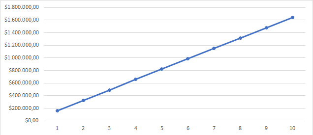
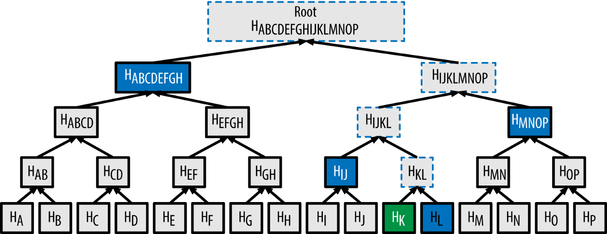

# Bitcoin

Bitcoin may be a complete different chain but there are ways to verify a Bitcoin block header within an Ethereum Smart Contract and Bitcoin data in general on the client-side as well. This requires a little bit more effort but you can use all the features of Incubed.

## Concept

For the verification of Bitcoin we make use of the Simplified Payment Verification (SPV) proposed in the [Bitcoin paper](https://bitcoin.org/bitcoin.pdf) by Satoshi Nakamoto.

> It is possible to verify payments without running a full network node. A user only needs to keep a copy of the block headers of the longest proof-of-work chain, which he can get by querying network nodes until he's convinced he has the longest chain, and obtain the Merkle branch linking the transaction to the block it's timestamped in. He can't check the transaction for himself, but by linking it to a place in the chain, he can see that a network node has accepted it, and blocks added after it further confirm the network has accepted it. As such, the verification is reliable as long as honest nodes control the network, but is more vulnerable if the network is overpowered by an attacker. While network nodes can verify transactions for themselves, the simplified method can be fooled by an attacker's fabricated transactions for as long as the attacker can continue to overpower the network.

In contrast to SPV-clients an Incubed client does not keep a copy of all block headers, instead the client is stateless and only requests required block headers. We are following a simple process: A client requests certain data, the server sends a response with proof data in adition to the actual result, the client verifies the result by using the proof data. We rely on the fact that it is extremly expensive to deliver a wrong block (wrong data) which still has following blocks referring the wrong block (i.e. delivering a chain of fake-blocks). This does not really work for very old blocks. Beside the very low difficulty at this time, the miner has many years of time to pre-mine a wrong chain of blocks. Therefore, we are setting some hard-coded checkpoints of hashes of bygone blocks. Proving the correctness of old blocks can be achieved by checking the linking from the requested block to a certain checkpoint (the server needs to provide the corresponding data). The only way for an attacker to fool the client would be by finding a hash collision.

### Bitcoin Block Header

```eval_rst

+-------------------+--------------------+--------------------------------------------------------------------------+
| Size              | Field              | Description                                                              |
+===================+====================+==========================================================================+
| 4 bytes           | Version            | A version number to track software/protocol upgrades                     |
+-------------------+--------------------+--------------------------------------------------------------------------+
| 32 bytes          | Parent Hash        | A reference to the hash of the previous (parent) block in the chain      |
+-------------------+--------------------+--------------------------------------------------------------------------+
| 32 bytes          | Merkle Root        | A hash of the root of the merkle tree of this block’s transactions       |
+-------------------+--------------------+--------------------------------------------------------------------------+
| 4 bytes           | Timestamp          | The approximate creation time of this block (seconds from Unix Epoch)    |
+-------------------+--------------------+--------------------------------------------------------------------------+
| 4 bytes           | Bits               | The Proof-of-Work algorithm difficulty target for this block             |     
+-------------------+--------------------+--------------------------------------------------------------------------+
| 4 bytes           | Nonce              | A counter used for the Proof-of-Work algorithm                           |
+-------------------+--------------------+--------------------------------------------------------------------------+
```

### Finality in Bitcoin
In terms of Bitcoin, finality is the assurance or guarantee that a block and its included transactions will not be revoked once committed to the blockchain. Bitcoin uses a probabilistic finality in which the probability that a block will not be reverted increases as the block sinks deeper into the chain. The deeper the block, the more likely that the fork containing that block is the longest chain. After being 6 blocks deep into the Bitcoin blockchain it is very unlikely (but not impossible) for that block to be reverted. (For more information see [here](https://medium.com/mechanism-labs/finality-in-blockchain-consensus-d1f83c120a9a))

### Mining in Bitcoin
The process of trying to add a new block of transactions to the Bitcoin blockchain is called *mining*. Miners are competing in a network-wide competition, each trying to find a new block faster than anyone else. The first miner who finds a block broadcasts it across the network and other miners are adding it to their blockchain after verifying the block. Miners restart the mining-process after a new block was added to the blockchain to build on top of this block. As a result, the blockchain is constantly growing – one block every 10 minutes on average.

> But how can miners *find* a block? 

They start by filling a candidate block with transactions from their memory pool. Next they construct a block header for this block, which is a summary of all the data in the block including a reference to a block that is already part of the blockchain (known as the parent hash). Now the actual mining happens: miners put the block header through the SHA256 hash function and hope that the resulting hash is below the current target. If this is not the case, miners keep trying by incrementing a number in the block header resulting in a completely different hash. This process is referred to as proof-of-work.

### Difficulty Adjustment Period 

This section is important to understand how the adjustment of the difficulty (and therefore the target) works. The knowledge of this section serves as the basis for the remaining part.

The white paper of Bitcoin specifies the block time as 10 minutes. Due to the fact that Bitcoin is a decentralized network that can be entered and exited by miners at any time, the computing power in the network constantly changes depending on the number of miners and their computing power. In order to still achieve an average block time of 10 minutes a mechanism to adjust the difficulty of finding a block is required: the `difficulty`.

The adjustment of the difficulty happens every 2016 blocks - roughly every two weeks and (which is one epoch/period). Since Bitcoin is a decentralized network there is no authority which adjusts the difficulty. Instead every miner calculates the expected time to mine 2016 blocks (20160 minutes) and compares it with the actual time it took to mine the last 2016 blocks (using timestamps). The difficulty increases when the blocks were mined faster than expected and vice versa. Although the computing power increased heavily since the introduction of Bitcoin in 2009 the average block time is still 10 minutes due to this mechanism.

> What is the difference between the `difficulty` and the `target`? 

The difficulty is a big number used for the adjustment process. The target is used for the mining process and for the verification of a block hash. As mentioned above the hash of a block has to be smaller than the target to be accepted across the network. The target can be calculated using the difficulty and the constant value `targetmax`:

```js
target = targetmax / difficulty

targetmax = 0x00000000FFFF0000000000000000000000000000000000000000000000000000
```

## Security Calculation

How secure is the Incubed Bitcoin Verification?

The highest risk is a situation, where a malicious node could provide a manipulated or fake block header (i.e. changing the data to gain benefits) and finality block headers which fullfill the rules but are not actually valid (i.e. not part of the longest chain / chain of fake-blocks). The client would trust this data in case he has no other information to check against. The following calculation outlines the security (in terms of $) when the client is requesting one of the newer blocks and 6 finality headers. This results in a total of 7 fake-blocks that an atacker has to calculate to fool the client. The calculation is based on assumptions and averages.

Assume that the attacker has 10% of the total
mining power. This would mean he needs around 100 minutes to mine 1 block (average block time of Bitcoin is 10 minutes) and around 700 minutes to mine 7 blocks. While mining fake-blocks, the attacker loses his chance of earning block rewards. Assuming that we would have been able to mine 7 blocks, with a current block reward of 6.25 BTC and $11,400 per Bitcoin at the time of writing:

```
7 * 6.25 BTC = 43.75 BTC

43.75 BTC * ($11,400 / 1 BTC) = $498,750
```

Furthermore, the attacker needs to achieve 10% of the mining power. With a current total hash rate of 120 EH/s, this would mean 12 EH/s. There are two options: buying the hardware or renting the mining power from others. [15]
A new [Antminer S9](https://www.buybitcoinworldwide.com/mining/hardware/) with 14 TH/s can be bought for $3,000. This would mean an attacker has to pay $2,568,000,000 to buy so many of these miners to reach 12 EH/s. The costs for electricity, storage room and cooling still needs to be added.

Hashing power can also be rented online. Obviously nobody is offering to lend 12 EH/s of hashing power – but for this calculation we assume that an attacker is still able to rent this amount of hashing power. The website [nicehash.com](https://www.nicehash.com/marketplace) is offering 1 PH/s for 0.0098 BTC (for 24 hours).

```
1 PH/s = 0.0098 BTC

12 EH/s = 117.6 BTC
```

Assuming it is possible to rent it for 700 minutes only (which would be 48.6% of one day).

```
117.6 BTC * 0.486 = 57.15 BTC

57.15 BTC * ($11,400 / 1 BTC) = $651,510

Total: $498,750 + $651,510 = $1,150,260
```

Therefore, 6 finality headers provide a security of estimated **$1,150,260** in total.

> What does that mean for the client?

A rental car is equipped with an Incubed client running on a microship to perform authorization checks and activate the ignition if necessary. The car is its own owner and it has a Bitcoin address to receive payments to rent itself to customers. Part of the authorization check is the verification of the existence and correctness of the payment (using the Incubed client). Therefore, a customers sends the hash of the payment transaction to the car to be authorized in case the transaction gets verified. 

Assuming that a customer (Bob) runs a malicious Incubed node and the car randomly asks exactly this node for the verification of the transaction. Bob could fool the car by creating a fake-transaction in a fake-block. To prove the correctness of the fake-transaction, Bob needs to calculate a chain of fake-blocks as well (to prove the finality). In this case the car would authorize Bob because it was able to verify the transaction, even though the transaction is fake.

Bob would be able to use the car without having to pay for it, **but** performing such an attack (calculate a wrong block and 6 finality headers) is very expensive as shown above. And this is what is meant by *security in terms of $* - fooling the client in such a scenario is definitely not worth it (since paying the actual fees for the car would be a *far* less than the cost of performing such an attack). Hence, Incubed clients can trust in the correctness of a transaction (with a high probability) if the value is less than $1,150,260 and the server is able to provide 6 finality headers for the block that transaction is included. The higher the number of finality blocks, the higher the security (i.e. the higher the costs for an attack). The following figure shows the cost to mine *n* fake-blocks based on the numbers mentioned above.




## Proofs

### Target Proof

Having a verified target on the client-side is important to verify the proof of work and therefore the data itself (assuming that the data is correct when someone put a lot of work into it). Since the target is part of a block header (`bits`-field) we can verify the target by verifying the block header. This is a dilemma since we want to verify the target by verifying the block header but we need a verified target to verify the block header (as shown in [block proof](bitcoin.html#block-proof)). You will read about two different options to verify a target.

#### Verification using finality headers

The client maintains a cache with the number of a difficulty adjustment period (dap) and the corresponding target - which stays the same for the duration of one period. This cache was filled with default values at the time of the release of the Bitcoin implementation. If a target is not yet part of the cache it needs to be verified first and added to the cache afterwards.

> How does the verification works?

We completely rely on the finality of a block. We can verify the target of a block (and therefore for a whole period) by requesting a block header (`getblockheader`) and `n`-amount of finality headers. If we are able to prove the finality using the [finality proof](bitcoin.html#finality-proof) we can consider the target as verified as mentioned earlier.

The client sets a limit in his configuration regarding the maximum change of the target from a verified one to the one he wants to verify. The client will not trust the changes of the target when they are too big (i.e. greater than the limit). In this case the client will use the [proofTarget-method](rpc.html#btc_prooftarget) to verify the big changes in smaller steps.

#### Verification using signatures

*Important: This concept is still in development and discussion and is not yet fully implemented.*

This approach uses signatures of Incubed nodes to verify the target.

Since the target is part of the block header we just have to be very sure that the block header is correct - which leads us to a correct target. The client fetches the node list and chooses n nodes which will provide signature. Afterwards he sends a `getblockheader`-request (also containing the addresses of the selected nodes) to a random provider node. This node asks the signatures nodes to sign his result (the block header). The response will include the block header itself and all the signatures as well. The client can verify all signatures by using the node list and therefore verifying the actual result (a verified block header and therefore a verified target). The incentivation for the nodes to act honest is their deposit which they will loose in case they act malicious.
(see [here](https://github.com/slockit/in3/blob/master/in3_image.png) for more details of this process)

The amount of signatures nodes n should be chosen with the 
[Risk Calculation](Threat-Model-for-Incubed.html#risk-calculation) in mind.

### Block Proof

Verifying a Bitcoin block is quite easy when you already have a verified block hash. 

1. We take the first 80 bytes of the block data - which is the block header - and hash it with `sha256` twice. Since Bitcoin stores the hashes in little endian we have to reverse the order of the bytes afterwards:

    ```js
    // btc hash = sha256(sha256(data))
    const hash(data: Buffer) => crypto.createHash('sha256').update(crypto.createHash('sha256').update(data).digest()).digest()

    const blockData:Buffer = ...
    // take the first 80 bytes, hash them and reverse the order
    const blockHash = hash(blockData.slice(0,80)).reverse()
    ```

2. In order to check the proof of work in the block header we compare the target with the hash:

    ```js
    const target = Buffer.alloc(32)
    // we take the first 3 bytes from the bits-field and use the 4th byte as exponent
    blockData.copy(target, blockData[75]-3,72,75);

    // the hash must be lower than the target
    if (target.reverse().compare(blockHash) < 0) 
       throw new Error('blockHash must be smaller than the target')
    ```

### Finality Proof

Necessary data to perform this proof:

- Block header (block `X`)
- Finality block header (block `X+1`, ..., `X+n`)

The finality for block `X` can be proven as follows: 

The proof data contains the block header of block `X` as well as `n` following block headers as finality headers. In Bitcoin every block header includes a `parentHash`-field which contains the block hash of its predecessor. By checking this linking the finality can be proven for block `X`. Meaning the block hash of block `X` is the `parentHash` of block `X+1`, the hash of block `X+1` is the `parentHash` of block `X+2`, and so on. If this linking correct until block `X+n` (i.e. the last finality header) then block `X` can be considered as final (Hint: as mentioned above Bitcoin uses a probabilistic finality, meaning a higher `n` increases the probability of being actual final). 

**Example**

This example will use two finality headers to demonstrate the process:

Hash: 00000000000000000000140a7289f3aada855dfd23b0bb13bb5502b0ca60cdd7 (block #[625000](https://blockchair.com/bitcoin/block/625000))

Finality Headers:

```
(1) 00e00020d7cd60cab00255bb13bbb023fd5d85daaaf389720a140000000000000000000040273a5828953c61554c98540f7b0ba8332e385b3e5b38f60679c95bca4df92921ff8d5ebc2013179c43c722 

(2) 00e0ff7fc78d20fab2c28de35d00f7ec5fb269a63d597146d9b31000000000000000000052960bb1aa3c23581ab3c233a2ad911c9a943ff448216e7e8d9c7a969f4f349575ff8d5ebc201317b4bb8784
```

```
Hash (reversed): d7cd60cab00255bb13bbb023fd5d85daaaf389720a1400000000000000000000
Parent Hash (1): d7cd60cab00255bb13bbb023fd5d85daaaf389720a1400000000000000000000

Hash of (1):     c78d20fab2c28de35d00f7ec5fb269a63d597146d9b310000000000000000000
Parent Hash (2): c78d20fab2c28de35d00f7ec5fb269a63d597146d9b310000000000000000000
```

### Transaction Proof (Merkle Proof)

Necessary data to perform this proof:

- Block header
- Transaction
- Merkle proof (for this transaction)
- Index (of this transaction)

All transactions of a Bitcoin block are stored in a **merkle tree**. Every leaf node is labelled with with the hash of a transaction, and every non-leaf node is labelled with the hash of the labels of its two child nodes. This results in one single hash - the **merkle root** - which is part of the block header. Attempts to change or remove a leaf node after the block was mined (i.e. changing or removing a transaction) will not be possible since this will cause changes in the merkle root, thereby changes in the block header and therefore changes in the hash of this block. By checking the block header against the block hash such an attempt will be discovered.

Having a verified block header and therefore a verified merkle root allows us to perform a merkle root proving the existence and correctness of a certain transaction.

The following example explains a merkle proof (for more details see [here](https://medium.com/crypto-0-nite/merkle-proofs-explained-6dd429623dc5)):



In order to verify the existence and correctness of transaction [K] we use `sha256` to hash [K] twice to obtain H(K). For this example the merkle proof data will contain the hashes H(L), H(IJ), H(MNOP) and H(ABCDEFGH). These hashes can be used to calculate the merkle root as shown in the picture. The hash of the next level can be calculated by concatenating the two hashes of the level below and then hashing this hash with `sha256` twice.
The index determines which of the hashes is on the right and which one on the left side for the concatenation (Hint: the placement is important, since swaped hashes will result in a completely different hash). When the calculated merkle root appears to be equal to the one contained by the block header we've hence proven the existence and correctness of transaction [K]. 

This can be done for every transaction of a block by simply hashing the transaction and then keep on hashing this result with the next hash from the merkle proof data. The last hash must match the merkle root. (Hint: obviously the merkle proof data will be different for different transactions).


### Block Number Proof

Necessary data to perform this proof:

- Block header
- Coinbase transaction (first transaction of the block)
- Merkle proof (for the coinbase transaction) 

In comparison to Ethereum there is no block number in a [Bitcoin block header](bitcoin.html#bitcoin-block-header). Bitcoin uses the height of a block, which is the number of predecessors. The genesis block is at height 0 since there are no predecessors (the block with 100 predecessors is at height 100). Therefore, you need to know the complete Bitcoin blockchain to verify the height of a block (by counting the links back to the genesis block). Hence, actors that do not store the complete chain (like an Incubed client) are not able to verify the height of a block. To change that Gavin Andresen proposed a change to the Bitcoin protocol in 2012.

> Bitcoin Improvement Proposal 34 (BIP-34) introduces an upgrade path for versioned transactions and blocks. A unique value is added to newly produced coinbase transactions, and blocks are updated to version 2. After block number 227,835 all blocks must include the block height in their coinbase transaction.

For all blocks after block number 227,835 the block number can be proven as follows:

1.) Extract block number out of the coinbase transaction

Coinbase transaction of block [624692](https://blockchair.com/bitcoin/transaction/02d8cdb103f50532e2f18d9d1f85c016468ee0294908d387e38f80b99410d893)
```
03348809041f4e8b5e7669702f7777772e6f6b65782e636f6d2ffabe6d6db388905769d4e3720b1e59081407ea75173ba3ed6137d32308591495198155ce020000004204cb9a2a31601215b2ffbeaf1c4e00
```

Decode:

a) `03`: first byte signals the length of the block number (push the following 3 bytes) \
b) `348809`: the block number in big endian (convert to little endian) \
c) `098834`: the block number in little endian (convert to decimal) \
d) **`624692`**: the actual block number \
e) `041f4e...` : the rest can be anything

2.) Prove the existence and correctness of the coinbase transaction

To trust the extracted block number it's necessary to verify the existence and correctness of the coinbase transaction. This can be done by performing a [merkle proof](bitcoin.html#transaction-proof-merkle-proof) using the provided block header and the merkle proof data.

**Size of a block number proof**

As mentioned above three things are required to perform this proof:
*  block header (fixed size): 80 bytes
*  coinbase transaction (variable size): 300 bytes on average \
   (there are some extra ordinary large ones: e.g. of block [#376992](https://blockchair.com/bitcoin/transaction/cbb4836f85b820af27ee3225cda308b0f185d3bdff5f1373d6e3a8aa4282fcdc) with 9,534 bytes)
*  merkle proof (variable size): block limit of 1 MB, a maximum of approximately 3500 transactions in one block, maximum of 12 hashes needed in the merkle proof \
   = 12 * 32 bytes = 384 bytes

Conclusion: a block number proof will be **764 bytes** on average (the size of this proof can be much smaller - but can also be much bigger - depending on the size of the coinbase transaction and the total amount of transaction)

## Conviction

*Important: This concept is still in development and discussion and is not yet fully implemented.*

Just as the Incubed Client can ask for signed blockhashes in Ethereum, he can do this in Bitcoin as well. The signed payload from the node will have to contain these data:

```js
bytes32 blockhash;
uint256 timestamp;
bytes32 registryId;
```

**Client requires a Signed Blockhash**

and the Data Provider Node will ask the chosen node to sign.

**The Data Provider Node (or Watchdog) will then check the signature**

If the signed blockhash is wrong it will start the conviting process:

**Convict with BlockHeaders**

In order to convict, the Node needs to provide proof, which is the correct blockheader.

But since the BlockHeader does not contain the BlockNumber, we have to use the timestamp. So the correct block as proof must have either the same timestamp or a the last block before the timestamp. Additionally the Node may provide FinalityBlockHeaders. As many as possible, but at least one in order to prove, that the timestamp of the correct block is the closest one.

**The Registry Contract will then verify**    

- the Signature of the convited Node.
- the BlockHeaders gives as Proof


The Verification of the BlockHeader can be done directly in Solitidy, because the EVM offers a precompiled Contract at address `0x2` : sha256, which is needed to calculate the Blockhash. With this in mind we can follow the steps as described in [Block Proof](bitcoin.html#block-proof) implemented in Solidity.


While doing so we need to add the difficulties of each block and store the last blockHash and the `totalDifficulty` for later.

**Challenge the longest chain**

Now the convited Server has the chance to also deliver blockheaders to proof that he has signed the correct one.
    
The simple rule is: 

> If the other node (convited or convitor) is not able to add enough verified BlockHeaders with a higher `totalDifficulty` within 1 hour, the other party can get the deposit and kick the malicious node out.

Even though this game could go for a while, if the convicted Node signed a hash, which is not part of the longest chain, it will not be possible to create enough mining power to continue mining enough blocks to keep up with the longest chain in the mainnet. Therefore he will most likely give up right after the first transaction.
