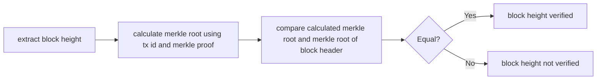

# Bitcoin Verification

## BIP-34 (Bitcoin Improvement Proposal 34)
This BIP introduces an upgrade path for versioned transactions and blocks. A 
unique value is added to newly produced coinbase transactions, and blocks are 
updated to version 2. After block number 227,835 all blocks must include the 
block height in their coinbase transaction.

The server has to provide the following data:
*  block header
*  first tx of the block (coinbase tx)
*  merkle proof for this tx

This flowchart shows the process for a client to verify the height of the block:

The block height is part of the signature script of the coinbase tx. The following
example will show the steps to extract the block height out of the signature
script. 
*  Signature script (coinbase tx of block [624692](https://blockchair.com/bitcoin/transaction/02d8cdb103f50532e2f18d9d1f85c016468ee0294908d387e38f80b99410d893)):
*  **03348809**041f4e8b5e7669702f7777772e6f6b65782e636f6d2ffabe6d6db388905769d4e3720b1e59081407ea75173ba3ed6137d32308591495198155ce020000004204cb9a2a31601215b2ffbeaf1c4e00
*  Decode this script:
    *  03 - push the following 3 bytes
    *  348809 - little endian = 098834
    *  098834 - convert to decimal = 624692
    *  041f4e8.. - the rest can be anything
    
