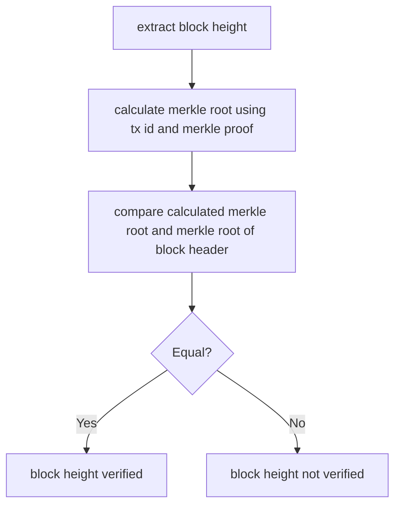
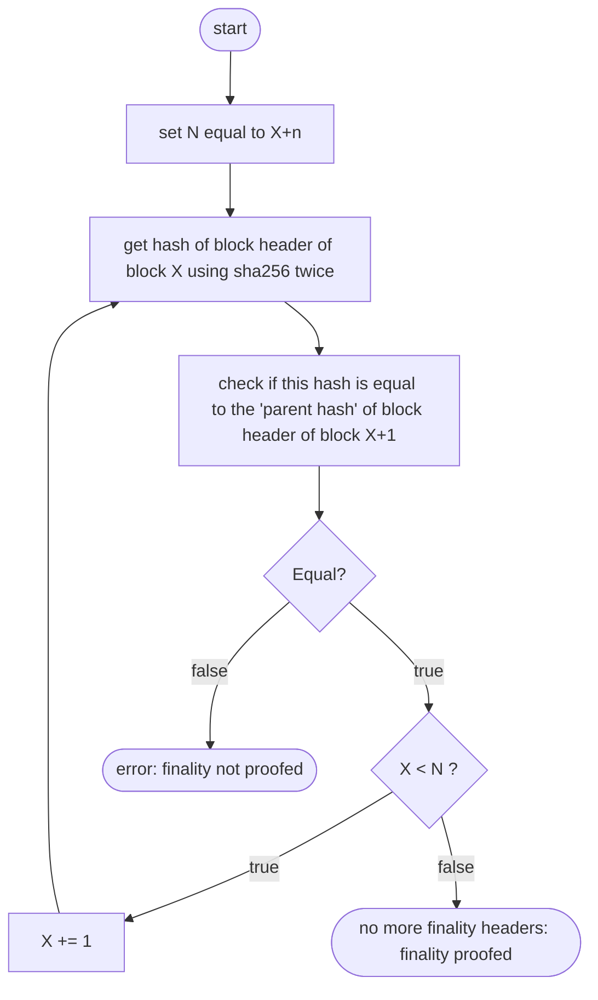
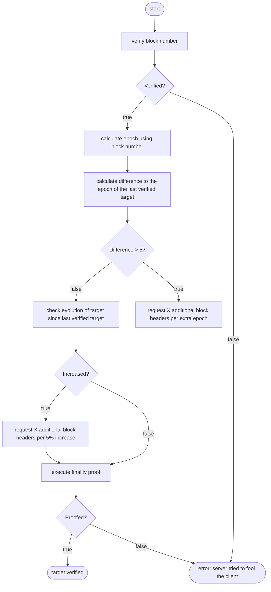
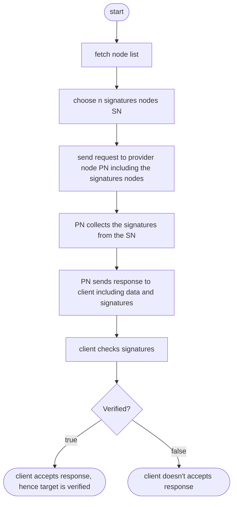
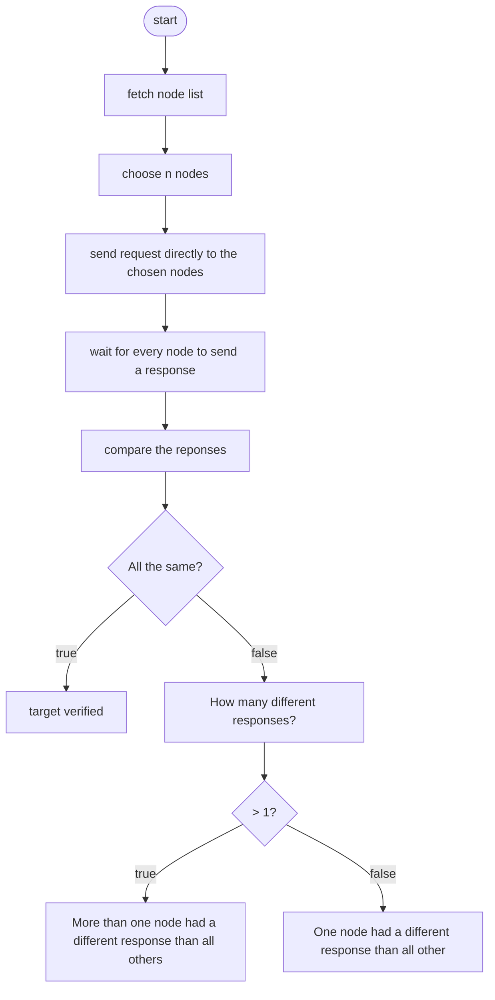
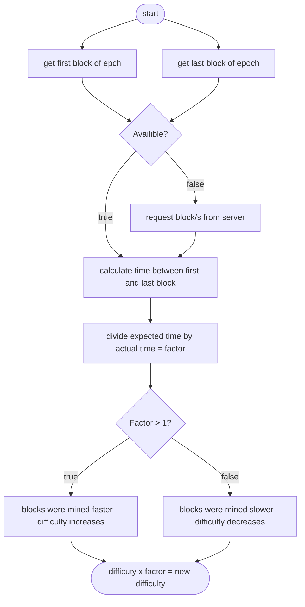

# Bitcoin Verification

## Block number proof

### BIP-34 (Bitcoin Improvement Proposal 34)
This BIP introduces an upgrade path for versioned transactions and blocks. A 
unique value is added to newly produced coinbase transactions, and blocks are 
updated to version 2. After block number 227,835 all blocks must include the 
block height in their coinbase transaction.

### Proof

The server has to provide the following data:
*  block header
*  coinbase tx (first tx of the block)
*  merkle proof (for coinbase tx)

This flowchart shows the process for a client to verify the height of the block:



The block height is part of the signature script of the coinbase tx. The following
example will show the steps to extract the block height out of the signature
script. 
*  Signature script (coinbase tx of block [624692](https://blockchair.com/bitcoin/transaction/02d8cdb103f50532e2f18d9d1f85c016468ee0294908d387e38f80b99410d893)):
*  **03348809**041f4e8b5e7669702f7777772e6f6b65782e636f6d2ffabe6d6db388905769d4e3720b1e59081407ea75173ba3ed6137d32308591495198155ce020000004204cb9a2a31601215b2ffbeaf1c4e00
*  Decode this script:
    *  03 - push the following 3 bytes
    *  348809 - little endian = 098834
    *  098834 - convert to decimal = 624692
    *  041f4e8.. - the rest can be anything
    
By doing a merkle proof the client can verify that the coinbase tx is part of
the block (hence the block header is at height X). \
*Merkle proofs are established by hashing a hash’s corresponding hash together 
and climbing up the tree until you obtain the root hash which is or can be publicly known.* \
A more detailed description an example can be found [here](https://medium.com/crypto-0-nite/merkle-proofs-explained-6dd429623dc5).

### Size of the proof

As mentioned above there are three things that are neccessary for the proof: block header, coinbase tx and merkle proof.
*  block header: always 80 bytes
*  coinbase tx: variable size - largest found: 377 bytes
*  merkle proof: variable size - 1 MB block limit = approximately 3500 tx, 12 hashes needed, 12 * 32 bytes = 384 bytes
*  conclusion: maximum total size of: 80 + 377 + 384 = **841 bytes**

The amount of 841 bytes is a maximum value. The size of the coinbase tx can be 
much smaller (down to about 200 bytes). Depending on the amount of txs in the 
block the size of the merkle proof can be much smaller as well (down to only 1 hash = 32 bytes).


## Finality proof

### Block header

| **Size** | **Field** | **Description** |
| ------ | ------ | ------ |
| 4 bytes | Version | A version number to track software/protocol upgrades |
| 32 bytes | Parent Hash | A reference to the hash of the previous (parent) block in the chain |
| 32 bytes | Merkle Root | A hash of the root of the merkle tree of this block’s transactions |
| 4 bytes | Timestamp | The approximate creation time of this block (seconds from Unix Epoch) |
| 4 bytes | Bits | The Proof-of-Work algorithm difficulty target for this block |
| 4 bytes| Nonce | A counter used for the Proof-of-Work algorithm |

### Proof

The server will provide n finality headers. Assume the client requests the block header of block X.
The response of the server will include the header of block header and the block header of block X+1,
X+2, ..., X+n. \
The client can verify the finality by himself as follows:



He starts with hash (using sha256 twice) of the first block header. This hash has to be equal
to the parent hash of the second block header. Now he uses the hash (using sha256 twice) of
the second block. This hash has to be equal to the parent hash of the third block header. And so on.
If there is an error at some point (hash is not equal to parent hash) then the finality proof failed.

### Example

For this example the server provides the block hash and two finality headers.

Hash: 00000000000000000000140a7289f3aada855dfd23b0bb13bb5502b0ca60cdd7 (Block [625000](https://blockchair.com/bitcoin/block/625000)) \
Finality Headers:
*  **(1)** 00e00020**d7cd60cab00255bb13bbb023fd5d85daaaf389720a1400000000000000000000**40273a5828953c61554c98540f7b0ba8332e385b3e5b38f60679c95bca4df92921ff8d5ebc2013179c43c722
*  **(2)** 00e0ff7f**c78d20fab2c28de35d00f7ec5fb269a63d597146d9b310000000000000000000**52960bb1aa3c23581ab3c233a2ad911c9a943ff448216e7e8d9c7a969f4f349575ff8d5ebc201317b4bb8784

Reverse(Hash): d7cd60cab00255bb13bbb023fd5d85daaaf389720a1400000000000000000000 \
Parent Hash (1): d7cd60cab00255bb13bbb023fd5d85daaaf389720a1400000000000000000000

Hash of (1): c78d20fab2c28de35d00f7ec5fb269a63d597146d9b310000000000000000000 \
Parent Hash (2): c78d20fab2c28de35d00f7ec5fb269a63d597146d9b310000000000000000000

Finality proofed.

## Verify target

### Verification using finality headers

The server has to provide the following data:
*  block header
*  finality headers (default 5)
*  coinbase tx
*  merkle proof (for coinbase tx)

The client can verify the target by himself as follows:



ToDo: Add description! \
ToDo: Rework regarding the numbers needed! \
ToDo: What happens when a new epoch starts within the finality headers? Do we accept that or is that an error?

### Verification using signatures



The amount of signatures nodes n should be chosen with the 
[Risk Calculation](https://in3.readthedocs.io/en/develop/Threat-Model-for-Incubed.html#risk-calculation) in mind.

The clients starts with fetching the node list. He chooses n nodes to provide signatures.
He sends his request to the provider node including all nodes that he wants signatures from.
The server manages to get all signatures from these nodes. Finally, when the provider node
gathered all signatures he sends the client a response including the data and signatures.
The client verifies the signatures using the node list. The incentive for the nodes to be honest
is their deposit which they will loose if they try to fool the network and someone convicts them.


### Verification using different randomly chosen nodes

**Should this methode be implemented?**
The verification by using sigantures is less computational work for the client since
the provider node collects all signatures and checks whether they are 
correct or not. In this verifciation the client has to compare the responses
from the nodes and has to decide whether he accepts a reponse or not.



ToDo: How does the convict-process looks like? (Graph id10 and id11)


advantage: a single node doesn't know that other nodes were asked as well.

### Calculate target



The target for the next epoch can be calculated by using the first and the last 
block of an epoch (2016 blocks) to. The client has to divide the expected time for 2016 blocks 
to be mined (2016 x 10 minutes) by the actual time it took (difference 
between the two timestamps of the first and the last block) to calculate the factor. 
The client uses this factor to calculate the difficulty (which is used to calculate 
the target) for the next epoch: difficulty * factor = new difficulty.
If miners were able to mine the blocks faster than expected the equation 
should look like this: 20160 / 18144 = 1.11 (for example 18144 minutes = 9 minutes per block).
Hence the new difficulty will be difficulty * 1.11.

Two possibilities:
*  the factor is greater than 1 (block were mined faster) → difficulty increases
*  the number is less than 1 (block were  mined slower) → difficulty decreases

Rule: Target adjustments are limited by a factor of 4 to prevent overly-large adjustments from one target to the next.

### Difference between target, difficulty and bits

These three things are actually almost the same. They all represent a number to define 
the difficulty for the proof-of-work algorithm. 

```
target = targetmax / difficulty
targetmax = 0x00000000FFFF0000000000000000000000000000000000000000000000000000
```

With this formula the taget can be calculated with absolute precision.

The bits format is the target without absolute precision. That means it's much smaller
regarding disk space. The bits are part of the block headers and will always be 4 bytes in total.
These 4 bytes are split in the length of the target (1 byte) and the actual target
(3 bytes, imprecise).

