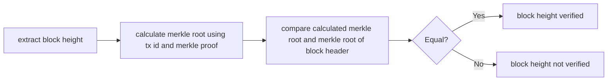
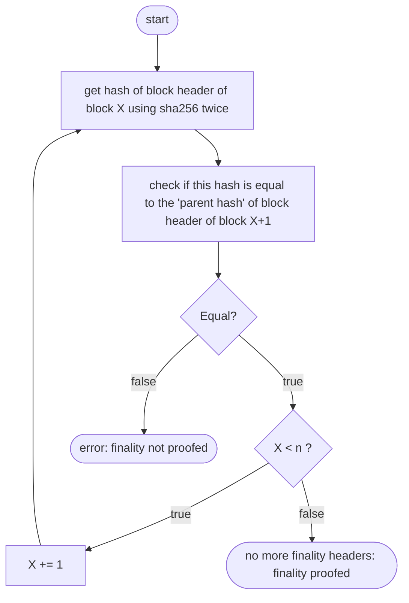

# Bitcoin Verification

## Block number proof

### BIP-34 (Bitcoin Improvement Proposal 34)
This BIP introduces an upgrade path for versioned transactions and blocks. A 
unique value is added to newly produced coinbase transactions, and blocks are 
updated to version 2. After block number 227,835 all blocks must include the 
block height in their coinbase transaction.

### Proof

The server has to provide the following data:
*  block header
*  first tx of the block (coinbase tx)
*  merkle proof for this tx

This flowchart shows the process for a client to verify the height of the block:

The block height is part of the signature script of the coinbase tx. The following
example will show the steps to extract the block height out of the signature
script. 
*  Signature script (coinbase tx of block [624692](https://blockchair.com/bitcoin/transaction/02d8cdb103f50532e2f18d9d1f85c016468ee0294908d387e38f80b99410d893)):
*  **03348809**041f4e8b5e7669702f7777772e6f6b65782e636f6d2ffabe6d6db388905769d4e3720b1e59081407ea75173ba3ed6137d32308591495198155ce020000004204cb9a2a31601215b2ffbeaf1c4e00
*  Decode this script:
    *  03 - push the following 3 bytes
    *  348809 - little endian = 098834
    *  098834 - convert to decimal = 624692
    *  041f4e8.. - the rest can be anything
    
By doing a merkle proof the client can verify that the coinbase tx is part of
the block (hence the block header is at height X). \
*Merkle proofs are established by hashing a hash’s corresponding hash together 
and climbing up the tree until you obtain the root hash which is or can be publicly known.* \
A more detailed description an example can be found [here](https://medium.com/crypto-0-nite/merkle-proofs-explained-6dd429623dc5).

### Size of the proof

As mentioned above there are three things that are neccessary for the proof: block header, coinbase tx and merkle proof.
*  block header: always 80 bytes
*  coinbase tx: variable size - largest found: 377 bytes
*  merkle proof: variable size - 1 MB block limit = approximately 3500 tx, 12 hashes needed, 12 * 32 bytes = 384 bytes
*  conclusion: maximum total size of: 80 + 377 + 384 = **841 bytes**

The amount of 841 bytes is a maximum value. The size of the coinbase tx can be 
much smaller (down to about 200 bytes). Depending on the amount of txs in the 
block the size of the merkle proof can be much smaller as well (down to only 1 hash = 32 bytes).

## Finality proof

The server will provide n finality headers. Assume the client requests the block header of block X.
The response of the server will include the header of block header and the block header of block X+1,
X+2, ..., X+n. \
The client can verify the finality by himself as follows:

