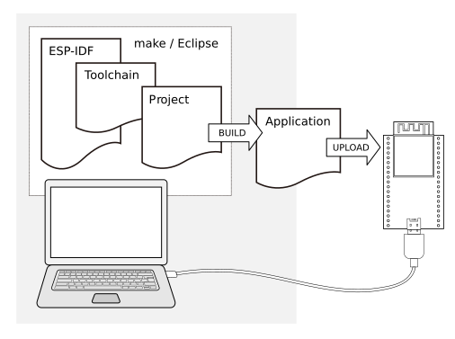
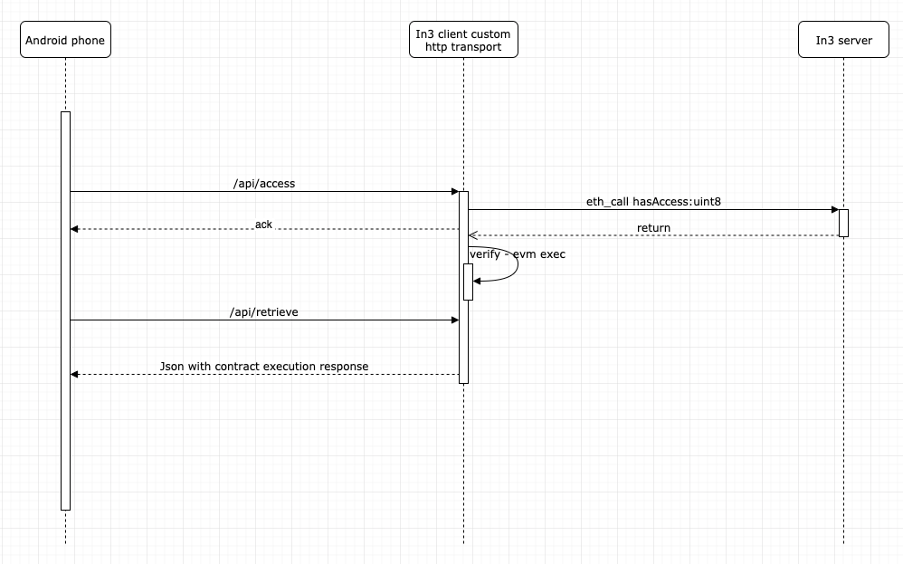
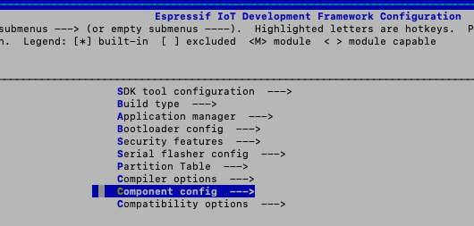
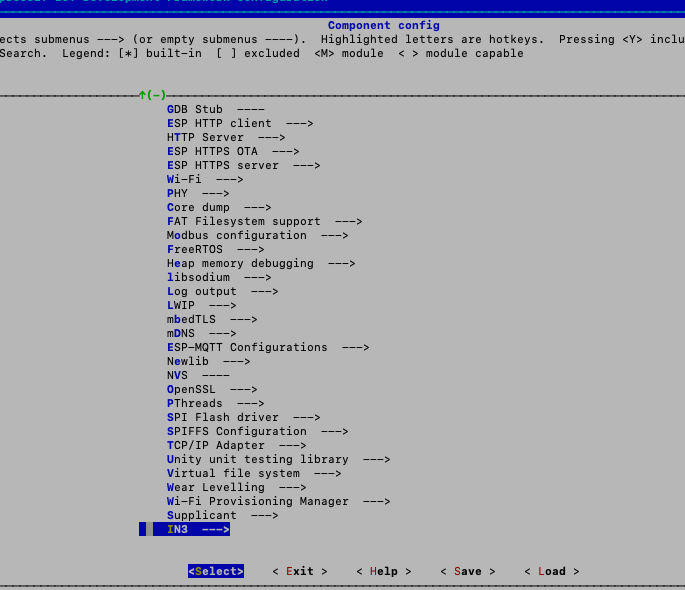
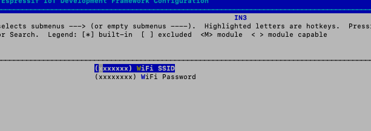

# Embedded Devices


## Hardware Requirements
### Memory 


| Memory type                 | Free size KB |
| ------------------------ | -------- |
| **Dynamic memory(DRAM)** | 30 - 50   |
| **Flash Memory**         | 150 - 200   |


### Networking
In3 client needs to have a reliable internet connection to work properly, so your hardware must support any network interface or module that could give you access to it. i.e  Bluetooth, Wifi, ethernet, etc.
        
## Incubed with ESP-IDF


### Use case example: Airbnb Property access

A smart door lock that grants access to a rented flat is installed on the property. It is able to connect to the Internet to check if renting is allowed and that the current user is authorized to open the lock.

The computational power of the control unit is restricted to the control of the lock. And it is also needed to maintain a permanent Internet connection.

You want to enable this in your application as an example of how in3 can help you, we will guide through the steps of doing it, from the very basics and the resources you will need 

**Hardware requirements**




* [ESP32-DevKitC V4](https://docs.espressif.com/projects/esp-idf/en/latest/hw-reference/get-started-devkitc.html) or similar dev board
* Android phone
* Laptop MAC, Linux, Windows
* USB Cable 

**Software requirements** 

*  [In3](https://github.com/slockit/in3-c) C client
*  Esp-IDF toolchain and SDK, (please follow this [guide](https://docs.espressif.com/projects/esp-idf/en/stable/get-started/)) 
*  [Android Studio](https://developer.android.com/studio)
* Solidity smart contract:  we will control access to properties using a public smart contract, for this example, we will use the following template

```
pragma solidity ^0.5.1;

contract Access {
    uint8 access;
    constructor() public  {
        access = 0;
    }
    
    function hasAccess() public view returns(uint8) {
        return access;
    }
    
    function setAccess(uint8 accessUpdate) public{
        access = accessUpdate;
    }
}
```

**How it works**





in3 will support a variety on microcontrollers for this we will use well-known esp32 with freertos framework, and an example android app to interact with it via Wifi connection. 

**Installation instructions**
1. Clone the repo

`git clone https://github.com/slockit/in3-devices-esp `

2. Follow [esp-idf](https://) instructions to setup your environment


3. Deploy the contract with your favorite tool (truffle, etc) or use our previously deployed contract on Goerli testnet, with address `0x36643F8D17FE745a69A2Fd22188921Fade60a98B`


4. To set up the password and SSID of your network, go to kconfig esp menu with: 
`idf.py menuconfig`
then select component config




then in3 at then end of the list:




then you will be able to input your credentials and be safe you are not hardcoding them in your code!:




5. Build the code
`idf.py build`

6. Connect the USB cable to flash and monitor the serial output from the application. 

`idf.py flash && idf.py monitor`

after the build finishes and the serial monitor is running you will see the configuration and init logs.

7. Configure the ip address of the example, to work with:
Take a look at the initial output of the serial console with `idf.py monitor` command, you will see the ESP32 IP address, as follows 

```
I (2647) tcpip_adapter: sta ip: 192.168.178.64, mask: 255.255.255.0, gw: 192.168.178.1
I (2647) IN3: got ip:192.168.178.64
```
take note of your IP address which will be used in the android application example. 

8. Clone the android repository, compile the android application and install the in3 demo application on your phone. 

`git clone https://github.com/slockit/in3-android-example`


9. Modify the android source changing ip address variable inside Kotlin source file `MainActivity.kt`, with the IP address found on step 6.

`(L:20) private const val ipaddress = "http://192.168.xx.xx"`


## Incubed with Zephyr

....(Comming soon)


