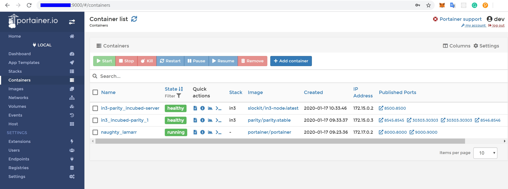

# Running an in3 node on a VPS


Disclaimers: This guide is meant to give you a general idea of the steps needed to run an in3 node on a VPS, please do 
not take it as a definitive source for all the information. An in3 node is a public facing service that comes with all 
the associated security implications and complexity. This guide is meant for internal use at this time, once a target audience
and depth has been defined, a public version will be made.

That being said, setup of an in3 node requires the following steps: 

    1. Generate a private key and docker-compose file from in3-setup.slock.it 
    2. Setup a VPS 
    3. Start the Ethereum RPC node using the docker-compose 
    4. Assign a DNS domain, static IP (or Dynamic DNS) to the server
    5. Run the in3 node docker image with the required flags
    6. Register the in3 node with in3-setup.slock.it

1. Generate a private key and docker-compose file using in3-setup.slock.it:
We will use the in3-setup tool to guide us through the process of starting an incubed node.
Begin by filling up the required details, add metadata if you improve our statistics. Choose the required chain and 
logging level. Choose a secure private key passphrase, it is important to save it in your password manager or somewhere
secure, we cannot recover it for you. Click on generate private key, this process takes some time. Download the private 
key and store it in the secure location. 

Once the private key is downloaded, enter your Ethereum node URL in case you already have one. Generate the 
docker-compose file and save it in the same folder as the private key. 

2. Setup a VPS:

A VPS is basically a computer away from home that offers various preselected (usually) Linux distros out of the box. 
You can then set it up with any service you like - for example Hetzner,Contabo,etc. ServerHunter is a good comparison portal
to find a suitable VPS service.The minimum specs required for a server to host both an ethereum RPC node 
as well as an in3 node would be: 

```
4 CPU cores
8GB of Ram
300GB SSD disk space or more
Atleast 5MBit/s up/down
Linux OS, eg: Ubuntu
```

Once the server has been provisioned, look for the IP address,SSH port and username. This information would be used to login,transfer files
 to the VPS.

Transfer the files to the server using a file browser or an scp command. The target directory for docker-compose.yml and exported-private.key.json file on the incubed server is the /int3 directory  The scp command to transfer the files are: 
```asm
scp docker-compose.yml user@ip-address:
scp exported-private-key.json user@ip-address:
```
If you are using windows you should use Winscp. Copy it to your home directory and thean move the files to /int3

Once the files have been transferred, we will SSH into the server with:

```asm
ssh username@ip-address
```
Now we will install the dependencies required to run in3. This is possible through a one step install script that can be
found (here)[https://github.com/slockit/in3-server-setup-tool/blob/master/incubed_dependency_install_script.sh] or 
by installing each dependency individually. 

If you wish to use our dependency install script, please run the following commands in your VPS, then skip to step 4 and setup your domain name:
```asm
curl -o incubed_dependency_install_script.sh https://raw.githubusercontent.com/slockit/in3-server-setup-tool/master/incubed_dependency_install_script.sh 
chmod +x incubed_dependency_install_script.sh
sudo su
./incubed_dependency_install_script.sh
```

If you wish to install each dependency individually, please follow the proceeding steps. 
Begin by removing older installations of docker:
```asm
# remove existing docker installations
sudo apt remove docker docker-engine docker.io
```

Make sure you have the necessary packages to allow the use of Docker’s repository:

```asm
# install dependencies
sudo apt install apt-transport-https ca-certificates curl software-properties-common
```

To verify the hashes of the docker images from dockerhub you must add Docker’s GPG key:
```asm
# add the docker gpg key
curl -fsSL https://download.docker.com/linux/ubuntu/gpg | sudo apt-key add -
```

Verify the fingerprint of the GPG key, the UID should say "Docker Release":
```asm
# verify the gpg key
sudo apt-key fingerprint 0EBFCD88
```

Add the stable Docker repository: 
```asm
# add the stable Docker repository
sudo add-apt-repository "deb [arch=amd64] https://download.docker.com/linux/ubuntu $(lsb_release -cs) stable"
```

Update and install docker-ce:
```asm
# update the sources
sudo apt update
# install docker-ce
sudo apt install docker-ce
```    

Add your limited Linux user account to the docker group:
```asm
# add your limited Linux user account to the docker group
sudo usermod -aG docker $USER
```     

Verify your installation with a hello-world image: 
```asm
docker run hello-world
```                   

Now we will continue to install docker-compose by downloading it and moving it to the right location: 
```asm
# install docker-compose
sudo curl -L https://github.com/docker/compose/releases/download/1.18.0/docker-compose-`uname -s`-`uname -m` -o /usr/local/bin/docker-compose
```

Set the right permissions:
```asm
# set the right permissions
sudo chmod +x /usr/local/bin/docker-compose
```

Verify the installation with: 
```asm
docker-compose --version
``` 

3. Start the Ethereum RPC node using the docker-compose:
We will use the downloaded docker-compose file to start the Ethereum RPC node.

Change directory to the created in3 folder, verify that the files exist there and then start parity with:
```asm
screen
docker-compose up incubed-parity
control+A and control+D to exit from screen
```        

The time for the whole sync with parity is nearly 4h. The sync process starts with Block snapshots. After This is ready the block syncing starts. 
In order to verify the status of the syncing, run: 
```asm
echo $((`curl --data '{"method":"eth_blockNumber","params":[],"id":1,"jsonrpc":"2.0"}' -H "Content-Type: application/json" -X POST 172.15.0.3:8545 | grep -oh "\w*0x\w*"`))
```
That command will return the latest block number, verify that the block number is the latest one by 
checking on etherscan. We recommend to go forward with Step 4. if sync is completly finished.

4. Run the in3 node docker image with the required flags
Once the Ethereum RPC node has been synced, we can proceed with starting the in3-node. This can also be done with the 
docker-compose file that we used earlier. 

```asm
docker-compose up incubed-server
```     

Wait for the in3-server to finish starting, then run the below command to verify the functioning of the in3-server:
```asm
echo $((`curl --data '{"method":"eth_blockNumber","params":[],"id":1,"jsonrpc":"2.0"}' -H "Content-Type: application/json" -X POST 172.15.0.2:8500 | grep -oh "\w*0x\w*"`))
```

You can now type "exit" to end the SSH session, we should be done with the setup stages in the VPS.

5. Assign a DNS domain, static IP (or Dynamic DNS) to the server 
You need to register a DNS domain name using cloudflare or some other DNS provider. This Domain name needs to point to your
server. A simple way to test it once it is up is with the following command run from your computer:

```asm
echo $((`curl --data '{"method":"eth_blockNumber","params":[],"id":1,"jsonrpc":"2.0"}' -H "Content-Type: application/json" -X POST Domain-name:80 | grep -oh "\w*0x\w*"`))
```

6. Setup https for your domain

a) Install nginx and certbot and generate certificates.
```asm
sudo apt-get install certbot nginx
sudo certbot certonly --standalone
# check if automatic renewal of the certificates works as expected 
sudo certbot renew --dry-run
```
b) Configure nginx as a reverse proxy using SSL. 
Replace /etc/nginx/sites/available/default with the following content.
(Comment everything else out, also the certbot generated stuff.)
```asm
server {
        listen 443 default_server;
        server_name Domain-name;
        ssl on;
        ssl_certificate /etc/letsencrypt/live/Domain-name/fullchain.pem;
        ssl_certificate_key /etc/letsencrypt/live/Domain-name/privkey.pem;
        ssl_session_cache shared:SSL:10m;

        location / {
                proxy_pass http://localhost:80;
                proxy_set_header Host $host;

                proxy_redirect http:// https://;
        }
}
```
c) Restart nginx. 
```asm
sudo service nginx restart
```
HTTPS should be working now. Check with: 
```asm
echo $((`curl --data '{"method":"eth_blockNumber","params":[],"id":1,"jsonrpc":"2.0"}' -H "Content-Type: application/json" -X POST Domain-name:443 | grep -oh "\w*0x\w*"`))
```
7. Register the in3 node with in3-setup.slock.it
Lastly, we need to head back to in3-setup.slock.it and register our new node. Enter the URL address from which the in3 
node can be reached. Add the deposit amount in Ether and click on "Register in3 server" to send the transaction. 


### Side notes/ chat summary

1. Redirect HTTP to HTTPS

Using the above config file nginx doesn't listen on port 80, that port is already being listened to by the incubed-server image (see docker-compose file, mapping 80:8500). 
That way the port is open for normal HTTP requests and when registering the node one can "check" the HTTP capability. 
If that is unwanted one can append
```asm
server {
    listen 80;
    return 301 https://$host$request_uri;
}
``` 
to the nginx config file and change the port mapping for the incubed-server image. One also needs then to adjust the port that nginx redirects to on localhost. For example
```asm
        ports: 
        - 8080:8500/tcp
```
In the incubed-server section in the docker compose file and
```asm
                proxy_pass http://localhost:8080;
```
in the nginx config. (Port 8080 also has to be closed using the firewall, e.g. `ufw deny 8080`)

2. OOM - Out of memory

If having memory issues while syncing adding some parity flags might help (need to be added in the docker-compose for incubed-parity)
```asm
    --pruning-history=[NUM]
        Set a minimum number of recent states to keep in memory when pruning is active. (default: 64)

    --pruning-memory=[MB]
        The ideal amount of memory in megabytes to use to store recent states. As many states as possible will be kept
        within this limit, and at least --pruning-history states will always be kept. (default: 32)
```
with appropiate values.
Note that inside the docker compose file pruning-memory is set to 30000, which might exceed your RAM!

3. Saving the chaindb on disk using docker volume

To prevent the chaindb data being lost add 
```asm
        volumes:
        - /wherever-you-want-to-store-data/:/home/parity/.local/share/io.parity.ethereum/
```
to the parity section in the docker compose file.

4. Added stability/ speed while syncing

Exposing the port 30303 to the public will prevent parity having to rely on UPnP for node discovery. For this add 
```asm
        ports:
        - 30303:30303
        - 30303:30303/udp
```
to the parity section in the docker compose file.

Increasing the database, state and queuing cache can improve the syncing speed (default is around 200MB). The needed flag for it is:
```
    --cache-size=[MB]
        Set total amount of discretionary memory to use for the entire system, overrides other cache and queue options.
```

5. If you like a UI to manage and check your docker containers, please have a look at Portainer.io

Installation instructions can be found here: https://www.portainer.io/installation/.

It can be run with docker, using: 
```
sudo docker run -d --restart always -p 8000:8000 -p 9000:9000 -v /var/run/docker.sock:/var/run/docker.sock -v portainer_data:/data portainer/portainer
```

After the setup, it will be availabe on port 9000. The enabled WebGUI looks like the below picture:




### Recommendations

1. Disable SSH `PasswordAuthentication` & `RootLogin` and install `fail2ban` to protect your VPS from unauthorized access and brute-force attacks. See [How To Configure SSH Key-Based Authentication on a Linux Server](https://www.digitalocean.com/community/tutorials/how-to-configure-ssh-key-based-authentication-on-a-linux-server) and [How To Protect SSH with Fail2Ban](https://www.digitalocean.com/community/tutorials/how-to-protect-ssh-with-fail2ban-on-ubuntu-14-04).
