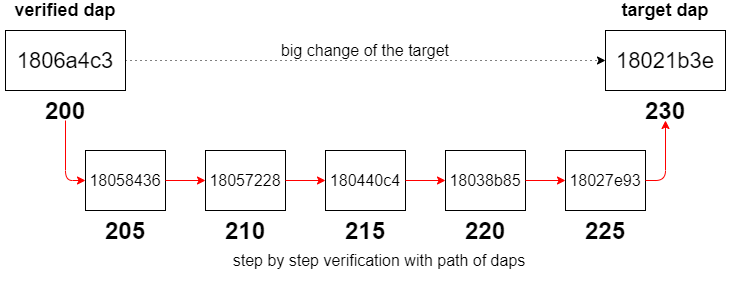

# API RPC


This section describes the behavior for each RPC-method supported with incubed.

The core of incubed is to execute rpc-requests which will be send to the incubed nodes and verified. This means the available RPC-Requests are defined by the clients itself.


## btc


*Important: This feature is still experimental and not considered stable yet. In order to use it, you need to set the experimental-flag (-x on the comandline or `"experimental":true`!*

For bitcoin incubed follows the specification as defined in [https://bitcoincore.org/en/doc/0.18.0/](https://bitcoincore.org/en/doc/0.18.0/).
Internally the in3-server will add proofs as part of the responses. The proof data differs between the methods. You will read which proof data will be provided and how the data can be used to prove the result for each method. 

Proofs will add a special `in3`-section to the response containing a `proof`- object. This object will contain parts or all of the following properties:

*  **block**
*  **final**
*  **txIndex**
*  **merkleProof**
*  **cbtx**
*  **cbtxMerkleProof**


### btc_proofTarget


Whenever the client is not able to trust the changes of the target (which is the case if a block can't be found in the verified target cache *and* the value of the target changed more than the client's limit `max_diff`) he will call this method. It will return additional proof data to verify the changes of the target on the side of the client. This is not a standard Bitcoin rpc-method like the other ones, but more like an internal method.

*Parameters:*

1. **target_dap** : `uint64` - the number of the difficulty adjustment period (dap) we are looking for


2. **verified_dap** : `uint64` - the number of the closest already verified dap


3. **max_diff** : `int?` *(optional)* - the maximum target difference between 2 verified daps (default: `5`)


4. **max_dap** : `int?` *(optional)* - the maximum amount of daps between 2 verified daps (default: `5`)


5. **limit** : `int?` *(optional)* - the maximum amount of daps to return (`0` = no limit) - this is important for embedded devices since returning all daps might be too much for limited memory


The following in3-configuration will have an impact on the result:


* **finality** : `int` - defines the amount of finality headers


* **verification** : `string` - defines the kind of proof the client is asking for (must be `never` or `proof`)


* **preBIP34** : `bool` - defines if the client wants to verify blocks before BIP34 (height < 227836)


Hints:

- difference between `target_dap` and `verified_dap` should be greater than `1`
- `target_dap` and `verified_dap` have to be greater than `0`
- `limit` will be set to `40` internaly when the parameter is equal to `0` or greater than `40`
- `max_dap` can't be equal to `0`
- `max_diff` equal to `0` means no tolerance regarding the change of the target - the path will contain every dap between `target_dap` and `verified_dap` (under consideration of `limit`)
- total possible amount of finality headers (`in3.finaliy` \* `limit`) can't be greater than `1000`
- changes of a target will always be accepted if it decreased from one dap to another (i.e. difficulty to mine a block increased)
- in case a dap that we want to verify next (i.e. add it to the path) is only 1 dap apart from a verified dap (i.e. `verified_dap` or latest dap of the path) *but* not within the given limit (`max_diff`) it will still be added to the path (since we can't do even smaller steps)

This graph shows the usage of this method and visualizes the result from above. The client is not able to trust the changes of the target due to his limits (`max_diff` and `max_dap`). This method provides a path of daps in which the limits are fulfilled from dap to another. The client is going to trust the target of the target dap since he is able to perform a step by step verification of the target by using the path of daps.




*Returns:* `object[]`

A path of daps from the `verified_dap` to the `target_dap` which fulfils the conditions of `max_diff`, `max_dap` and `limit`. Each dap of the path is a `dap`-object with corresponding proof data.


The return value contains the following properties :

* **dap** : `uint64` - the difficulty adjustement period


* **block** : `bytes` - the first blockheader


* **final** : `bytes` - the finality header


* **cbtx** : `bytes` - the coinbase transaction as hex


* **cbtxMerkleProof** : `bytes` - the coinbasetx merkle proof


*Proof:*

Each `dap`-object contains the following properties:

- for blocks before BIP34 (height < 227836) and `in3.preBIP34` = false

    - **dap** - the numer of the difficulty adjustment period
    - **block** - a hex string with 80 bytes representing the  (always the first block of a dap)
    - **final** - the finality headers, which are hexcoded bytes of the following headers (80 bytes each) concatenated, the number depends on the requested finality (`finality`-property in the `in3`-section of the request)

- for blocks before BIP34 (height < 227836) and `in3.preBIP34` = true

    - **dap** - the numer of the difficulty adjustment period
    - **block** - a hex string with 80 bytes representing the blockheader
    - **final** - the finality headers, which are hexcoded bytes of the following headers (80 bytes each) concatenated up to the next checkpoint (maximum of 200 finality headers, since the distance between checkpoints = 200)
    - **height** - the height of the block (block number)

- for blocks after BIP34 (height >= 227836), *the value of `in3.preBIP34` does not matter*

    - **dap** - the numer of the difficulty adjustment period
    - **block** - a hex string with 80 bytes representing the  (always the first block of a dap)
    - **final** - the finality headers, which are hexcoded bytes of the following headers (80 bytes each) concatenated, the number depends on the requested finality (`finality`-property in the `in3`-section of the request)
    - **cbtx** - the serialized coinbase transaction of the block (this is needed to get the verified block number) 
    - **cbtxMerkleProof** - the merkle proof of the coinbase transaction, proving the correctness of the `cbtx`

The goal is to verify the target of the `target_dap`. We will use the daps of the result to verify the target step by step starting with the `verified_dap`. For old blocks (height < 227,836) with `in3.preBIP34` disabled the target cannot be verified (proving the finality does not provide any security as explained in [preBIP34 proof](bitcoin.html#id1)). For old blocks with `in.preBIP34` enabled the block header can be verified by performing a [preBIP34 proof](bitcoin.html#id1). Verifying newer blocks requires multiple proofs. The block header from the `block`-field and the finality headers from the `final`-field will be used to perform a [finality proof](bitcoin.html#finality-proof). Having a verified block header allows us to consider the target of the block header as verified. Therefore, we have a verified target for the whole `dap`. Having a verified block header (and therefore a verified merkle root) enables the possibility of a [block number proof](bitcoin.html#block-number-proof) using the coinbase transaction (`cbtx`-field) and the [merkle proof](bitcoin.html#transaction-proof-merkle-proof) for the coinbase transaction (`cbtxMerkleProof`-field). This proof is needed to verify the dap number (`dap`). Having a verified dap number allows us to verify the mapping between the target and the dap number.


*Example:*

```sh
> in3 -x -c btc -f 8 btc_proofTarget 230 200 5 5 15 | jq
[
  {
    "dap": 205,
    "block": "0x04000000e62ef28cb9793f4f9cd2a67a58c1e7b593129b9b...0ab284",
    "final": "0x04000000cc69b68b702321adf4b0c485fdb1f3d6c1ddd140...090a5b",
    "cbtx": "0x01000000...1485ce370573be63d7cc1b9efbad3489eb57c8...000000",
    "cbtxMerkleProof": "0xc72dffc1cb4cbeab960d0d2bdb80012acf7f9c...affcf4"
  },
  {
    "dap": 210,
    "block": "0x0000003021622c26a4e62cafa8e434c7e083f540bccc8392...b374ce",
    "final": "0x00000020858f8e5124cd516f4d5e6a078f7083c12c48e8cd...308c3d",
    "cbtx": "0x01000000...c075061b4b6e434d696e657242332d50314861...000000",
    "cbtxMerkleProof": "0xf2885d0bac15fca7e1644c1162899ecd43d52b...93761d"
  },
  {
    "dap": 215,
    "block": "0x000000202509b3b8e4f98290c7c9551d180eb2a463f0b978...f97b64",
    "final": "0x0000002014c7c0ed7c33c59259b7b508bebfe3974e1c99a5...eb554e",
    "cbtx": "0x01000000...90133cf94b1b1c40fae077a7833c0fe0ccc474...000000",
    "cbtxMerkleProof": "0x628c8d961adb157f800be7cfb03ffa1b53d3ad...ca5a61"
  },
  {
    "dap": 220,
    "block": "0x00000020ff45c783d09706e359dcc76083e15e51839e4ed5...ddfe0e",
    "final": "0x0000002039d2f8a1230dd0bee50034e8c63951ab812c0b89...5670c5",
    "cbtx": "0x01000000...b98e79fb3e4b88aefbc8ce59e82e99293e5b08...000000",
    "cbtxMerkleProof": "0x16adb7aeec2cf254db0bab0f4a5083fb0e0a3f...63a4f4"
  },
  {
    "dap": 225,
    "block": "0x02000020170fad0b6b1ccbdc4401d7b1c8ee868c6977d6ce...1e7f8f",
    "final": "0x0400000092945abbd7b9f0d407fcccbf418e4fc20570040c...a9b240",
    "cbtx": "0x01000000...cf6e8f930acb8f38b588d76cd8c3da3258d5a7...000000",
    "cbtxMerkleProof": "0x25575bcaf3e11970ccf835e88d6f97bedd6b85...bfdf46"
  }
]
```

```js
//---- Request -----

{
  "method": "btc_proofTarget",
  "params": [
    230,
    200,
    5,
    5,
    15
  ],
  "in3": {
    "verification": "proof"
  }
}

//---- Response -----

{
  "result": [
    {
      "dap": 205,
      "block": "0x04000000e62ef28cb9793f4f9cd2a67a58c1e7b593129b9b...0ab284",
      "final": "0x04000000cc69b68b702321adf4b0c485fdb1f3d6c1ddd140...090a5b",
      "cbtx": "0x01000000...1485ce370573be63d7cc1b9efbad3489eb57c8...000000",
      "cbtxMerkleProof": "0xc72dffc1cb4cbeab960d0d2bdb80012acf7f9c...affcf4"
    },
    {
      "dap": 210,
      "block": "0x0000003021622c26a4e62cafa8e434c7e083f540bccc8392...b374ce",
      "final": "0x00000020858f8e5124cd516f4d5e6a078f7083c12c48e8cd...308c3d",
      "cbtx": "0x01000000...c075061b4b6e434d696e657242332d50314861...000000",
      "cbtxMerkleProof": "0xf2885d0bac15fca7e1644c1162899ecd43d52b...93761d"
    },
    {
      "dap": 215,
      "block": "0x000000202509b3b8e4f98290c7c9551d180eb2a463f0b978...f97b64",
      "final": "0x0000002014c7c0ed7c33c59259b7b508bebfe3974e1c99a5...eb554e",
      "cbtx": "0x01000000...90133cf94b1b1c40fae077a7833c0fe0ccc474...000000",
      "cbtxMerkleProof": "0x628c8d961adb157f800be7cfb03ffa1b53d3ad...ca5a61"
    },
    {
      "dap": 220,
      "block": "0x00000020ff45c783d09706e359dcc76083e15e51839e4ed5...ddfe0e",
      "final": "0x0000002039d2f8a1230dd0bee50034e8c63951ab812c0b89...5670c5",
      "cbtx": "0x01000000...b98e79fb3e4b88aefbc8ce59e82e99293e5b08...000000",
      "cbtxMerkleProof": "0x16adb7aeec2cf254db0bab0f4a5083fb0e0a3f...63a4f4"
    },
    {
      "dap": 225,
      "block": "0x02000020170fad0b6b1ccbdc4401d7b1c8ee868c6977d6ce...1e7f8f",
      "final": "0x0400000092945abbd7b9f0d407fcccbf418e4fc20570040c...a9b240",
      "cbtx": "0x01000000...cf6e8f930acb8f38b588d76cd8c3da3258d5a7...000000",
      "cbtxMerkleProof": "0x25575bcaf3e11970ccf835e88d6f97bedd6b85...bfdf46"
    }
  ]
}
```

### getbestblockhash


Returns the hash of the best (tip) block in the longest blockchain.

*Parameters:* - 

The following in3-configuration will have an impact on the result:


* **finality** : `int` - defines the amount of finality headers


* **verification** : `string` - defines the kind of proof the client is asking for (must be `never` or `proof`)


* **preBIP34** : `bool` - defines if the client wants to verify blocks before BIP34 (height < 227836)


*Returns:* `bytes32`

the hash of the best block

*Proof:*

Since we can't prove the finality of the latest block we consider the `current block count` - `amount of finality` (set in `in3.finality`-field) as the latest block. The hash of this block will be returned. Setting `in3.finality`=`0` will return will return the hash of the actual latest block.

The `proof`-object contains the following properties:

- **block** - a hex string with 80 bytes representing the blockheader
- **final** - the finality headers, which are hexcoded bytes of the following headers (80 bytes each) concatenated, the number depends on the requested finality (`finality`-property in the `in3`-section of the request)
- **cbtx** - the serialized coinbase transaction of the block (this is needed to get the verified block number)
- **cbtxMerkleProof* - the merkle proof of the coinbase transaction, proving the correctness of the `cbtx`

The server is not able to prove the finality for the latest block (obviously there are no finality headers available yet). Instead the server will fetch the number of the latest block and subtracts the amount of finality headers (set in `in3.finality`-field) and returns the hash of this block to the client (the result is considered as the latest block hash). By doing so the server is able to provide finality headers. \
The block header from the `block`-field and the finality headers from the `final`-field will be used to perform a [finality proof](bitcoin.html#finality-proof). Having a verified block header (and therefore a verified merkle root) enables the possibility of a [block number proof](bitcoin.html#block-number-proof) using the coinbase transaction (`cbtx`-field) and the [merkle proof](bitcoin.html#transaction-proof-merkle-proof) for the coinbase transaction (`cbtxMerkleProof`-field).

The client can set `in3.finality` equal to `0` to get the actual latest block hash. **Caution**: This block is not final and could no longer be part of the blockchain later on due to the possibility of a fork. Additionally, there may already be a newer block that the server does not yet know about due to latency in the network.


*Example:*


The actual latest block is block `#640395` and `in3.finality` is set to `8`. The server is going to calculate `640395` - `8` and returns the hash of block `#640387` to the client. The headers of block `640388`..`640395` will be returned as finality headers.

```sh
> in3 -x -c btc -f 8 getbestblockhash 
000000000000000000039cbb4e842de0de9651852122b117d7ae6d7ac4fc1df6
```

```js
//---- Request -----

{
  "method": "getbestblockhash",
  "params": [],
  "in3": {
    "verification": "proof",
    "finality": 8
  }
}

//---- Response -----

{
  "result": "000000000000000000039cbb4e842de0de9651852122b117d7ae6d7ac4fc1df6",
  "in3": {
    "proof": {
      "block": "0x0000e020bd3eecbd741522e1aa78cd7b375744590502939aef9b...9c8b18",
      "final": "0x00008020f61dfcc47a6daed717b12221855196dee02d844ebb9c...774f4c",
      "cbtx": "0x02000000000101000000000000000000000000000000000000000...000000",
      "cbtxMerkleProof": "0xa3d607b274770911e53f06dbdb76440580ff968239...0ba297"
    }
  }
}
```

### getblock


Returns data of block for given block hash. The returned level of details depends on the argument verbosity.

*Parameters:*

1. **hash** : `bytes32` - The block hash


2. **verbosity** : `int` - 0 or false for hex-encoded data, 1 or true for a json object, and 2 for json object **with** transaction data


The following in3-configuration will have an impact on the result:


* **finality** : `int` - defines the amount of finality headers


* **verification** : `string` - defines the kind of proof the client is asking for (must be `never` or `proof`)


* **preBIP34** : `bool` - defines if the client wants to verify blocks before BIP34 (height < 227836)


*Returns:* `btcblockWithTx`

the block. 
- verbose `0` or `false`: a hex string with 80 bytes representing the blockheader
- verbose `1` or `true`: an object representing the blockheader.


The return value contains the following properties :

* **hash** : `bytes32` - the block hash (same as provided)


* **confirmations** : `int` - The number of confirmations, or -1 if the block is not on the main chain


* **height** : `uint64` - The block height or index


* **version** : `int` - The block version


* **versionHex** : `hex` - The block version formatted in hexadecimal


* **merkleroot** : `bytes32` - The merkle root ( 32 bytes )


* **time** : `uint64` - The block time in seconds since epoch (Jan 1 1970 GMT)


* **mediantime** : `uint64` - The median block time in seconds since epoch (Jan 1 1970 GMT)


* **nonce** : `uint64` - The nonce


* **bits** : `bytes4` - The bits ( 4 bytes as hex) representing the target


* **difficulty** : `uint256` - The difficulty


* **chainwork** : `hex` - Expected number of hashes required to produce the current chain (in hex)


* **nTx** : `int` - The number of transactions in the block.


* **tx** : `btctransaction[]` - the array of transactions either as ids (verbose=1) or full transaction (verbose=2)
The tx object supports the following properties :

    * **txid** : `bytes32` - txid
    

    * **in_active_chain** : `bool` - Whether specified block is in the active chain or not (only present with explicit "blockhash" argument)
    

    * **hex** : `bytes` - The serialized, hex-encoded data for `txid`
    

    * **hash** : `bytes32` - The transaction hash (differs from txid for witness transactions)
    

    * **size** : `uint64` - The serialized transaction size
    

    * **vsize** : `uint64` - The virtual transaction size (differs from size for witness transactions)
    

    * **weight** : `uint64` - The transaction's weight (between `vsize`\*4-3 and `vsize`\*4)
    

    * **version** : `int` - The version
    

    * **locktime** : `uint64` - The lock time
    

    * **vin** : `object[]` - array of json objects of incoming txs to be used
The vin object supports the following properties :
    
        * **txid** : `bytes32` - the transaction id
        

        * **vout** : `uint64` - the index of the transaction out to be used
        

        * **scriptSig** : `object` - the script
The scriptSig object supports the following properties :
        
            * **asm** : `string` - the asm-codes
            

            * **hex** : `string` - hex representation
            

        

        * **sequence** : `uint64` - The script sequence number
        

        * **txinwitness** : `string[]` - hex-encoded witness data (if any)
        

    

    * **vout** : `object[]` - array of json objects describing the tx outputs
The vout object supports the following properties :
    
        * **value** : `float` - The Value in BTC
        

        * **n** : `int` - the index
        

        * **scriptPubKey** : `object` - the script pubkey
The scriptPubKey object supports the following properties :
        
            * **asm** : `string` - asm
            

            * **hex** : `string` - hex representation of the script
            

            * **reqSigs** : `int` - the required signatures
            

            * **type** : `string` - The type, eg 'pubkeyhash'
            

            * **addresses** : `string[]` - Array of address(each representing a bitcoin adress)
            

        

    

    * **blockhash** : `bytes32` - the block hash
    

    * **confirmations** : `int` - The confirmations
    

    * **blocktime** : `uint64` - The block time in seconds since epoch (Jan 1 1970 GMT)
    

    * **time** : `uint64` - Same as "blocktime"
    


* **previousblockhash** : `bytes32` - The hash of the previous block


* **nextblockhash** : `bytes32` - The hash of the next block


*Proof:*


The proof will be calculated as described in [getblockheader](#getblockheader). See Details there.


*Example:*

```sh
> in3 -x -c btc -f 8 getblock 000000000000000000103b2395f6cd94221b10d02eb9be5850303c0534307220 1 | jq
{
  "hash": "000000000000000000103b2395f6cd94221b10d02eb9be5850303c0534307220",
  "confirmations": 8268,
  "height": 624958,
  "version": 536928256,
  "versionHex": 2000,
  "merkleroot": "d786a334ea8c65f39272d5b9be505ac3170f3904842bd52525538a9377b359cb",
  "time": 1586333924,
  "mediantime": 1586332639,
  "nonce": 1985217615,
  "bits": "17143b41",
  "difficulty": 13912524048945.91,
  "chainwork": "00000000000000000000000000000000000000000e4c88b66c5ee78deff0d494",
  "tx": [
    "d79ffc80e07fe9e0083319600c59d47afe69995b1357be6e5dba035675780290",
    "...",
    "6456819bfa019ba30788620153ea9a361083cb888b3662e2ff39c0f7adf16919"
  ],
  "nTx": 33,
  "previousblockhash": "00000000000000000013cba040837778744ce66961cfcf2e7c34bb3d194c7f49",
  "nextblockhash": "0000000000000000000c799dc0e36302db7fbb471711f140dc308508ef19e343"
}
```

```js
//---- Request -----

{
  "method": "getblock",
  "params": [
    "000000000000000000103b2395f6cd94221b10d02eb9be5850303c0534307220",
    1
  ],
  "in3": {
    "verification": "proof",
    "finality": 8,
    "preBIP34": true
  }
}

//---- Response -----

{
  "result": {
    "hash": "000000000000000000103b2395f6cd94221b10d02eb9be5850303c0534307220",
    "confirmations": 8268,
    "height": 624958,
    "version": 536928256,
    "versionHex": 2000,
    "merkleroot": "d786a334ea8c65f39272d5b9be505ac3170f3904842bd52525538a9377b359cb",
    "time": 1586333924,
    "mediantime": 1586332639,
    "nonce": 1985217615,
    "bits": "17143b41",
    "difficulty": 13912524048945.91,
    "chainwork": "00000000000000000000000000000000000000000e4c88b66c5ee78deff0d494",
    "tx": [
      "d79ffc80e07fe9e0083319600c59d47afe69995b1357be6e5dba035675780290",
      "...",
      "6456819bfa019ba30788620153ea9a361083cb888b3662e2ff39c0f7adf16919"
    ],
    "nTx": 33,
    "previousblockhash": "00000000000000000013cba040837778744ce66961cfcf2e7c34bb3d194c7f49",
    "nextblockhash": "0000000000000000000c799dc0e36302db7fbb471711f140dc308508ef19e343"
  },
  "in3": {
    "proof": {
      "final": "0x00e0ff2720723034053c305058beb92ed010...276470",
      "cbtx": "0x0100000000010100000000000000000000000...39da2fc",
      "cbtxMerkleProof": "0x6a8077bb4ce76b71d7742ddd368770279a64667b...52e688"
    }
  }
}
```

### getblockcount


Returns the number of blocks in the longest blockchain.

*Parameters:* - 

The following in3-configuration will have an impact on the result:


* **finality** : `int` - defines the amount of finality headers


* **verification** : `string` - defines the kind of proof the client is asking for (must be `never` or `proof`)


*Returns:* `uint64`

the current blockheight

*Proof:*

Since we can't prove the finality of the latest block we consider the `current block count` - `amount of finality` (set in `in3.finality`-field) as the latest block. The number of this block will be returned. Setting `in3.finality`=`0` will return the actual current block count.

The `proof`-object contains the following properties:

- **block** - a hex string with 80 bytes representing the blockheader
- **final** - the finality headers, which are hexcoded bytes of the following headers (80 bytes each) concatenated, the number depends on the requested finality (`finality`-property in the `in3`-section of the request)
- **cbtx** - the serialized coinbase transaction of the block (this is needed to get the verified block number)
- vcbtxMerkleProof** - the merkle proof of the coinbase transaction, proving the correctness of the `cbtx`


The server is not able to prove the finality for the latest block (obviously there are no finality headers available yet). Instead the server will fetch the number of the latest block and subtracts the amount of finality headers (set in `in3.finality`-field) and returns the result to the client (the result is considered as the latest block number). By doing so the server is able to provide finality headers. \
The block header from the `block`-field and the finality headers from the `final`-field will be used to perform a [finality proof](bitcoin.html#finality-proof). Having a verified block header (and therefore a verified merkle root) enables the possibility of a [block number proof](bitcoin.html#block-number-proof) using the coinbase transaction (`cbtx`-field) and the [merkle proof](bitcoin.html#transaction-proof-merkle-proof) for the coinbase transaction (`cbtxMerkleProof`-field).

The client can set `in3.finality` equal to `0` to get the actual latest block number. **Caution**: This block is not final and could no longer be part of the blockchain later on due to the possibility of a fork. Additionally, there may already be a newer block that the server does not yet know about due to latency in the network.


*Example:*


The actual latest block is block `#640395` and `in3.finality` is set to `8`. The server is going to calculate `640395` - `8` and returns `640387` as the latest block number to the client. The headers of block `640388`..`640395` will be returned as finality headers.

```sh
> in3 -x -c btc -f 8 getblockcount 
640387
```

```js
//---- Request -----

{
  "method": "getblockcount",
  "params": [],
  "in3": {
    "verification": "proof",
    "finality": 8
  }
}

//---- Response -----

{
  "result": 640387,
  "in3": {
    "proof": {
      "block": "0x0000e020bd3eecbd741522e1aa78cd7b375744590502939aef9b...9c8b18",
      "final": "0x00008020f61dfcc47a6daed717b12221855196dee02d844ebb9c...774f4c",
      "cbtx": "0x02000000000101000000000000000000000000000000000000000...000000",
      "cbtxMerkleProof": "0xa3d607b274770911e53f06dbdb76440580ff968239...0ba297"
    }
  }
}
```

### getblockheader


Returns data of block header for given block hash. The returned level of details depends on the argument verbosity.

*Parameters:*

1. **hash** : `bytes32` - The block hash


2. **verbosity** : `int` - 0 or false for the hex-encoded data, 1 or true for a json object


The following in3-configuration will have an impact on the result:


* **verification** : `string` - defines the kind of proof the client is asking for (must be `never` or `proof`)


* **preBIP34** : `bool` - defines if the client wants to verify blocks before BIP34 (height < 227836)


*Returns:* `btcblockheader`

the blockheader. 
- verbose `0` or `false`: a hex string with 80 bytes representing the blockheader
- verbose `1` or `true`: an object representing the blockheader.


The return value contains the following properties :

* **hash** : `bytes32` - the block hash (same as provided)


* **confirmations** : `int` - The number of confirmations, or -1 if the block is not on the main chain


* **height** : `uint64` - The block height or index


* **version** : `int` - The block version


* **versionHex** : `hex` - The block version formatted in hexadecimal


* **merkleroot** : `bytes32` - The merkle root ( 32 bytes )


* **time** : `uint64` - The block time in seconds since epoch (Jan 1 1970 GMT)


* **mediantime** : `uint64` - The median block time in seconds since epoch (Jan 1 1970 GMT)


* **nonce** : `uint64` - The nonce


* **bits** : `bytes4` - The bits ( 4 bytes as hex) representing the target


* **difficulty** : `uint256` - The difficulty


* **chainwork** : `hex` - Expected number of hashes required to produce the current chain (in hex)


* **nTx** : `int` - The number of transactions in the block.


* **previousblockhash** : `bytes32` - The hash of the previous block


* **nextblockhash** : `bytes32` - The hash of the next block


*Proof:*

The `proof`-object contains the following properties:

- for blocks before BIP34 (height < 227,836) and `in3.preBIP34` = false

    - **final**  - the finality headers, which are hexcoded bytes of the following headers (80 bytes each) concatenated, the number depends on the requested finality (`finality`-property in the `in3`-section of the request)

- for blocks before BIP34 (height < 227,836) and `in3.preBIP34` = true

    - **final** - the finality headers, which are hexcoded bytes of the following headers (80 bytes each) concatenated up to the next checkpoint (maximum of 200 finality headers, since the distance between checkpoints = 200)
    - **height** - the height of the block (block number)

- for blocks after BIP34 (height >= 227,836), *the value of `in3.preBIP34` does not matter*

    - **final** - the finality headers, which are hexcoded bytes of the following headers (80 bytes each) concatenated, the number depends on the requested finality (`finality`-property in the `in3`-section of the request)
    - **cbtx** - the serialized coinbase transaction of the block (this is needed to get the verified block number)
    - **cbtxMerkleProof** - the merkle proof of the coinbase transaction, proofing the correctness of the cbtx.

Old blocks (height < 227,836) with `in3.preBIP34` disabled cannot be verified (proving the finality does not provide any security as explained in [preBIP34 proof](bitcoin.html#id1)). Old blocks with `in.preBIP34` enabled can be verified by performing a [preBIP34 proof](bitcoin.html#id1). Verifying newer blocks requires multiple proofs. The finality headers from the `final`-field will be used to perform a [finality proof](bitcoin.html#finality-proof). To verify the block number we are going to perform a [block number proof](bitcoin.html#block-number-proof) using the coinbase transaction (`cbtx`-field) and the [merkle proof](bitcoin.html#transaction-proof-merkle-proof) for the coinbase transaction (`cbtxMerkleProof`-field).


This proof section contains the following properties:


* **final** : `bytes` - the finality headers, which are hexcoded bytes of the following headers (80 bytes each) concatenated, the number depends on the requested finality (`finality`-property in the `in3`-section of the request)


* **cbtx** : `bytes` - the serialized coinbase transaction of the block (this is needed to get the verified block number). It will only be included if the blocknumber supports BIP34 and is higher 227,836)


* **cbtxMerkleProof** : `bytes` - the merkle proof of the coinbase transaction, proofing the correctness of the cbtx.


* **height** : `uint64` - the height of the block (block number)


*Example:*

```sh
> in3 -x -c btc -f 8 getblockheader 000000000000000000103b2395f6cd94221b10d02eb9be5850303c0534307220 true | jq
{
  "hash": "000000000000000000103b2395f6cd94221b10d02eb9be5850303c0534307220",
  "confirmations": 8268,
  "height": 624958,
  "version": 536928256,
  "versionHex": 2000,
  "merkleroot": "d786a334ea8c65f39272d5b9be505ac3170f3904842bd52525538a9377b359cb",
  "time": 1586333924,
  "mediantime": 1586332639,
  "nonce": 1985217615,
  "bits": "17143b41",
  "difficulty": 13912524048945.91,
  "chainwork": "00000000000000000000000000000000000000000e4c88b66c5ee78deff0d494",
  "nTx": 33,
  "previousblockhash": "00000000000000000013cba040837778744ce66961cfcf2e7c34bb3d194c7f49",
  "nextblockhash": "0000000000000000000c799dc0e36302db7fbb471711f140dc308508ef19e343"
}
```

```js
//---- Request -----

{
  "method": "getblockheader",
  "params": [
    "000000000000000000103b2395f6cd94221b10d02eb9be5850303c0534307220",
    true
  ],
  "in3": {
    "verification": "proof",
    "finality": 8,
    "preBIP34": true
  }
}

//---- Response -----

{
  "result": {
    "hash": "000000000000000000103b2395f6cd94221b10d02eb9be5850303c0534307220",
    "confirmations": 8268,
    "height": 624958,
    "version": 536928256,
    "versionHex": 2000,
    "merkleroot": "d786a334ea8c65f39272d5b9be505ac3170f3904842bd52525538a9377b359cb",
    "time": 1586333924,
    "mediantime": 1586332639,
    "nonce": 1985217615,
    "bits": "17143b41",
    "difficulty": 13912524048945.91,
    "chainwork": "00000000000000000000000000000000000000000e4c88b66c5ee78deff0d494",
    "nTx": 33,
    "previousblockhash": "00000000000000000013cba040837778744ce66961cfcf2e7c34bb3d194c7f49",
    "nextblockhash": "0000000000000000000c799dc0e36302db7fbb471711f140dc308508ef19e343"
  },
  "in3": {
    "proof": {
      "final": "0x00e0ff2720723034053c305058beb92ed010...276470",
      "cbtx": "0x0100000000010100000000000000000000000...39da2fc",
      "cbtxMerkleProof": "0x6a8077bb4ce76b71d7742ddd368770279a64667b...52e688"
    }
  }
}
```

### getdifficulty


Returns the proof-of-work difficulty as a multiple of the minimum difficulty.

*Parameters:*

1. **blocknumber** : `uint64` - Can be the number of a certain block to get its difficulty. To get the difficulty of the latest block use `latest`, `earliest`, `pending` or leave `params` empty (Hint: Latest block always means `actual latest block` minus `in3.finality`)


The following in3-configuration will have an impact on the result:


* **finality** : `int` - defines the amount of finality headers


* **verification** : `string` - defines the kind of proof the client is asking for (must be `never` or `proof`)


* **preBIP34** : `bool` - defines if the client wants to verify blocks before BIP34 (height < 227836)


*Returns:* `uint256`

- `blocknumber` is a certain number: the difficulty of this block
- `blocknumber` is `latest`, `earliest`, `pending` or empty: the difficulty of the latest block (`actual latest block` minus `in3.finality`)


*Proof:*

The `proof`-object contains the following properties:

- for blocks before BIP34 (height < 227,836) and `in3.preBIP34` = false

    - **final**  - the finality headers, which are hexcoded bytes of the following headers (80 bytes each) concatenated, the number depends on the requested finality (`finality`-property in the `in3`-section of the request)

- for blocks before BIP34 (height < 227,836) and `in3.preBIP34` = true

    - **final** - the finality headers, which are hexcoded bytes of the following headers (80 bytes each) concatenated up to the next checkpoint (maximum of 200 finality headers, since the distance between checkpoints = 200)
    - **height** - the height of the block (block number)

- for blocks after BIP34 (height >= 227,836), *the value of `in3.preBIP34` does not matter*

    - **final** - the finality headers, which are hexcoded bytes of the following headers (80 bytes each) concatenated, the number depends on the requested finality (`finality`-property in the `in3`-section of the request)
    - **cbtx** - the serialized coinbase transaction of the block (this is needed to get the verified block number)
    - **cbtxMerkleProof** - the merkle proof of the coinbase transaction, proofing the correctness of the cbtx.

In case the client requests the diffictuly of a certain block (`blocknumber` is a certain number) the `block`-field will contain the block header of this block and the `final`-field the corresponding finality headers. For old blocks (height < 227,836) with `in3.preBIP34` disabled the result cannot be verified (proving the finality does not provide any security as explained in [preBIP34 proof](bitcoin.html#id1)). The result of old blocks with `in.preBIP34` enabled can be verified by performing a [preBIP34 proof](bitcoin.html#id1). In case the client requests the difficulty of the latest block the server is not able to prove the finality for this block (obviously there are no finality headers available yet). The server considers the latest block minus `in3.finality` as the latest block and returns its difficulty. The result can be verified by performing multiple proof. The block header from the `block`-field and the finality headers from the `final`-field will be used to perform a [finality proof](bitcoin.html#finality-proof).  Having a verified block header (and therefore a verified merkle root) enables the possibility of a [block number proof](bitcoin.html#block-number-proof) using the coinbase transaction (`cbtx`-field) and the [merkle proof](bitcoin.html#transaction-proof-merkle-proof) for the coinbase transaction (`cbtxMerkleProof`-field).

The result itself (the difficulty) can be verified in two ways:
- by converting the difficulty into a target and check whether the block hash is lower than the target (since we proved the finality we consider the block hash as verified)
- by converting the difficulty and the bits (part of the block header) into a target and check if both targets are similar (they will not be equal since the target of the bits is not getting saved with full precision - leading bytes are equal)


This proof section contains the following properties:


* **final** : `bytes` - the finality headers, which are hexcoded bytes of the following headers (80 bytes each) concatenated, the number depends on the requested finality (`finality`-property in the `in3`-section of the request)


* **cbtx** : `bytes` - the serialized coinbase transaction of the block (this is needed to get the verified block number). It will only be included if the blocknumber supports BIP34 and is higher 227,836)


* **cbtxMerkleProof** : `bytes` - the merkle proof of the coinbase transaction, proofing the correctness of the cbtx.


* **height** : `uint64` - the height of the block (block number)


*Example:*

```sh
> in3 -x -c btc -f 8 getdifficulty 631910
15138043247082.88
```

```js
//---- Request -----

{
  "method": "getdifficulty",
  "params": [
    631910
  ],
  "in3": {
    "verification": "proof",
    "finality": 8
  }
}

//---- Response -----

{
  "result": 15138043247082.88,
  "in3": {
    "proof": {
      "block": "0x0000e020bd3eecbd741522e1aa78cd7b375744590502939aef9b...9c8b18",
      "final": "0x00008020f61dfcc47a6daed717b12221855196dee02d844ebb9c...774f4c",
      "cbtx": "0x02000000000101000000000000000000000000000000000000000...000000",
      "cbtxMerkleProof": "0xa3d607b274770911e53f06dbdb76440580ff968239...0ba297"
    }
  }
}
```

### getrawtransaction


Returns the raw transaction data. The returned level of details depends on the argument verbosity.

*Parameters:*

1. **txid** : `bytes32` - The transaction id


2. **verbosity** : `int?` *(optional)* - 0 or false for the hex-encoded data for `txid`, 1 or true for a json object with information about `txid` (default: `1`)


3. **blockhash** : `bytes32?` *(optional)* - The block in which to look for the transaction


The following in3-configuration will have an impact on the result:


* **finality** : `int` - defines the amount of finality headers


* **verification** : `string` - defines the kind of proof the client is asking for (must be `never` or `proof`)


* **preBIP34** : `bool` - defines if the client wants to verify blocks before BIP34 (height < 227836)


*Returns:* `btctransaction`

- verbose `0` or `false`: a string that is serialized, hex-encoded data for `txid`
- verbose `1` or `false`: an object representing the transaction.        


The return value contains the following properties :

* **txid** : `bytes32` - txid


* **in_active_chain** : `bool` - Whether specified block is in the active chain or not (only present with explicit "blockhash" argument)


* **hex** : `bytes` - The serialized, hex-encoded data for `txid`


* **hash** : `bytes32` - The transaction hash (differs from txid for witness transactions)


* **size** : `uint64` - The serialized transaction size


* **vsize** : `uint64` - The virtual transaction size (differs from size for witness transactions)


* **weight** : `uint64` - The transaction's weight (between `vsize`\*4-3 and `vsize`\*4)


* **version** : `int` - The version


* **locktime** : `uint64` - The lock time


* **vin** : `object[]` - array of json objects of incoming txs to be used
The vin object supports the following properties :

    * **txid** : `bytes32` - the transaction id
    

    * **vout** : `uint64` - the index of the transaction out to be used
    

    * **scriptSig** : `object` - the script
The scriptSig object supports the following properties :
    
        * **asm** : `string` - the asm-codes
        

        * **hex** : `string` - hex representation
        

    

    * **sequence** : `uint64` - The script sequence number
    

    * **txinwitness** : `string[]` - hex-encoded witness data (if any)
    


* **vout** : `object[]` - array of json objects describing the tx outputs
The vout object supports the following properties :

    * **value** : `float` - The Value in BTC
    

    * **n** : `int` - the index
    

    * **scriptPubKey** : `object` - the script pubkey
The scriptPubKey object supports the following properties :
    
        * **asm** : `string` - asm
        

        * **hex** : `string` - hex representation of the script
        

        * **reqSigs** : `int` - the required signatures
        

        * **type** : `string` - The type, eg 'pubkeyhash'
        

        * **addresses** : `string[]` - Array of address(each representing a bitcoin adress)
        

    


* **blockhash** : `bytes32` - the block hash


* **confirmations** : `int` - The confirmations


* **blocktime** : `uint64` - The block time in seconds since epoch (Jan 1 1970 GMT)


* **time** : `uint64` - Same as "blocktime"


*Proof:*

- for blocks before BIP34 (height < 227836) and `in3.preBIP34` = false

    - **block** - a hex string with 80 bytes representing the blockheader
    - **final** - the finality headers, which are hexcoded bytes of the following headers (80 bytes each) concatenated, the number depends on the requested finality (`finality`-property in the `in3`-section of the request)
    - **txIndex** - index of the transaction (`txIndex`=`0` for coinbase transaction, necessary to create/verify the merkle proof)
    - **merkleProof** - the merkle proof of the requested transaction, proving the correctness of the transaction

- for blocks before BIP34 (height < 227836) and `in3.preBIP34` = true

    - **block** - a hex string with 80 bytes representing the blockheader
    - **final** - the finality headers, which are hexcoded bytes of the following headers (80 bytes each) concatenated up to the next checkpoint (maximum of 200 finality headers, since the distance between checkpoints = 200)
    - **txIndex** - index of the transaction (`txIndex`=`0` for coinbase transaction, necessary to create/verify the merkle proof)
    - **merkleProof** - the merkle proof of the requested transaction, proving the correctness of the transaction
    - **height** - the height of the block (block number)

- for blocks after BIP34 (height >= 227836), *the value of `in3.preBIP34` does not matter*

    - **block** - a hex string with 80 bytes representing the blockheader
    - **final** - the finality headers, which are hexcoded bytes of the following headers (80 bytes each) concatenated, the number depends on the requested finality (`finality`-property in the `in3`-section of the request)
    - **txIndex** - index of the transaction (`txIndex`=`0` for coinbase transaction, necessary to create/verify the merkle proof)
    - **merkleProof** - the merkle proof of the requested transaction, proving the correctness of the transaction
    - **cbtx** - the serialized coinbase transaction of the block (this is needed to get the verified block number)
    - **cbtxMerkleProof** - the merkle proof of the coinbase transaction, proving the correctness of the `cbtx`


Transactions of old blocks (height < 227836) with `in3.preBIP34` disabled cannot be verified (proving the finality does not provide any security as explained in [preBIP34 proof](bitcoin.html#id1) and relying on the merkle proof is only possible when the block is final). Transactions of old blocks with `in3.preBIP34` enabled can be verified by performing a [preBIP34 proof](bitcoin.html#id1) and a [merkle proof](bitcoin.html#transaction-proof-merkle-proof). Verifying newer blocks requires multiple proofs. The block header from the `block`-field and the finality headers from the `final`-field will be used to perform a [finality proof](bitcoin.html#finality-proof). By doing a [merkle proof](bitcoin.html#transaction-proof-merkle-proof) using the `txIndex`-field and the `merkleProof`-field the correctness of the requested transation can be proven. Furthermore we are going to perform a [block number proof](bitcoin.html#block-number-proof) using the coinbase transaction (`cbtx`-field) and the [merkle proof](bitcoin.html#transaction-proof-merkle-proof) for the coinbase transaction (`cbtxMerkleProof`-field). 


*Example:*

```sh
> in3 -x -c btc -f 8 getrawtransaction f3c06e17b04ef748ce6604ad68e5b9f68ca96914b57c2118a1bb9a09a194ddaf true 000000000000000000103b2395f6cd94221b10d02eb9be5850303c0534307220 | jq
{
  "in_active_chain": true,
  "txid": "f3c06e17b04ef748ce6604ad68e5b9f68ca96914b57c2118a1bb9a09a194ddaf",
  "hash": "f3c06e17b04ef748ce6604ad68e5b9f68ca96914b57c2118a1bb9a09a194ddaf",
  "version": 1,
  "size": 518,
  "vsize": 518,
  "weight": 2072,
  "locktime": 0,
  "vin": [
    {
      "txid": "0a74f6e5f99bc69af80da9f0d9878ea6afbfb5fbb2d43f1ff899bcdd641a098c",
      "vout": 0,
      "scriptSig": {
        "asm": "30440220481f2b3a49b202e26c73ac1b7bce022e4a74aff08473228cc...254874",
        "hex": "4730440220481f2b3a49b202e26c73ac1b7bce022e4a74aff08473228...254874"
      },
      "sequence": 4294967295
    },
    {
      "txid": "869c5e82d4dfc3139c8a153d2ee126e30a467cf791718e6ea64120e5b19e5044",
      "vout": 0,
      "scriptSig": {
        "asm": "3045022100ae5bd019a63aed404b743c9ebcc77fbaa657e481f745e4...f3255d",
        "hex": "483045022100ae5bd019a63aed404b743c9ebcc77fbaa657e481f745...f3255d"
      },
      "sequence": 4294967295
    },
    {
      "txid": "8a03d29a1b8ae408c94a2ae15bef8329bc3d6b04c063d36b2e8c997273fa8eff",
      "vout": 1,
      "scriptSig": {
        "asm": "304402200bf7c5c7caec478bf6d7e9c5127c71505034302056d1284...0045da",
        "hex": "47304402200bf7c5c7caec478bf6d7e9c5127c71505034302056d12...0045da"
      },
      "sequence": 4294967295
    }
  ],
  "vout": [
    {
      "value": 0.00017571,
      "n": 0,
      "scriptPubKey": {
        "asm": "OP_DUP OP_HASH160 53196749b85367db9443ef9a5aec25cf0bdceedf OP_EQUALVERIFY OP_CHECKSIG",
        "hex": "76a91453196749b85367db9443ef9a5aec25cf0bdceedf88ac",
        "reqSigs": 1,
        "type": "pubkeyhash",
        "addresses": [
          "18aPWzBTq1nzs9o86oC9m3BQbxZWmV82UU"
        ]
      }
    },
    {
      "value": 0.00915732,
      "n": 1,
      "scriptPubKey": {
        "asm": "OP_HASH160 8bb2b4b848d0b6336cc64ea57ae989630f447cba OP_EQUAL",
        "hex": "a9148bb2b4b848d0b6336cc64ea57ae989630f447cba87",
        "reqSigs": 1,
        "type": "scripthash",
        "addresses": [
          "3ERfvuzAYPPpACivh1JnwYbBdrAjupTzbw"
        ]
      }
    }
  ],
  "hex": "01000000038c091a64ddbc99f81f3fd4b2fbb5bfafa68e8...000000",
  "blockhash": "000000000000000000103b2395f6cd94221b10d02eb9be5850303c0534307220",
  "confirmations": 15307,
  "time": 1586333924,
  "blocktime": 1586333924
}
```

```js
//---- Request -----

{
  "method": "getrawtransaction",
  "params": [
    "f3c06e17b04ef748ce6604ad68e5b9f68ca96914b57c2118a1bb9a09a194ddaf",
    true,
    "000000000000000000103b2395f6cd94221b10d02eb9be5850303c0534307220"
  ],
  "in3": {
    "verification": "proof",
    "finality": 8
  }
}

//---- Response -----

{
  "result": {
    "in_active_chain": true,
    "txid": "f3c06e17b04ef748ce6604ad68e5b9f68ca96914b57c2118a1bb9a09a194ddaf",
    "hash": "f3c06e17b04ef748ce6604ad68e5b9f68ca96914b57c2118a1bb9a09a194ddaf",
    "version": 1,
    "size": 518,
    "vsize": 518,
    "weight": 2072,
    "locktime": 0,
    "vin": [
      {
        "txid": "0a74f6e5f99bc69af80da9f0d9878ea6afbfb5fbb2d43f1ff899bcdd641a098c",
        "vout": 0,
        "scriptSig": {
          "asm": "30440220481f2b3a49b202e26c73ac1b7bce022e4a74aff08473228cc...254874",
          "hex": "4730440220481f2b3a49b202e26c73ac1b7bce022e4a74aff08473228...254874"
        },
        "sequence": 4294967295
      },
      {
        "txid": "869c5e82d4dfc3139c8a153d2ee126e30a467cf791718e6ea64120e5b19e5044",
        "vout": 0,
        "scriptSig": {
          "asm": "3045022100ae5bd019a63aed404b743c9ebcc77fbaa657e481f745e4...f3255d",
          "hex": "483045022100ae5bd019a63aed404b743c9ebcc77fbaa657e481f745...f3255d"
        },
        "sequence": 4294967295
      },
      {
        "txid": "8a03d29a1b8ae408c94a2ae15bef8329bc3d6b04c063d36b2e8c997273fa8eff",
        "vout": 1,
        "scriptSig": {
          "asm": "304402200bf7c5c7caec478bf6d7e9c5127c71505034302056d1284...0045da",
          "hex": "47304402200bf7c5c7caec478bf6d7e9c5127c71505034302056d12...0045da"
        },
        "sequence": 4294967295
      }
    ],
    "vout": [
      {
        "value": 0.00017571,
        "n": 0,
        "scriptPubKey": {
          "asm": "OP_DUP OP_HASH160 53196749b85367db9443ef9a5aec25cf0bdceedf OP_EQUALVERIFY OP_CHECKSIG",
          "hex": "76a91453196749b85367db9443ef9a5aec25cf0bdceedf88ac",
          "reqSigs": 1,
          "type": "pubkeyhash",
          "addresses": [
            "18aPWzBTq1nzs9o86oC9m3BQbxZWmV82UU"
          ]
        }
      },
      {
        "value": 0.00915732,
        "n": 1,
        "scriptPubKey": {
          "asm": "OP_HASH160 8bb2b4b848d0b6336cc64ea57ae989630f447cba OP_EQUAL",
          "hex": "a9148bb2b4b848d0b6336cc64ea57ae989630f447cba87",
          "reqSigs": 1,
          "type": "scripthash",
          "addresses": [
            "3ERfvuzAYPPpACivh1JnwYbBdrAjupTzbw"
          ]
        }
      }
    ],
    "hex": "01000000038c091a64ddbc99f81f3fd4b2fbb5bfafa68e8...000000",
    "blockhash": "000000000000000000103b2395f6cd94221b10d02eb9be5850303c0534307220",
    "confirmations": 15307,
    "time": 1586333924,
    "blocktime": 1586333924
  },
  "in3": {
    "proof": {
      "block": "0x00e00020497f4c193dbb347c2ecfcf6169e64c747877...045476",
      "final": "0x00e0ff2720723034053c305058beb92ed0101b2294cd...276470",
      "txIndex": 7,
      "merkleProof": "0x348d4bb04943400a80f162c4ef64b746bc4af0...52e688",
      "cbtx": "0x010000000001010000000000000000000000000000000...9da2fc",
      "cbtxMerkleProof": "0x6a8077bb4ce76b71d7742ddd368770279a...52e688"
    }
  }
}
```

## eth


Standard JSON-RPC calls as described in https://eth.wiki/json-rpc/API.

Whenever a request is made for a response with `verification`: `proof`, the node must provide the proof needed to validate the response result. The proof itself depends on the chain.

For ethereum, all proofs are based on the correct block hash. That's why verification differentiates between [Verifying the blockhash](poa.html) (which depends on the user consensus) the actual result data.

There is another reason why the BlockHash is so important. This is the only value you are able to access from within a SmartContract, because the evm supports a OpCode (`BLOCKHASH`), which allows you to read the last 256 blockhashes, which gives us the chance to verify even the blockhash onchain.

Depending on the method, different proofs are needed, which are described in this document.

Proofs will add a special in3-section to the response containing a `proof`- object. Each `in3`-section of the response containing proofs has a property with a proof-object with the following properties:

*  **type** `string` (required)  - The type of the proof.   
Must be one of the these values : `'transactionProof`', `'receiptProof`', `'blockProof`', `'accountProof`', `'callProof`', `'logProof`'
*  **block** `string` - The serialized blockheader as hex, required in most proofs. 
*  **finalityBlocks** `array` - The serialized following blockheaders as hex, required in case of finality asked (only relevant for PoA-chains). The server must deliver enough blockheaders to cover more then 50% of the validators. In order to verify them, they must be linkable (with the parentHash).    
*  **transactions** `array` - The list of raw transactions of the block if needed to create a merkle trie for the transactions. 
*  **uncles** `array` - The list of uncle-headers of the block. This will only be set if full verification is required in order to create a merkle tree for the uncles and so prove the uncle_hash.   
*  **merkleProof** `string[]` - The serialized merkle-nodes beginning with the root-node (depending on the content to prove).
*  **merkleProofPrev** `string[]` - The serialized merkle-nodes beginning with the root-node of the previous entry (only for full proof of receipts).   
*  **txProof** `string[]` - The serialized merkle-nodes beginning with the root-node in order to proof the transactionIndex (only needed for transaction receipts).
*  **logProof** [LogProof](#logproof) - The Log Proof in case of a `eth_getLogs`-request.   
*  **accounts** `object` - A map of addresses and their AccountProof.   
*  **txIndex** `integer` - The transactionIndex within the block (for transaactions and receipts).   
*  **signatures** `Signature[]` - Requested signatures.   


### eth_blockNumber


returns the number of the most recent block.

See [eth_blockNumber](https://eth.wiki/json-rpc/API#eth_blockNumber) for spec.

No proof returned, since there is none, but the client should verify the result by comparing it to the current blocks returned from others. 
With the `blockTime` from the chainspec, including a tolerance, the current blocknumber may be checked if in the proposed range.


*Parameters:* - 

*Returns:* `uint64`

the highest known blocknumber

*Example:*

```sh
> in3 eth_blockNumber 
0xb8a2a5
```

```js
//---- Request -----

{
  "method": "eth_blockNumber",
  "params": []
}

//---- Response -----

{
  "result": "0xb8a2a5"
}
```

### eth_call


calls a function of a contract (or simply executes the evm opcodes) and returns the result. for spec see [eth_call](https://eth.wiki/json-rpc/API#eth_call)

*Parameters:*

1. **tx** : `object` - the tx-object, which is the same as specified in [eth_sendTransaction](https://eth.wiki/json-rpc/API#eth_sendTransaction).
The tx object supports the following properties :

    * **to** : `address` - address of the contract
    

    * **from** : `address?` *(optional)* - sender of the address
    

    * **value** : `uint256?` *(optional)* - value in wei to send
    

    * **gas** : `uint64?` *(optional)* - the gas to be send along (default: `21000`)
    

    * **gasPrice** : `uint64?` *(optional)* - the price in wei for one gas-unit. If not specified it will be fetched using `eth_gasPrice`
    

    * **nonce** : `uint64?` *(optional)* - the current nonce of the sender. If not specified it will be fetched using `eth_getTransactionCount`
    

    * **data** : `bytes?` *(optional)* - the data-section of the transaction, which includes the functionhash and the abi-encoded arguments
    


2. **block** : `uint64` - the blockNumber or  `latest`


*Returns:*

the abi-encoded result of the function.

*Proof:*

Verifying the result of an `eth_call` is a little bit more complex because the response is a result of executing opcodes in the vm. The only way to do so is to reproduce it and execute the same code. That's why a call proof needs to provide all data used within the call. This means:

- All referred accounts including the code (if it is a contract), storageHash, nonce and balance.
- All storage keys that are used (this can be found by tracing the transaction and collecting data based on the `SLOAD`-opcode).
- All blockdata, which are referred at (besides the current one, also the `BLOCKHASH`-opcodes are referring to former blocks). 

For verifying, you need to follow these steps:

1. Serialize all used blockheaders and compare the blockhash with the signed hashes. (See [BlockProof](#blockproof))

2. Verify all used accounts and their storage as showed in [Account Proof](#account-proof).

3. Create a new [VM](https://github.com/ethereumjs/ethereumjs-vm) with a MerkleTree as state and fill in all used value in the state:


```js 
  // create new state for a vm
  const state = new Trie()
  const vm = new VM({ state })

  // fill in values
  for (const adr of Object.keys(accounts)) {
    const ac = accounts[adr]

    // create an account-object
    const account = new Account([ac.nonce, ac.balance, ac.stateRoot, ac.codeHash])

    // if we have a code, we will set the code
    if (ac.code) account.setCode( state, bytes( ac.code ))

    // set all storage-values
    for (const s of ac.storageProof)
      account.setStorage( state, bytes32( s.key ), rlp.encode( bytes32( s.value )))

    // set the account data
    state.put( address( adr ), account.serialize())
  }

  // add listener on each step to make sure it uses only values found in the proof
  vm.on('step', ev => {
    if (ev.opcode.name === 'SLOAD') {
        const contract = toHex( ev.address ) // address of the current code
        const storageKey = bytes32( ev.stack[ev.stack.length - 1] ) // last element on the stack is the key
        if (!getStorageValue(contract, storageKey))
          throw new Error(`incomplete data: missing key ${storageKey}`)
    }
    /// ... check other opcodes as well
  })

  // create a transaction
  const tx = new Transaction(txData)

  // run it
  const result = await vm.runTx({ tx, block: new Block([block, [], []]) })

  // use the return value
  return result.vm.return
```

In the future, we will be using the same approach to verify calls with ewasm.

If the request requires proof (`verification`: `proof`) the node will provide an Call Proof as part of the in3-section of the response. Details on how create the proof can be found in the [CallProof-Chapter](#call-proof).


This proof section contains the following properties:


* **type** : `string` - proof type, which is `callProof`


* **block** : `bytes` - serialized blockheader


* **accounts** : `object` - Object with the addresses of all accounts required to run the call as keys. This includes also all storage values (SLOAD) including proof used. The DataStructure of the Proof for each account is exactly the same as the result of - [`eth_getProof`](https://eth.wiki/json-rpc/API#eth_getproof).
The accounts object supports the following properties :

    * **address** : `address` - address of the account
    

    * **balance** : `uint256` - the balance
    

    * **nonce** : `uint64` - nonce of the account
    

    * **codeHash** : `bytes32` - codehash of the account
    

    * **storageHash** : `bytes32` - MerkleRoot of the Storage Trie
    

    * **accountProof** : `bytes[]` - MerkleProof of this account-node
    

    * **storageProof** : `object[]` - Array of Proofs for all required storage values
The storageProof object supports the following properties :
    
        * **key** : `bytes32` - the storage key (or hash)
        

        * **value** : `bytes32` - the storage value
        

        * **proof** : `bytes[]` - the merkleProof of the value down to the storageHash as MerkleRoot
        

    


* **signatures** : `signature[]` - the array of signatures for all used blocks in the result.


* **finalityBlocks** : `bytes[]` - a array of blockHeaders which were mined after the requested block. The number of blocks depends on the request-property `finality`. If this is not specified, this property will not be defined.


*Example:*

```sh
> in3 eth_call '{"to":"0x2736D225f85740f42D17987100dc8d58e9e16252","data":"0x5cf0f3570000000000000000000000000000000000000000000000000000000000000001"}' latest
0x0000000000000000000000000...
```

```js
//---- Request -----

{
  "method": "eth_call",
  "params": [
    {
      "to": "0x2736D225f85740f42D17987100dc8d58e9e16252",
      "data": "0x5cf0f3570000000000000000000000000000000000000000000000000000000000000001"
    },
    "latest"
  ],
  "in3": {
    "verification": "proof"
  }
}

//---- Response -----

{
  "result": "0x0000000000000000000000000...",
  "in3": {
    "proof": {
      "type": "callProof",
      "block": "0xf90215a0c...",
      "signatures": [
        "..."
      ],
      "accounts": {
        "0x2736D225f85740f42D17987100dc8d58e9e16252": {
          "accountProof": [
            "0xf90211a095...",
            "0xf90211a010...",
            "0xf90211a062...",
            "0xf90211a091...",
            "0xf90211a03a...",
            "0xf901f1a0d1...",
            "0xf8b18080808..."
          ],
          "address": "0x2736d225f85740f42d17987100dc8d58e9e16252",
          "balance": "0x4fffb",
          "codeHash": "0x2b8bdc59ce78fd8c248da7b5f82709e04f2149c39e899c4cdf4587063da8dc69",
          "nonce": "0x1",
          "storageHash": "0xbf904e79d4ebf851b2380d81aab081334d79e231295ae1b87f2dd600558f126e",
          "storageProof": [
            {
              "key": "0x0",
              "proof": [
                "0xf901f1a0db74...",
                "0xf87180808080...",
                "0xe2a0200decd9....05"
              ],
              "value": "0x5"
            },
            {
              "key": "0x290decd9548b62a8d60345a988386fc84ba6bc95484008f6362f93160ef3e569",
              "proof": [
                "0xf901f1a0db74...",
                "0xf891a0795a99...",
                "0xe2a020ab8540...43"
              ],
              "value": "0x43"
            },
            {
              "key": "0xaaab8540682e3a537d17674663ea013e92c83fdd69958f314b4521edb3b76f1a",
              "proof": [
                "0xf901f1a0db747...",
                "0xf891808080808...",
                "0xf843a0207bd5ee..."
              ],
              "value": "0x68747470733a2f2f696e332e736c6f636b2e69742f6d61696e6e65742f6e642d"
            }
          ]
        }
      }
    }
  }
}
```

### eth_estimateGas


calculates the gas needed to execute a transaction. for spec see [eth_estimateGas](https://eth.wiki/json-rpc/API#eth_estimateGas)

*Parameters:*

1. **tx** : `transaction` - the tx-object, which is the same as specified in [eth_sendTransaction](https://eth.wiki/json-rpc/API#eth_sendTransaction).
The tx object supports the following properties :

    * **to** : `address` - receipient of the transaction.
    

    * **from** : `address` - sender of the address (if not sepcified, the first signer will be the sender)
    

    * **value** : `uint256?` *(optional)* - value in wei to send
    

    * **gas** : `uint64?` *(optional)* - the gas to be send along (default: `21000`)
    

    * **gasPrice** : `uint64?` *(optional)* - the price in wei for one gas-unit. If not specified it will be fetched using `eth_gasPrice`
    

    * **nonce** : `uint64?` *(optional)* - the current nonce of the sender. If not specified it will be fetched using `eth_getTransactionCount`
    

    * **data** : `bytes?` *(optional)* - the data-section of the transaction
    


2. **block** : `uint64` - the blockNumber or  `latest`


*Returns:*

the amount of gass needed.

*Proof:*


The proof will be calculated as described in [eth_call](#eth-call). See Details there.


### eth_getBalance


gets the balance of an account for a given block

*Parameters:*

1. **account** : `address` - address of the account


2. **block** : `uint64` - the blockNumber or `latest`


*Returns:*

the balance

*Proof:*


The proof will be calculated as described in [eth_getStorageAt](#eth-getstorageat). See Details there.


*Example:*

```sh
> in3 eth_getBalance 0x2e333ec090f1028df0a3c39a918063443be82b2b latest
0x20599832af6ec00
```

```js
//---- Request -----

{
  "method": "eth_getBalance",
  "params": [
    "0x2e333ec090f1028df0a3c39a918063443be82b2b",
    "latest"
  ],
  "in3": {
    "verification": "proof"
  }
}

//---- Response -----

{
  "result": "0x20599832af6ec00",
  "in3": {
    "proof": {
      "type": "accountProof",
      "block": "0xf90212a0af...5643f426d",
      "signatures": [],
      "accounts": {
        "0x2e333EC090f1028df0a3c39a918063443Be82B2b": {
          "address": "0x2e333ec090f1028df0a3c39a918063443be82b2b",
          "accountProof": [
            "0xf90211a099a5e...6d9f924480",
            "0xf90211a052b61...b19ff23445180",
            "0xf90211a0cc125...7e7afd9170280",
            "0xf90211a088c91...555f0b76fc6ec80",
            "0xf90211a0641a3...477d355d557a180",
            "0xf90211a0619e5...5977318c9487280",
            "0xf90111a0e25a1...641683d34adae808080",
            "0xf86e9d3f681a18...2273b7bfad8045d85a470"
          ],
          "balance": "0x20599832af6ec00",
          "codeHash": "0xc5d2460186f7233c927e7db2dcc703c0e500b653ca82273b7bfad8045d85a470",
          "nonce": "0x5",
          "storageHash": "0x56e81f171bcc55a6ff8345e692c0f86e5b48e01b996cadc001622fb5e363b421",
          "storageProof": []
        }
      }
    }
  }
}
```

### eth_getBlockByHash


Returns information about a block by hash.

See [eth_getBlockByHash](https://eth.wiki/json-rpc/API#eth_getBlockByHash) for spec.


*Parameters:*

1. **blockHash** : `bytes32` - the blockHash of the block


2. **fullTx** : `bool` - if true the full transactions are contained in the result.


*Returns:* `blockdata?`

the blockdata, or in case the block with that number does not exist, `null` will be returned.


The return value contains the following properties :

* **transactions** : `transactiondata[]` - Array of transaction objects
The transactions object supports the following properties :

    * **to** : `address` - receipient of the transaction.
    

    * **from** : `address` - sender or signer of the transaction
    

    * **value** : `uint256` - value in wei to send
    

    * **gas** : `uint64` - the gas to be send along
    

    * **gasPrice** : `uint64` - the price in wei for one gas-unit. If not specified it will be fetched using `eth_gasPrice`
    

    * **nonce** : `uint64` - the current nonce of the sender. If not specified it will be fetched using `eth_getTransactionCount`
    

    * **blockHash** : `bytes32` - blockHash of the block holding this transaction or `null` if still pending.
    

    * **blockNumber** : `uint64` - blockNumber of the block holding this transaction or `null` if still pending.
    

    * **hash** : `bytes32` - transactionHash
    

    * **input** : `bytes` - data of the transaaction
    

    * **transactionIndex** : `uint64` - index of the transaaction in the block
    

    * **v** : `byte` - recovery-byte of the signature
    

    * **r** : `bytes32` - x-value of the EC-Point of the signature
    

    * **s** : `bytes32` - y-value of the EC-Point of the signature
    


* **number** : `uint64` - the block number. `null` when its pending block.


* **hash** : `bytes32` - hash of the block. `null` when its pending block.


* **parentHash** : `bytes32` - hash of the parent block.


* **nonce** : `uint256` - hash of the generated proof-of-work. `null` when its pending block.


* **sha3Uncles** : `bytes32` - SHA3 of the uncles Merkle root in the block.


* **logsBloom** : `bytes256` - the bloom filter for the logs of the block. `null` when its pending block.


* **transactionsRoot** : `bytes32` - the root of the transaction trie of the block.


* **stateRoot** : `bytes32` - the root of the final state trie of the block.


* **receiptsRoot** : `bytes32` - the root of the receipts trie of the block.


* **miner** : `address` - the address of the beneficiary to whom the mining rewards were given.


* **difficulty** : `uint256` - integer of the difficulty for this block.


* **totalDifficulty** : `uint256` - integer of the total difficulty of the chain until this block.


* **extraData** : `bytes` - the "extra data" field of this block.


* **size** : `uint64` - integer the size of this block in bytes.


* **gasLimit** : `uint64` - the maximum gas allowed in this block.


* **gasUsed** : `uint64` - the total used gas by all transactions in this block.


* **timestamp** : `uint64` - the unix timestamp for when the block was collated.


* **uncles** : `bytes32[]` - Array of uncle hashes.


*Proof:*


The proof will be calculated as described in [eth_getBlockByNumber](#eth-getblockbynumber). See Details there.


*Example:*

```sh
> in3 eth_getBlockByHash 0x2baa54adcd8a105cdedfd9c6635d48d07b8f0e805af0a5853190c179e5a18585 false | jq
{
  "author": "0x0000000000000000000000000000000000000000",
  "difficulty": "0x2",
  "extraData": "0x696e667572612d696f0000000000000...31570f1e500",
  "gasLimit": "0x7a1200",
  "gasUsed": "0x20e145",
  "hash": "0x2baa54adcd8a105cdedfd9c6635d48d07b8f0e805af0a5853190c179e5a18585",
  "logsBloom": "0x000008000000000000...00400100000000080",
  "miner": "0x0000000000000000000000000000000000000000",
  "number": "0x449956",
  "parentHash": "0x2c2a4fcd11aa9aea6b9767651a10e7dbd2bcddbdaba703c74458ad6faf7c2694",
  "receiptsRoot": "0x0240b90272b5600bef7e25d0894868f85125174c2f387ef3236fc9ed9bfb3eff",
  "sealFields": [
    "0xa00000000000000000000000000000000000000000000000000000000000000000",
    "0x880000000000000000"
  ],
  "sha3Uncles": "0x1dcc4de8dec75d7aab85b567b6ccd41ad312451b948a7413f0a142fd40d49347",
  "size": "0x74b",
  "stateRoot": "0xf44699575afd2668060be5ba77e66e1e80edb77ad1b5070969ddfa63da6a4910",
  "timestamp": "0x605aec86",
  "totalDifficulty": "0x6564de",
  "transactions": [
    "0xcb7edfdb3229c9beeb418ab1ef1a3c9210ecfb22f0157791c3287085d798da58",
    "0x0fb803696521ba109c40b3eecb773c93dc6ee891172af0f620c8d44c05198641",
    "0x3ef6725cab4470889c3c7d53609a5d4b263701f5891aa98c9ed48b73b6b2fb75",
    "0x4010c4c112514756dcdcf14f91117503826dcbe15b03a1636c07aa713da24b8d",
    "0xd9c14daa5e2e9cc955534865365ef6bde3045c70e3a984a74c298606c4d67bb5",
    "0xfa2326237ba5dcca2127241562be16b68c48fed93d29add8d62f79a00518c2d8"
  ],
  "transactionsRoot": "0xddbbd7bf723abdfe885539406540671c2c0eb97684972175ad199258c75416cc",
  "uncles": []
}
```

```js
//---- Request -----

{
  "method": "eth_getBlockByHash",
  "params": [
    "0x2baa54adcd8a105cdedfd9c6635d48d07b8f0e805af0a5853190c179e5a18585",
    false
  ],
  "in3": {
    "verification": "proof"
  }
}

//---- Response -----

{
  "result": {
    "author": "0x0000000000000000000000000000000000000000",
    "difficulty": "0x2",
    "extraData": "0x696e667572612d696f0000000000000...31570f1e500",
    "gasLimit": "0x7a1200",
    "gasUsed": "0x20e145",
    "hash": "0x2baa54adcd8a105cdedfd9c6635d48d07b8f0e805af0a5853190c179e5a18585",
    "logsBloom": "0x000008000000000000...00400100000000080",
    "miner": "0x0000000000000000000000000000000000000000",
    "number": "0x449956",
    "parentHash": "0x2c2a4fcd11aa9aea6b9767651a10e7dbd2bcddbdaba703c74458ad6faf7c2694",
    "receiptsRoot": "0x0240b90272b5600bef7e25d0894868f85125174c2f387ef3236fc9ed9bfb3eff",
    "sealFields": [
      "0xa00000000000000000000000000000000000000000000000000000000000000000",
      "0x880000000000000000"
    ],
    "sha3Uncles": "0x1dcc4de8dec75d7aab85b567b6ccd41ad312451b948a7413f0a142fd40d49347",
    "size": "0x74b",
    "stateRoot": "0xf44699575afd2668060be5ba77e66e1e80edb77ad1b5070969ddfa63da6a4910",
    "timestamp": "0x605aec86",
    "totalDifficulty": "0x6564de",
    "transactions": [
      "0xcb7edfdb3229c9beeb418ab1ef1a3c9210ecfb22f0157791c3287085d798da58",
      "0x0fb803696521ba109c40b3eecb773c93dc6ee891172af0f620c8d44c05198641",
      "0x3ef6725cab4470889c3c7d53609a5d4b263701f5891aa98c9ed48b73b6b2fb75",
      "0x4010c4c112514756dcdcf14f91117503826dcbe15b03a1636c07aa713da24b8d",
      "0xd9c14daa5e2e9cc955534865365ef6bde3045c70e3a984a74c298606c4d67bb5",
      "0xfa2326237ba5dcca2127241562be16b68c48fed93d29add8d62f79a00518c2d8"
    ],
    "transactionsRoot": "0xddbbd7bf723abdfe885539406540671c2c0eb97684972175ad199258c75416cc",
    "uncles": []
  },
  "in3": {
    "proof": {
      "type": "blockProof",
      "signatures": [],
      "transactions": [
        "0xf8ac830331f78449504f80830186a094f74a...8a83ce8dc",
        "0xf8ac830331f88449504f80830186a094f74a...a81c2f1fee77",
        "0xf8a91e843b9aca008315a92594f0277caffea...c30d64dd139",
        "0xf8c601843b9aca008305573094309906d7b701...62f5e7a2319a",
        "0xf8c680843b9aca008305573094309906d7b701...78289116eac194e",
        "0xf9014b82020a843b9aca0083010f6894786f8d72...b649"
      ]
    }
  }
}
```

### eth_getBlockByNumber


returns information about a block by block number.

See [eth_getBlockByNumber](https://eth.wiki/json-rpc/API#eth_getBlockByNumber) for spec.


*Parameters:*

1. **blockNumber** : `uint64?` *(optional)* - the blockNumber or one of `latest`, `earliest`or `pending`


2. **fullTx** : `bool` - if true the full transactions are contained in the result.


*Returns:* `blockdata?`

the blockdata, or in case the block with that number does not exist, `null` will be returned.


The return value contains the following properties :

* **transactions** : `transactiondata[]` - Array of transaction objects
The transactions object supports the following properties :

    * **to** : `address` - receipient of the transaction.
    

    * **from** : `address` - sender or signer of the transaction
    

    * **value** : `uint256` - value in wei to send
    

    * **gas** : `uint64` - the gas to be send along
    

    * **gasPrice** : `uint64` - the price in wei for one gas-unit. If not specified it will be fetched using `eth_gasPrice`
    

    * **nonce** : `uint64` - the current nonce of the sender. If not specified it will be fetched using `eth_getTransactionCount`
    

    * **blockHash** : `bytes32` - blockHash of the block holding this transaction or `null` if still pending.
    

    * **blockNumber** : `uint64` - blockNumber of the block holding this transaction or `null` if still pending.
    

    * **hash** : `bytes32` - transactionHash
    

    * **input** : `bytes` - data of the transaaction
    

    * **transactionIndex** : `uint64` - index of the transaaction in the block
    

    * **v** : `byte` - recovery-byte of the signature
    

    * **r** : `bytes32` - x-value of the EC-Point of the signature
    

    * **s** : `bytes32` - y-value of the EC-Point of the signature
    


* **number** : `uint64` - the block number. `null` when its pending block.


* **hash** : `bytes32` - hash of the block. `null` when its pending block.


* **parentHash** : `bytes32` - hash of the parent block.


* **nonce** : `uint256` - hash of the generated proof-of-work. `null` when its pending block.


* **sha3Uncles** : `bytes32` - SHA3 of the uncles Merkle root in the block.


* **logsBloom** : `bytes256` - the bloom filter for the logs of the block. `null` when its pending block.


* **transactionsRoot** : `bytes32` - the root of the transaction trie of the block.


* **stateRoot** : `bytes32` - the root of the final state trie of the block.


* **receiptsRoot** : `bytes32` - the root of the receipts trie of the block.


* **miner** : `address` - the address of the beneficiary to whom the mining rewards were given.


* **difficulty** : `uint256` - integer of the difficulty for this block.


* **totalDifficulty** : `uint256` - integer of the total difficulty of the chain until this block.


* **extraData** : `bytes` - the "extra data" field of this block.


* **size** : `uint64` - integer the size of this block in bytes.


* **gasLimit** : `uint64` - the maximum gas allowed in this block.


* **gasUsed** : `uint64` - the total used gas by all transactions in this block.


* **timestamp** : `uint64` - the unix timestamp for when the block was collated.


* **uncles** : `bytes32[]` - Array of uncle hashes.


*Proof:*

The `eth_getBlockBy...` methods return the Block-Data. 
In this case, all we need is somebody verifying the blockhash, which is done by requiring somebody who stored a deposit and would otherwise lose it, to sign this blockhash.

The verification is then done by simply creating the blockhash and comparing this to the signed one.

The blockhash is calculated by blockdata with [rlp](https://github.com/ethereum/wiki/wiki/RLP) and hashing it:


```js
blockHeader = rlp.encode([
  bytes32( parentHash ),
  bytes32( sha3Uncles ),
  address( miner || coinbase ),
  bytes32( stateRoot ),
  bytes32( transactionsRoot ),
  bytes32( receiptsRoot || receiptRoot ),
  bytes256( logsBloom ),
  uint( difficulty ),
  uint( number ),
  uint( gasLimit ),
  uint( gasUsed ),
  uint( timestamp ),
  bytes( extraData ),

  ... sealFields
    ? sealFields.map( rlp.decode )
    : [
      bytes32( b.mixHash ),
      bytes8( b.nonce )
    ]
])
```

For POA-chains, the blockheader will use the `sealFields` (instead of mixHash and nonce) which are already RLP-encoded and should be added as raw data when using rlp.encode.

```js
if (keccak256(blockHeader) !== singedBlockHash) 
  throw new Error('Invalid Block')
```

In case of the `eth_getBlockTransactionCountBy...`, the proof contains the full blockHeader already serilalized plus all transactionHashes. 
This is needed in order to verify them in a merkle tree and compare them with the `transactionRoot`.


Requests requiring proof for blocks will return a proof of type `blockProof`. Depending on the request, the proof will contain the following properties:

- `type` : constant : `blockProof`
- `signatures` : a array of signatures from the signers (if requested) of the requested block.
- `transactions`: a array of raw transactions of the block. This is only needed the last parameter of the request (includeTransactions) is `false`,  In this case the result only contains the transactionHashes, but in order to verify we need to be able to build the complete merkle-trie, where the raw transactions are needed. If the complete transactions are included the raw transactions can be build from those values.
- `finalityBlocks`: a array of blockHeaders which were mined after the requested block. The number of blocks depends on the request-property `finality`. If this is not specified, this property will not be defined.
- `uncles`: only if `fullProof` is requested we add  all blockheaders of the uncles to the proof in order to verify the uncleRoot.


*Example:*

```sh
> in3 eth_getBlockByNumber latest false | jq
{
  "author": "0x0000000000000000000000000000000000000000",
  "difficulty": "0x2",
  "extraData": "0x696e667572612d696f0000000000000...31570f1e500",
  "gasLimit": "0x7a1200",
  "gasUsed": "0x20e145",
  "hash": "0x2baa54adcd8a105cdedfd9c6635d48d07b8f0e805af0a5853190c179e5a18585",
  "logsBloom": "0x000008000000000000...00400100000000080",
  "miner": "0x0000000000000000000000000000000000000000",
  "number": "0x449956",
  "parentHash": "0x2c2a4fcd11aa9aea6b9767651a10e7dbd2bcddbdaba703c74458ad6faf7c2694",
  "receiptsRoot": "0x0240b90272b5600bef7e25d0894868f85125174c2f387ef3236fc9ed9bfb3eff",
  "sealFields": [
    "0xa00000000000000000000000000000000000000000000000000000000000000000",
    "0x880000000000000000"
  ],
  "sha3Uncles": "0x1dcc4de8dec75d7aab85b567b6ccd41ad312451b948a7413f0a142fd40d49347",
  "size": "0x74b",
  "stateRoot": "0xf44699575afd2668060be5ba77e66e1e80edb77ad1b5070969ddfa63da6a4910",
  "timestamp": "0x605aec86",
  "totalDifficulty": "0x6564de",
  "transactions": [
    "0xcb7edfdb3229c9beeb418ab1ef1a3c9210ecfb22f0157791c3287085d798da58",
    "0x0fb803696521ba109c40b3eecb773c93dc6ee891172af0f620c8d44c05198641",
    "0x3ef6725cab4470889c3c7d53609a5d4b263701f5891aa98c9ed48b73b6b2fb75",
    "0x4010c4c112514756dcdcf14f91117503826dcbe15b03a1636c07aa713da24b8d",
    "0xd9c14daa5e2e9cc955534865365ef6bde3045c70e3a984a74c298606c4d67bb5",
    "0xfa2326237ba5dcca2127241562be16b68c48fed93d29add8d62f79a00518c2d8"
  ],
  "transactionsRoot": "0xddbbd7bf723abdfe885539406540671c2c0eb97684972175ad199258c75416cc",
  "uncles": []
}
```

```js
//---- Request -----

{
  "method": "eth_getBlockByNumber",
  "params": [
    "latest",
    false
  ],
  "in3": {
    "verification": "proof"
  }
}

//---- Response -----

{
  "result": {
    "author": "0x0000000000000000000000000000000000000000",
    "difficulty": "0x2",
    "extraData": "0x696e667572612d696f0000000000000...31570f1e500",
    "gasLimit": "0x7a1200",
    "gasUsed": "0x20e145",
    "hash": "0x2baa54adcd8a105cdedfd9c6635d48d07b8f0e805af0a5853190c179e5a18585",
    "logsBloom": "0x000008000000000000...00400100000000080",
    "miner": "0x0000000000000000000000000000000000000000",
    "number": "0x449956",
    "parentHash": "0x2c2a4fcd11aa9aea6b9767651a10e7dbd2bcddbdaba703c74458ad6faf7c2694",
    "receiptsRoot": "0x0240b90272b5600bef7e25d0894868f85125174c2f387ef3236fc9ed9bfb3eff",
    "sealFields": [
      "0xa00000000000000000000000000000000000000000000000000000000000000000",
      "0x880000000000000000"
    ],
    "sha3Uncles": "0x1dcc4de8dec75d7aab85b567b6ccd41ad312451b948a7413f0a142fd40d49347",
    "size": "0x74b",
    "stateRoot": "0xf44699575afd2668060be5ba77e66e1e80edb77ad1b5070969ddfa63da6a4910",
    "timestamp": "0x605aec86",
    "totalDifficulty": "0x6564de",
    "transactions": [
      "0xcb7edfdb3229c9beeb418ab1ef1a3c9210ecfb22f0157791c3287085d798da58",
      "0x0fb803696521ba109c40b3eecb773c93dc6ee891172af0f620c8d44c05198641",
      "0x3ef6725cab4470889c3c7d53609a5d4b263701f5891aa98c9ed48b73b6b2fb75",
      "0x4010c4c112514756dcdcf14f91117503826dcbe15b03a1636c07aa713da24b8d",
      "0xd9c14daa5e2e9cc955534865365ef6bde3045c70e3a984a74c298606c4d67bb5",
      "0xfa2326237ba5dcca2127241562be16b68c48fed93d29add8d62f79a00518c2d8"
    ],
    "transactionsRoot": "0xddbbd7bf723abdfe885539406540671c2c0eb97684972175ad199258c75416cc",
    "uncles": []
  },
  "in3": {
    "proof": {
      "type": "blockProof",
      "signatures": [],
      "transactions": [
        "0xf8ac830331f78449504f80830186a094f74a...8a83ce8dc",
        "0xf8ac830331f88449504f80830186a094f74a...a81c2f1fee77",
        "0xf8a91e843b9aca008315a92594f0277caffea...c30d64dd139",
        "0xf8c601843b9aca008305573094309906d7b701...62f5e7a2319a",
        "0xf8c680843b9aca008305573094309906d7b701...78289116eac194e",
        "0xf9014b82020a843b9aca0083010f6894786f8d72...b649"
      ]
    }
  }
}
```

### eth_getBlockTransactionCountByHash


returns the number of transactions. For Spec, see [eth_getBlockTransactionCountByHash](https://eth.wiki/json-rpc/API#eth_getBlockTransactionCountByHash).

*Parameters:*

1. **blockHash** : `bytes32` - the blockHash of the block


*Returns:*

the number of transactions in the block

*Proof:*


The proof will be calculated as described in [eth_getUncleCountByBlockNumber](#eth-getunclecountbyblocknumber). See Details there.


### eth_getBlockTransactionCountByNumber


returns the number of transactions. For Spec, see [eth_getBlockTransactionCountByNumber](https://eth.wiki/json-rpc/API#eth_getBlockTransactionCountByNumber).

*Parameters:*

1. **blockNumber** : `uint64` - the blockNumber of the block


*Returns:*

the number of transactions in the block

*Proof:*


The proof will be calculated as described in [eth_getUncleCountByBlockNumber](#eth-getunclecountbyblocknumber). See Details there.


### eth_getCode


gets the code of a given contract

*Parameters:*

1. **account** : `address` - address of the account


2. **block** : `uint64?` *(optional)* - the blockNumber or `latest`


*Returns:*

the code as hex

*Proof:*


The proof will be calculated as described in [eth_getStorageAt](#eth-getstorageat). See Details there.


*Example:*

```sh
> in3 eth_getCode 0xac1b824795e1eb1f6e609fe0da9b9af8beaab60f latest
0x6080604052348...6c634300050a0040
```

```js
//---- Request -----

{
  "method": "eth_getCode",
  "params": [
    "0xac1b824795e1eb1f6e609fe0da9b9af8beaab60f",
    "latest"
  ],
  "in3": {
    "verification": "proof"
  }
}

//---- Response -----

{
  "result": "0x6080604052348...6c634300050a0040",
  "in3": {
    "proof": {
      "type": "accountProof",
      "block": "0xf9020da02776...8ba1d5458be3b98",
      "signatures": [],
      "accounts": {
        "0xaC1b824795E1EB1F6e609FE0dA9b9af8bEaAb60F": {
          "address": "0xac1b824795e1eb1f6e609fe0da9b9af8beaab60f",
          "accountProof": [
            "0xf90211a03...c41e862bd80",
            "0xf90211a02...c5766ac3ec9180",
            "0xf90211a0f...cdad27ecdfbc1c4c66e680",
            "0xf90211a08...84621739c3777ea1d5080",
            "0xf90211a00...02388c08615b82ef0320614380",
            "0xf90211a03...1b16a8c050f61d80",
            "0xf8f18080a...cafe05823be8080",
            "0xf8669d3ad8...903305697a1"
          ],
          "balance": "0x0",
          "codeHash": "0x29140efcd5358d1dd75badfaa179e3df0dd53f17a883a30152d82903305697a1",
          "nonce": "0x1",
          "storageHash": "0x4d6c5972bcc0c8229c8b041df4aa70879e37e9f7eb47530e4232b317438524ed",
          "storageProof": []
        }
      }
    }
  }
}
```

### eth_getLogs


searches for events matching the given criteria. See [eth_getLogs](https://eth.wiki/json-rpc/API#eth_getLogs) for the spec.

*Parameters:*

1. **filter** : `object` - The filter criteria for the events.
The filter object supports the following properties :

    * **fromBlock** : `uint64?` *(optional)* - Integer block number, or "latest" for the last mined block or "pending", "earliest" for not yet mined transactions. (default: `"latest"`)
    

    * **toBlock** : `uint64?` *(optional)* - Integer block number, or "latest" for the last mined block or "pending", "earliest" for not yet mined transactions. (default: `"latest"`)
    

    * **address** : `address?` *(optional)* - Contract address or a list of addresses from which logs should originate.
    

    * **topics** : `bytes32[]?` *(optional)* - Array of 32 Bytes DATA topics. Topics are order-dependent. Each topic can also be an array of DATA with “or” options.
    

    * **blockhash** : `bytes32?` *(optional)* - With the addition of EIP-234, blockHash will be a new filter option which restricts the logs returned to the single block with the 32-byte hash blockHash. Using blockHash is equivalent to fromBlock = toBlock = the block number with hash blockHash. If blockHash is present in in the filter criteria, then neither fromBlock nor toBlock are allowed.
    


*Proof:*

Since logs or events are based on the TransactionReceipts, the only way to prove them is by proving the TransactionReceipt each event belongs to.

That's why this proof needs to provide:
- all blockheaders where these events occured
- all TransactionReceipts plus their MerkleProof of the logs
- all MerkleProofs for the transactions in order to prove the transactionIndex

The proof data structure will look like this:

```ts
  Proof {
    type: 'logProof',
    logProof: {
      [blockNr: string]: {  // the blockNumber in hex as key
        block : string  // serialized blockheader
        receipts: {
          [txHash: string]: {  // the transactionHash as key
            txIndex: number // transactionIndex within the block
            txProof: string[] // the merkle Proof-Array for the transaction
            proof: string[] // the merkle Proof-Array for the receipts
          }
        }
      }
    }
  }
```


In order to create the proof, we group all events into their blocks and transactions, so we only need to provide the blockheader once per block. 
The merkle-proofs for receipts are created as described in the [Receipt Proof](#eth-gettransactionreceipt).


If the request requires proof (`verification`: `proof`) the node will provide an Transaction Proof as part of the in3-section of the response. 


This proof section contains the following properties:


* **type** : `string` - proofType, which is `logProof`


* **logProof** : `object` - The proof for all the receipts. This structure contains an object with the blockNumbers as keys. Each block contains the blockheader and the receipt proofs.
The logProof object supports the following properties :

    * **block** : `bytes` - serialized blockheader
    

    * **receipts** : `object` - array of proofs for the transayctionreceipts within the block
The receipts object supports the following properties :
    
        * **txIndex** : `int` - transactionIndex within the block
        

        * **txProof** : `bytes[]` - the merkle Proof-Array for the transaction
        

        * **proof** : `bytes[]` - the merkle Proof-Array for the receipt
        

    


* **signatures** : `signature[]` - the array of signatures for all used blocks in the result.


* **finalityBlocks** : `bytes[]` - a array of blockHeaders which were mined after the requested block. The number of blocks depends on the request-property `finality`. If this is not specified, this property will not be defined.


### eth_getStorageAt


gets the storage value of a given key

*Parameters:*

1. **account** : `address` - address of the account


2. **key** : `bytes32` - key to look for


3. **block** : `uint64?` *(optional)* - the blockNumber or`latest`


*Returns:*

the value of the storage slot.

*Proof:*

Each of these account values are stored in the account-object:

```js
account = rlp.encode([
  uint( nonce),
  uint( balance),
  bytes32( storageHash || ethUtil.KECCAK256_RLP),
  bytes32( codeHash || ethUtil.KECCAK256_NULL)
])
```

The proof of an account is created by taking the state merkle tree and creating a MerkleProof. Since all of the above RPC-methods only provide a single value, the proof must contain all four values in order to encode them and verify the value of the MerkleProof. 

For verification, the `stateRoot` of the blockHeader is used and `keccak(accountProof.address)` as the path or key within the merkle tree.

```js
verifyMerkleProof(
block.stateRoot, // expected merkle root
keccak(accountProof.address), // path, which is the hashed address
accountProof.accountProof), // array of Buffer with the merkle-proof-data
isNotExistend(accountProof) ? null : serializeAccount(accountProof), // the expected serialized account
)
```

In case the account does not exist yet (which is the case if `none` == `startNonce` and `codeHash` == `'0xc5d2460186f7233c927e7db2dcc703c0e500b653ca82273b7bfad8045d85a470'`), the proof may end with one of these nodes:
    
- The last node is a branch, where the child of the next step does not exist.
- The last node is a leaf with a different relative key.

Both would prove that this key does not exist.

For `eth_getStorageAt`, an additional storage proof is required. This is created by using the `storageHash` of the account and creating a MerkleProof using the hash of the storage key (`keccak(key)`) as path.


```js
verifyMerkleProof(
  bytes32( accountProof.storageHash ),   // the storageRoot of the account
  keccak(bytes32(s.key)),  // the path, which is the hash of the key
  s.proof.map(bytes), // array of Buffer with the merkle-proof-data
  s.value === '0x0' ? null : util.rlp.encode(s.value) // the expected value or none to proof non-existence
))
```


```eval_rst
.. graphviz::

    digraph minimal_nonplanar_graphs {
    
    fontname="Helvetica"
      subgraph all {

        node [ fontsize = "12", style="", color=black fontname="Helvetica", shape=record ]

        subgraph cluster_block_header {
            label="Blockheader" color=white  style=filled

            bheader[ label="parentHash|...|<tr>stateRoot|transactionRoot|receiptRoot|..."]
        }

        subgraph cluster_state_trie {
            label="State Trie"  color=lightblue  style=filled

            troot[label="|<a>0x123456|||||<b>0xabcdef"]  
            ta[label="|0x123456||<a>0xabcdef|||"]  
            tb[label="|0x98765||<a>0xfcab34|||"]  
            tval[label="nonce|balance|<sr>storageHash|codeHash"]  

            ta:a -> troot:a
            tb:a -> troot:b 
            tval:a -> ta:a
        }

        subgraph cluster_storage_trie {
            label="Storage Trie"  color=lightblue  style=filled

            sroot[label="|<a>0x123456|||||<b>0xabcdef"]  
            sa[label="|0x123456||<a>0xabcdef|||"]  
            sb[label="|0x98765||<a>0xfcab34|||"]  
            sval[label="storage value"]  

            sa:a -> sroot:a
            sb:a -> sroot:b 
            sval:a -> sa:a
        }

        sroot:a -> tval:sr
        troot:a -> bheader:tr 

      }
    }

```


If the request requires proof (`verification`: `proof`) the node will provide an Account Proof as part of the in3-section of the response.


This proof section contains the following properties:


* **type** : `string` - proof type, which is `accountProof`


* **block** : `bytes` - serialized blockheader


* **accounts** : `object` - object with all required accounts (using the address as keys)
The accounts object supports the following properties :

    * **address** : `address` - address of the account
    

    * **balance** : `uint256` - the balance
    

    * **nonce** : `uint256` - nonce of the account
    

    * **codeHash** : `bytes32` - codehash of the account
    

    * **storageHash** : `bytes32` - MerkleRoot of the Storage Trie
    

    * **accountProof** : `bytes[]` - MerkleProof of this account-node
    

    * **storageProof** : `object` - Array of Proofs for all required storage values
The storageProof object supports the following properties :
    
        * **key** : `bytes32` - the storage key (or hash)
        

        * **value** : `bytes32` - the storage value
        

        * **proof** : `bytes[]` - the merkleProof of the value down to the storageHash as MerkleRoot
        

    


* **signatures** : `signature[]` - the array of signatures for all used blocks in the result.


* **finalityBlocks** : `bytes[]` - a array of blockHeaders which were mined after the requested block. The number of blocks depends on the request-property `finality`. If this is not specified, this property will not be defined.


*Example:*

```sh
> in3 eth_getStorageAt 0xac1b824795e1eb1f6e609fe0da9b9af8beaab60f 0x0 latest
0x19
```

```js
//---- Request -----

{
  "method": "eth_getStorageAt",
  "params": [
    "0xac1b824795e1eb1f6e609fe0da9b9af8beaab60f",
    "0x0",
    "latest"
  ],
  "in3": {
    "verification": "proof"
  }
}

//---- Response -----

{
  "result": "0x19",
  "in3": {
    "proof": {
      "type": "accountProof",
      "block": "0xf90218a0e625bee...87a38707dbbc",
      "signatures": [],
      "accounts": {
        "0xaC1b824795E1EB1F6e609FE0dA9b9af8bEaAb60F": {
          "address": "0xac1b824795e1eb1f6e609fe0da9b9af8beaab60f",
          "accountProof": [
            "0xf90211a0cef18...56e5cfcf3ef70de80",
            "0xf90211a0b67e01...2a13db20dcf291d533480",
            "0xf90211a05df65...be23ffb94580",
            "0xf90211a0825413...75d61184621739c3777ea1d5080",
            "0xf90211a000a403...82ef0320614380",
            "0xf90211a03b0114...a6e41b16a8c050f61d80",
            "0xf8f18080a01a27...96fcdfe84cafe05823be8080",
            "0xf8669d3ad8a871b...d82903305697a1"
          ],
          "balance": "0x0",
          "codeHash": "0x29140efcd5358d1dd75badfaa179e3df0dd53f17a883a30152d82903305697a1",
          "nonce": "0x1",
          "storageHash": "0x4d6c5972bcc0c8229c8b041df4aa70879e37e9f7eb47530e4232b317438524ed",
          "storageProof": [
            {
              "key": "0x0",
              "value": "0x19",
              "proof": [
                "0xf90211a084b9482...1ad85a4f2f1680",
                "0xf901b1a0625f8d3...6e0788855d2780",
                "0xf851a08a14eff77...08080808080808080",
                "0xe19f3decd9548b62a8d60345a988386fc84ba6bc95484008f6362f93160ef3e56319"
              ]
            }
          ]
        }
      }
    }
  }
}
```

### eth_getTransactionByBlockHashAndIndex


returns the transaction data.

See JSON-RPC-Spec for [eth_getTransactionByBlockHashAndIndex](https://eth.wiki/json-rpc/API#eth_getTransactionByBlockHashAndIndex) for more details.


*Parameters:*

1. **blockHash** : `bytes32` - the blockhash containing the transaction.


2. **index** : `int` - the transactionIndex


*Returns:* `transactiondata`

the transactiondata or `null` if it does not exist


The return value contains the following properties :

* **to** : `address` - receipient of the transaction.


* **from** : `address` - sender or signer of the transaction


* **value** : `uint256` - value in wei to send


* **gas** : `uint64` - the gas to be send along


* **gasPrice** : `uint64` - the price in wei for one gas-unit. If not specified it will be fetched using `eth_gasPrice`


* **nonce** : `uint64` - the current nonce of the sender. If not specified it will be fetched using `eth_getTransactionCount`


* **blockHash** : `bytes32` - blockHash of the block holding this transaction or `null` if still pending.


* **blockNumber** : `uint64` - blockNumber of the block holding this transaction or `null` if still pending.


* **hash** : `bytes32` - transactionHash


* **input** : `bytes` - data of the transaaction


* **transactionIndex** : `uint64` - index of the transaaction in the block


* **v** : `byte` - recovery-byte of the signature


* **r** : `bytes32` - x-value of the EC-Point of the signature


* **s** : `bytes32` - y-value of the EC-Point of the signature


*Proof:*


The proof will be calculated as described in [eth_getTransactionByHash](#eth-gettransactionbyhash). See Details there.


*Example:*

```sh
> in3 eth_getTransactionByBlockHashAndIndex 0x4fc08daf8d670a23eba7a1aca1f09591c19147305c64d25e1ddd3dd43ff658ee 0xd5 | jq
{
  "blockHash": "0x4fc08daf8d670a23eba7a1aca1f09591c19147305c64d25e1ddd3dd43ff658ee",
  "blockNumber": "0xb8a4a9",
  "from": "0xcaa6cfc2ca92cabbdbce5a46901ee8b831e00a98",
  "gas": "0xac6b",
  "gasPrice": "0x1bf08eb000",
  "hash": "0xd635a97452d604f735116d9de29ac946e9987a20f99607fb03516ef267ea0eea",
  "input": "0x095ea7b300000000000000000000000...a7640000",
  "nonce": "0xa",
  "to": "0x95ad61b0a150d79219dcf64e1e6cc01f0b64c4ce",
  "transactionIndex": "0xd5",
  "value": "0x0",
  "type": "0x0",
  "v": "0x25",
  "r": "0xb18e0928c988d898d3217b145d78439072db15ea7de1005a73cf5feaf01a57d4",
  "s": "0x6b530c2613f543f9e26ef9c27a7986c748fbc856aaeacd6000a8ff46d2a2dd78"
}
```

```js
//---- Request -----

{
  "method": "eth_getTransactionByBlockHashAndIndex",
  "params": [
    "0x4fc08daf8d670a23eba7a1aca1f09591c19147305c64d25e1ddd3dd43ff658ee",
    "0xd5"
  ],
  "in3": {
    "verification": "proof"
  }
}

//---- Response -----

{
  "result": {
    "blockHash": "0x4fc08daf8d670a23eba7a1aca1f09591c19147305c64d25e1ddd3dd43ff658ee",
    "blockNumber": "0xb8a4a9",
    "from": "0xcaa6cfc2ca92cabbdbce5a46901ee8b831e00a98",
    "gas": "0xac6b",
    "gasPrice": "0x1bf08eb000",
    "hash": "0xd635a97452d604f735116d9de29ac946e9987a20f99607fb03516ef267ea0eea",
    "input": "0x095ea7b300000000000000000000000...a7640000",
    "nonce": "0xa",
    "to": "0x95ad61b0a150d79219dcf64e1e6cc01f0b64c4ce",
    "transactionIndex": "0xd5",
    "value": "0x0",
    "type": "0x0",
    "v": "0x25",
    "r": "0xb18e0928c988d898d3217b145d78439072db15ea7de1005a73cf5feaf01a57d4",
    "s": "0x6b530c2613f543f9e26ef9c27a7986c748fbc856aaeacd6000a8ff46d2a2dd78"
  },
  "in3": {
    "proof": {
      "type": "transactionProof",
      "block": "0xf90212a033a7afd1b9...fa16cf2",
      "merkleProof": [
        "0xf90131a0...91604f2f58080808080808080",
        "0xf851a06f...0808080808080808080",
        "0xf8d18080...8a2ac871c5808080",
        "0xf90111a05...0808080808080808080",
        "0xf8ae20b8...000a8ff46d2a2dd78"
      ],
      "txIndex": 213,
      "signatures": []
    }
  }
}
```

### eth_getTransactionByBlockNumberAndIndex


returns the transaction data.

See JSON-RPC-Spec for [eth_getTransactionByBlockNumberAndIndex](https://eth.wiki/json-rpc/API#eth_getTransactionByBlockNumberAndIndex) for more details.


*Parameters:*

1. **blockNumber** : `uint64` - the block number containing the transaction.


2. **index** : `int` - the transactionIndex


*Returns:* `transactiondata`

the transactiondata or `null` if it does not exist


The return value contains the following properties :

* **to** : `address` - receipient of the transaction.


* **from** : `address` - sender or signer of the transaction


* **value** : `uint256` - value in wei to send


* **gas** : `uint64` - the gas to be send along


* **gasPrice** : `uint64` - the price in wei for one gas-unit. If not specified it will be fetched using `eth_gasPrice`


* **nonce** : `uint64` - the current nonce of the sender. If not specified it will be fetched using `eth_getTransactionCount`


* **blockHash** : `bytes32` - blockHash of the block holding this transaction or `null` if still pending.


* **blockNumber** : `uint64` - blockNumber of the block holding this transaction or `null` if still pending.


* **hash** : `bytes32` - transactionHash


* **input** : `bytes` - data of the transaaction


* **transactionIndex** : `uint64` - index of the transaaction in the block


* **v** : `byte` - recovery-byte of the signature


* **r** : `bytes32` - x-value of the EC-Point of the signature


* **s** : `bytes32` - y-value of the EC-Point of the signature


*Proof:*


The proof will be calculated as described in [eth_getTransactionByHash](#eth-gettransactionbyhash). See Details there.


*Example:*

```sh
> in3 eth_getTransactionByBlockNumberAndIndex 0xb8a4a9 0xd5 | jq
{
  "blockHash": "0x4fc08daf8d670a23eba7a1aca1f09591c19147305c64d25e1ddd3dd43ff658ee",
  "blockNumber": "0xb8a4a9",
  "from": "0xcaa6cfc2ca92cabbdbce5a46901ee8b831e00a98",
  "gas": "0xac6b",
  "gasPrice": "0x1bf08eb000",
  "hash": "0xd635a97452d604f735116d9de29ac946e9987a20f99607fb03516ef267ea0eea",
  "input": "0x095ea7b300000000000000000000000...a7640000",
  "nonce": "0xa",
  "to": "0x95ad61b0a150d79219dcf64e1e6cc01f0b64c4ce",
  "transactionIndex": "0xd5",
  "value": "0x0",
  "type": "0x0",
  "v": "0x25",
  "r": "0xb18e0928c988d898d3217b145d78439072db15ea7de1005a73cf5feaf01a57d4",
  "s": "0x6b530c2613f543f9e26ef9c27a7986c748fbc856aaeacd6000a8ff46d2a2dd78"
}
```

```js
//---- Request -----

{
  "method": "eth_getTransactionByBlockNumberAndIndex",
  "params": [
    "0xb8a4a9",
    "0xd5"
  ],
  "in3": {
    "verification": "proof"
  }
}

//---- Response -----

{
  "result": {
    "blockHash": "0x4fc08daf8d670a23eba7a1aca1f09591c19147305c64d25e1ddd3dd43ff658ee",
    "blockNumber": "0xb8a4a9",
    "from": "0xcaa6cfc2ca92cabbdbce5a46901ee8b831e00a98",
    "gas": "0xac6b",
    "gasPrice": "0x1bf08eb000",
    "hash": "0xd635a97452d604f735116d9de29ac946e9987a20f99607fb03516ef267ea0eea",
    "input": "0x095ea7b300000000000000000000000...a7640000",
    "nonce": "0xa",
    "to": "0x95ad61b0a150d79219dcf64e1e6cc01f0b64c4ce",
    "transactionIndex": "0xd5",
    "value": "0x0",
    "type": "0x0",
    "v": "0x25",
    "r": "0xb18e0928c988d898d3217b145d78439072db15ea7de1005a73cf5feaf01a57d4",
    "s": "0x6b530c2613f543f9e26ef9c27a7986c748fbc856aaeacd6000a8ff46d2a2dd78"
  },
  "in3": {
    "proof": {
      "type": "transactionProof",
      "block": "0xf90212a033a7afd1b9...fa16cf2",
      "merkleProof": [
        "0xf90131a0...91604f2f58080808080808080",
        "0xf851a06f...0808080808080808080",
        "0xf8d18080...8a2ac871c5808080",
        "0xf90111a05...0808080808080808080",
        "0xf8ae20b8...000a8ff46d2a2dd78"
      ],
      "txIndex": 213,
      "signatures": []
    }
  }
}
```

### eth_getTransactionByHash


returns the transaction data.

See JSON-RPC-Spec for [eth_getTransactionByHash](https://eth.wiki/json-rpc/API#eth_getTransactionByHash) for more details.


*Parameters:*

1. **txHash** : `bytes32` - the transactionHash of the transaction.


*Returns:* `transactiondata`

the transactiondata or `null` if it does not exist


The return value contains the following properties :

* **to** : `address` - receipient of the transaction.


* **from** : `address` - sender or signer of the transaction


* **value** : `uint256` - value in wei to send


* **gas** : `uint64` - the gas to be send along


* **gasPrice** : `uint64` - the price in wei for one gas-unit. If not specified it will be fetched using `eth_gasPrice`


* **nonce** : `uint64` - the current nonce of the sender. If not specified it will be fetched using `eth_getTransactionCount`


* **blockHash** : `bytes32` - blockHash of the block holding this transaction or `null` if still pending.


* **blockNumber** : `uint64` - blockNumber of the block holding this transaction or `null` if still pending.


* **hash** : `bytes32` - transactionHash


* **input** : `bytes` - data of the transaaction


* **transactionIndex** : `uint64` - index of the transaaction in the block


* **v** : `byte` - recovery-byte of the signature


* **r** : `bytes32` - x-value of the EC-Point of the signature


* **s** : `bytes32` - y-value of the EC-Point of the signature


*Proof:*

```eval_rst
.. graphviz::

    digraph minimal_nonplanar_graphs {
    
    fontname="Helvetica"
      subgraph all {

        node [ fontsize = "12", style="", color=black fontname="Helvetica", shape=record ]

        subgraph block_header {
            label="blockheader" style="" color=black

            bheader[ label="parentHash|...|<tr>transactionRoot|receiptRoot|stateRoot"]
            troot:a -> bheader:tr 
        }

        subgraph cluster_client_registry {
            label="Transaction Trie"  color=lightblue  style=filled

            troot[label="|<a>0x123456|||||"]  
            ta[label="|0x123456||<a>0xabcdef|||"]  
            tb[label="|0x98765||<a>0xfcab34|||"]  
            tval[label="transaction data"]  

            ta:a -> troot:a
            tb:a -> troot:a 
            tval:a -> ta:a
        }


      }
    }

```

In order to prove the transaction data, each transaction of the containing block must be serialized

```js
transaction = rlp.encode([
  uint( tx.nonce ),
  uint( tx.gasPrice ),
  uint( tx.gas || tx.gasLimit ),
  address( tx.to ),
  uint( tx.value ),
  bytes( tx.input || tx.data ),
  uint( tx.v ),
  uint( tx.r ),
  uint( tx.s )
])
``` 

and stored in a merkle tree with `rlp.encode(transactionIndex)` as key or path, since the blockheader only contains the `transactionRoot`, which is the root-hash of the resulting merkle tree. A merkle-proof with the transactionIndex of the target transaction will then be created from this tree.

If the request requires proof (`verification`: `proof`) the node will provide an Transaction Proof as part of the in3-section of the response. 
This proof section contains the following properties:

- `type` : constant : `transactionProof`
- `block` : the serialized blockheader of the requested transaction.
- `signatures` : a array of signatures from the signers (if requested) of the above block.
- `txIndex` : The TransactionIndex as used in the MerkleProof ( not needed if the methode was `eth_getTransactionByBlock...`, since already given)
- `merkleProof`: the serialized nodes of the Transaction trie starting with the root node.
- `finalityBlocks`: a array of blockHeaders which were mined after the requested block. The number of blocks depends on the request-property `finality`. If this is not specified, this property will not be defined.

While there is no proof for a non existing transaction, if the request was a  `eth_getTransactionByBlock...` the node must deliver a partial merkle-proof to verify that this node does not exist.


*Example:*

```sh
> in3 eth_getTransactionByHash 0xe9c15c3b26342e3287bb069e433de48ac3fa4ddd32a31b48e426d19d761d7e9b | jq
{
  "blockHash": "0x4fc08daf8d670a23eba7a1aca1f09591c19147305c64d25e1ddd3dd43ff658ee",
  "blockNumber": "0xb8a4a9",
  "from": "0xcaa6cfc2ca92cabbdbce5a46901ee8b831e00a98",
  "gas": "0xac6b",
  "gasPrice": "0x1bf08eb000",
  "hash": "0xd635a97452d604f735116d9de29ac946e9987a20f99607fb03516ef267ea0eea",
  "input": "0x095ea7b300000000000000000000000...a7640000",
  "nonce": "0xa",
  "to": "0x95ad61b0a150d79219dcf64e1e6cc01f0b64c4ce",
  "transactionIndex": "0xd5",
  "value": "0x0",
  "type": "0x0",
  "v": "0x25",
  "r": "0xb18e0928c988d898d3217b145d78439072db15ea7de1005a73cf5feaf01a57d4",
  "s": "0x6b530c2613f543f9e26ef9c27a7986c748fbc856aaeacd6000a8ff46d2a2dd78"
}
```

```js
//---- Request -----

{
  "method": "eth_getTransactionByHash",
  "params": [
    "0xe9c15c3b26342e3287bb069e433de48ac3fa4ddd32a31b48e426d19d761d7e9b"
  ],
  "in3": {
    "verification": "proof"
  }
}

//---- Response -----

{
  "result": {
    "blockHash": "0x4fc08daf8d670a23eba7a1aca1f09591c19147305c64d25e1ddd3dd43ff658ee",
    "blockNumber": "0xb8a4a9",
    "from": "0xcaa6cfc2ca92cabbdbce5a46901ee8b831e00a98",
    "gas": "0xac6b",
    "gasPrice": "0x1bf08eb000",
    "hash": "0xd635a97452d604f735116d9de29ac946e9987a20f99607fb03516ef267ea0eea",
    "input": "0x095ea7b300000000000000000000000...a7640000",
    "nonce": "0xa",
    "to": "0x95ad61b0a150d79219dcf64e1e6cc01f0b64c4ce",
    "transactionIndex": "0xd5",
    "value": "0x0",
    "type": "0x0",
    "v": "0x25",
    "r": "0xb18e0928c988d898d3217b145d78439072db15ea7de1005a73cf5feaf01a57d4",
    "s": "0x6b530c2613f543f9e26ef9c27a7986c748fbc856aaeacd6000a8ff46d2a2dd78"
  },
  "in3": {
    "proof": {
      "type": "transactionProof",
      "block": "0xf90212a033a7afd1b9...fa16cf2",
      "merkleProof": [
        "0xf90131a0...91604f2f58080808080808080",
        "0xf851a06f...0808080808080808080",
        "0xf8d18080...8a2ac871c5808080",
        "0xf90111a05...0808080808080808080",
        "0xf8ae20b8...000a8ff46d2a2dd78"
      ],
      "txIndex": 213,
      "signatures": []
    }
  }
}
```

### eth_getTransactionCount


gets the nonce or number of transaction sent from this account at a given block

*Parameters:*

1. **account** : `address` - address of the account


2. **block** : `uint64` - the blockNumber or  `latest`


*Returns:*

the nonce

*Proof:*


The proof will be calculated as described in [eth_getStorageAt](#eth-getstorageat). See Details there.


*Example:*

```sh
> in3 eth_getTransactionCount 0x2e333ec090f1028df0a3c39a918063443be82b2b latest
0x5
```

```js
//---- Request -----

{
  "method": "eth_getTransactionCount",
  "params": [
    "0x2e333ec090f1028df0a3c39a918063443be82b2b",
    "latest"
  ],
  "in3": {
    "verification": "proof"
  }
}

//---- Response -----

{
  "result": "0x5",
  "in3": {
    "proof": {
      "type": "accountProof",
      "block": "0xf90212a0af...5643f426d",
      "signatures": [],
      "accounts": {
        "0x2e333EC090f1028df0a3c39a918063443Be82B2b": {
          "address": "0x2e333ec090f1028df0a3c39a918063443be82b2b",
          "accountProof": [
            "0xf90211a099a5e...6d9f924480",
            "0xf90211a052b61...b19ff23445180",
            "0xf90211a0cc125...7e7afd9170280",
            "0xf90211a088c91...555f0b76fc6ec80",
            "0xf90211a0641a3...477d355d557a180",
            "0xf90211a0619e5...5977318c9487280",
            "0xf90111a0e25a1...641683d34adae808080",
            "0xf86e9d3f681a18...2273b7bfad8045d85a470"
          ],
          "balance": "0x20599832af6ec00",
          "codeHash": "0xc5d2460186f7233c927e7db2dcc703c0e500b653ca82273b7bfad8045d85a470",
          "nonce": "0x5",
          "storageHash": "0x56e81f171bcc55a6ff8345e692c0f86e5b48e01b996cadc001622fb5e363b421",
          "storageProof": []
        }
      }
    }
  }
}
```

### eth_getTransactionReceipt


The Receipt of a Transaction. For Details, see [eth_getTransactionReceipt](https://eth.wiki/json-rpc/API#eth_gettransactionreceipt).

*Parameters:*

1. **txHash** : `bytes32` - the transactionHash


*Returns:* `transactionReceipt?`

the TransactionReceipt or `null`  if it does not exist.


The return value contains the following properties :

* **blockNumber** : `uint64` - the blockNumber


* **blockHash** : `bytes32` - blockhash if ther containing block


* **contractAddress** : `address` - the deployed contract in case the tx did deploy a new contract


* **cumulativeGasUsed** : `uint64` - gas used for all transaction up to this one in the block


* **gasUsed** : `uint64` - gas used by this transaction.


* **logs** : `object` - array of events created during execution of the tx
The logs object supports the following properties :

    * **address** : `address` - the address triggering the event.
    

    * **blockNumber** : `uint64` - the blockNumber
    

    * **blockHash** : `bytes32` - blockhash if ther containing block
    

    * **data** : `bytes` - abi-encoded data of the event (all non indexed fields)
    

    * **logIndex** : `int` - the index of the even within the block.
    

    * **removed** : `bool` - the reorg-status of the event.
    

    * **topics** : `bytes32[]` - array of 32byte-topics of the indexed fields.
    

    * **transactionHash** : `bytes32` - requested transactionHash
    

    * **transactionIndex** : `int` - transactionIndex within the containing block.
    

    * **transactionLogIndex** : `int` - index of the event within the transaction.
    

    * **type** : `string` - mining-status
    


* **logsBloom** : `bytes128` - bloomfilter used to detect events for `eth_getLogs`


* **status** : `int` - error-status of the tx.  0x1 = success 0x0 = failure


* **transactionHash** : `bytes32` - requested transactionHash


* **transactionIndex** : `int` - transactionIndex within the containing block.


*Proof:*

```eval_rst
.. graphviz::

    digraph minimal_nonplanar_graphs {
    
    fontname="Helvetica"
      subgraph all {

        node [ fontsize = "12", style="", color=black fontname="Helvetica", shape=record ]

        subgraph blockheader {
            label="blocheader" style="" color=black

            bheader[ label="parentHash|...|transactionRoot|<tr>receiptRoot|stateRoot"]
            troot:a -> bheader:tr 
        }

        subgraph cluster_client_registry {
            label="Receipt Trie"  color=lightblue  style=filled

            troot[label="|<a>0x123456|||||"]  
            ta[label="|0x123456||<a>0xabcdef|||"]  
            tb[label="|0x98765||<a>0xfcab34|||"]  
            tval[label="transaction receipt"]  

            ta:a -> troot:a
            tb:a -> troot:a 
            tval:a -> ta:a
        }


      }
    }

```

The proof works similiar to the transaction proof.

In order to create the proof we need to serialize all transaction receipts 

```js
transactionReceipt = rlp.encode([
  uint( r.status || r.root ),
  uint( r.cumulativeGasUsed ),
  bytes256( r.logsBloom ),
  r.logs.map(l => [
    address( l.address ),
    l.topics.map( bytes32 ),
    bytes( l.data )
  ])
].slice(r.status === null && r.root === null ? 1 : 0))
``` 

and store them in a merkle tree with `rlp.encode(transactionIndex)` as key or path, since the blockheader only contains the `receiptRoot`, which is the root-hash of the resulting merkle tree. A merkle proof with the transactionIndex of the target transaction receipt will then be created from this tree.

Since the merkle proof is only proving the value for the given transactionIndex, we also need to prove that the transactionIndex matches the transactionHash requested. This is done by adding another MerkleProof for the transaction itself as described in the [Transaction Proof](#eth-gettransactionbyhash).


If the request requires proof (`verification`: `proof`) the node will provide an Transaction Proof as part of the in3-section of the response. 
This proof section contains the following properties:

- `type` : constant : `receiptProof`
- `block` : the serialized blockheader of the requested transaction.
- `signatures` : a array of signatures from the signers (if requested) of the above block.
- `txIndex` : The TransactionIndex as used in the MerkleProof
- `txProof` : the serialized nodes of the Transaction trie starting with the root node. This is needed in order to proof that the required transactionHash matches the receipt.
- `merkleProof`: the serialized nodes of the Transaction Receipt trie starting with the root node.
- `merkleProofPrev`: the serialized nodes of the previous Transaction Receipt (if txInxdex>0) trie starting with the root node. This is only needed if full-verification is requested. With a verified previous Receipt we can proof the `usedGas`.
- `finalityBlocks`: a array of blockHeaders which were mined after the requested block. The number of blocks depends on the request-property `finality`. If this is not specified, this property will not be defined.


*Example:*

```sh
> in3 eth_getTransactionReceipt 0x5dc2a9ec73abfe0640f27975126bbaf14624967e2b0b7c2b3a0fb6111f0d3c5e | jq
{
  "blockHash": "0xea6ee1e20d3408ad7f6981cfcc2625d80b4f4735a75ca5b20baeb328e41f0304",
  "blockNumber": "0x8c1e39",
  "contractAddress": null,
  "cumulativeGasUsed": "0x2466d",
  "gasUsed": "0x2466d",
  "logs": [
    {
      "address": "0x85ec283a3ed4b66df4da23656d4bf8a507383bca",
      "blockHash": "0xea6ee1e20d3408ad7f6981cfcc2625d80b4f4735a75ca5b20baeb328e41f0304",
      "blockNumber": "0x8c1e39",
      "data": "0x00000000000...",
      "logIndex": "0x0",
      "removed": false,
      "topics": [
        "0x9123e6a7c5d144bd06140643c88de8e01adcbb24350190c02218a4435c7041f8",
        "0xa2f7689fc12ea917d9029117d32b9fdef2a53462c853462ca86b71b97dd84af6",
        "0x55a6ef49ec5dcf6cd006d21f151f390692eedd839c813a150000000000000000"
      ],
      "transactionHash": "0x5dc2a9ec73abfe0640f27975126bbaf14624967e2b0b7c2b3a0fb6111f0d3c5e",
      "transactionIndex": "0x0",
      "transactionLogIndex": "0x0",
      "type": "mined"
    }
  ],
  "logsBloom": "0x00000000000000000000200000...",
  "root": null,
  "status": "0x1",
  "transactionHash": "0x5dc2a9ec73abfe0640f27975126bbaf14624967e2b0b7c2b3a0fb6111f0d3c5e",
  "transactionIndex": "0x0"
}
```

```js
//---- Request -----

{
  "method": "eth_getTransactionReceipt",
  "params": [
    "0x5dc2a9ec73abfe0640f27975126bbaf14624967e2b0b7c2b3a0fb6111f0d3c5e"
  ],
  "in3": {
    "verification": "proof"
  }
}

//---- Response -----

{
  "result": {
    "blockHash": "0xea6ee1e20d3408ad7f6981cfcc2625d80b4f4735a75ca5b20baeb328e41f0304",
    "blockNumber": "0x8c1e39",
    "contractAddress": null,
    "cumulativeGasUsed": "0x2466d",
    "gasUsed": "0x2466d",
    "logs": [
      {
        "address": "0x85ec283a3ed4b66df4da23656d4bf8a507383bca",
        "blockHash": "0xea6ee1e20d3408ad7f6981cfcc2625d80b4f4735a75ca5b20baeb328e41f0304",
        "blockNumber": "0x8c1e39",
        "data": "0x00000000000...",
        "logIndex": "0x0",
        "removed": false,
        "topics": [
          "0x9123e6a7c5d144bd06140643c88de8e01adcbb24350190c02218a4435c7041f8",
          "0xa2f7689fc12ea917d9029117d32b9fdef2a53462c853462ca86b71b97dd84af6",
          "0x55a6ef49ec5dcf6cd006d21f151f390692eedd839c813a150000000000000000"
        ],
        "transactionHash": "0x5dc2a9ec73abfe0640f27975126bbaf14624967e2b0b7c2b3a0fb6111f0d3c5e",
        "transactionIndex": "0x0",
        "transactionLogIndex": "0x0",
        "type": "mined"
      }
    ],
    "logsBloom": "0x00000000000000000000200000...",
    "root": null,
    "status": "0x1",
    "transactionHash": "0x5dc2a9ec73abfe0640f27975126bbaf14624967e2b0b7c2b3a0fb6111f0d3c5e",
    "transactionIndex": "0x0"
  },
  "in3": {
    "proof": {
      "type": "receiptProof",
      "block": "0xf9023fa019e9d929ab...",
      "txProof": [
        "0xf851a083c8446ab932130..."
      ],
      "merkleProof": [
        "0xf851a0b0f5b7429a54b10..."
      ],
      "txIndex": 0,
      "signatures": [
        "..."
      ],
      "merkleProofPrev": [
        "0xf851a0b0f5b7429a54b10..."
      ]
    }
  }
}
```

### eth_getUncleCountByBlockHash


returns the number of uncles. For Spec, see [eth_getUncleCountByBlockHash](https://eth.wiki/json-rpc/API#eth_getUncleCountByBlockHash).

*Parameters:*

1. **blockHash** : `bytes32` - the blockHash of the block


*Returns:*

the number of uncles

*Proof:*


The proof will be calculated as described in [eth_getUncleCountByBlockNumber](#eth-getunclecountbyblocknumber). See Details there.


### eth_getUncleCountByBlockNumber


returns the number of uncles. For Spec, see [eth_getUncleCountByBlockNumber](https://eth.wiki/json-rpc/API#eth_getUncleCountByBlockNumber).

*Parameters:*

1. **blockNumber** : `uint64` - the blockNumber of the block


*Returns:*

the number of uncles

*Proof:*

Requests requiring proof for blocks will return a proof of type `blockProof`.  Depending on the request, the proof will contain the following properties:

- `type` : constant : `blockProof`
- `signatures` : a array of signatures from the signers (if requested) of the requested block.
- `block` : the serialized blockheader
- `transactions`: a array of raw transactions of the block. This is only needed if the number of transactions are requested.
- `finalityBlocks`: a array of blockHeaders which were mined after the requested block. The number of blocks depends on the request-property `finality`. If this is not specified, this property will not be defined.
- `uncles`: a array of blockheaders of the uncles of the block. This is only needed if the number of uncles are requested.


### eth_sendRawTransaction


sends or broadcasts a prviously signed raw transaction. See [eth_sendRawTransaction](https://eth.wiki/json-rpc/API#eth_sendRawTransaction)

*Parameters:*

1. **tx** : `bytes` - the raw signed transactiondata to send


*Returns:* `bytes32`

the transactionhash

### eth_sendTransaction


signs and sends a Transaction

*Parameters:*

1. **tx** : `transaction` - the transactiondata to send
The tx object supports the following properties :

    * **to** : `address` - receipient of the transaction.
    

    * **from** : `address` - sender of the address (if not sepcified, the first signer will be the sender)
    

    * **value** : `uint256?` *(optional)* - value in wei to send
    

    * **gas** : `uint64?` *(optional)* - the gas to be send along (default: `21000`)
    

    * **gasPrice** : `uint64?` *(optional)* - the price in wei for one gas-unit. If not specified it will be fetched using `eth_gasPrice`
    

    * **nonce** : `uint64?` *(optional)* - the current nonce of the sender. If not specified it will be fetched using `eth_getTransactionCount`
    

    * **data** : `bytes?` *(optional)* - the data-section of the transaction
    


*Returns:*

the transactionHash

*Proof:*

No proof from the nodes are required, because the client can generate the TransactionHash itself. This means to ensure the success of a transaction the receipt needs to be verified.

### eth_sendTransactionAndWait


signs and sends a Transaction, but then waits until the transaction receipt can be verified. Depending on the finality of the nodes, this may take a while, since only final blocks will be signed by the nodes.

*Parameters:*

1. **tx** : `transaction` - the transactiondata to send
The tx object supports the following properties :

    * **to** : `address` - receipient of the transaction.
    

    * **from** : `address` - sender of the address (if not sepcified, the first signer will be the sender)
    

    * **value** : `uint256?` *(optional)* - value in wei to send
    

    * **gas** : `uint64?` *(optional)* - the gas to be send along (default: `21000`)
    

    * **gasPrice** : `uint64?` *(optional)* - the price in wei for one gas-unit. If not specified it will be fetched using `eth_gasPrice`
    

    * **nonce** : `uint64?` *(optional)* - the current nonce of the sender. If not specified it will be fetched using `eth_getTransactionCount`
    

    * **data** : `bytes?` *(optional)* - the data-section of the transaction
    


*Returns:* `transactionReceipt`

the transactionReceipt


The return value contains the following properties :

* **blockNumber** : `uint64` - the blockNumber


* **blockHash** : `bytes32` - blockhash if ther containing block


* **contractAddress** : `address` - the deployed contract in case the tx did deploy a new contract


* **cumulativeGasUsed** : `uint64` - gas used for all transaction up to this one in the block


* **gasUsed** : `uint64` - gas used by this transaction.


* **logs** : `object` - array of events created during execution of the tx
The logs object supports the following properties :

    * **address** : `address` - the address triggering the event.
    

    * **blockNumber** : `uint64` - the blockNumber
    

    * **blockHash** : `bytes32` - blockhash if ther containing block
    

    * **data** : `bytes` - abi-encoded data of the event (all non indexed fields)
    

    * **logIndex** : `int` - the index of the even within the block.
    

    * **removed** : `bool` - the reorg-status of the event.
    

    * **topics** : `bytes32[]` - array of 32byte-topics of the indexed fields.
    

    * **transactionHash** : `bytes32` - requested transactionHash
    

    * **transactionIndex** : `int` - transactionIndex within the containing block.
    

    * **transactionLogIndex** : `int` - index of the event within the transaction.
    

    * **type** : `string` - mining-status
    


* **logsBloom** : `bytes128` - bloomfilter used to detect events for `eth_getLogs`


* **status** : `int` - error-status of the tx.  0x1 = success 0x0 = failure


* **transactionHash** : `bytes32` - requested transactionHash


* **transactionIndex** : `int` - transactionIndex within the containing block.


### eth_sign


The sign method calculates an Ethereum specific signature with: 

```js
sign(keccak256("\x19Ethereum Signed Message:\n" + len(message) + message))).
```

By adding a prefix to the message makes the calculated signature recognisable as an Ethereum specific signature. This prevents misuse where a malicious DApp can sign arbitrary data (e.g. transaction) and use the signature to impersonate the victim.

For the address to sign a signer must be registered.


*Parameters:*

1. **account** : `address` - the account to sign with


2. **message** : `bytes` - the message to sign


*Returns:*

the signature (65 bytes) for the given message.

*Example:*

```sh
> in3 eth_sign 0x9b2055d370f73ec7d8a03e965129118dc8f5bf83 0xdeadbeaf
0xa3f20717a250c2b0b729b7e5becbff67fdaef7e0699da4de7ca5895b02a170a12d887fd3b17bfdce3481f10bea41f45ba9f709d39ce8325427b57afcfc994cee1b
```

```js
//---- Request -----

{
  "method": "eth_sign",
  "params": [
    "0x9b2055d370f73ec7d8a03e965129118dc8f5bf83",
    "0xdeadbeaf"
  ]
}

//---- Response -----

{
  "result": "0xa3f20717a250c2b0b729b7e5becbff67fdaef7e0699da4de7ca5895b02a170a12d887fd3b17bfdce3481f10bea41f45ba9f709d39ce8325427b57afcfc994cee1b"
}
```

### eth_signTransaction


Signs a transaction that can be submitted to the network at a later time using with eth_sendRawTransaction.

*Parameters:*

1. **tx** : `transaction` - transaction to sign
The tx object supports the following properties :

    * **to** : `address` - receipient of the transaction.
    

    * **from** : `address` - sender of the address (if not sepcified, the first signer will be the sender)
    

    * **value** : `uint256?` *(optional)* - value in wei to send
    

    * **gas** : `uint64?` *(optional)* - the gas to be send along (default: `21000`)
    

    * **gasPrice** : `uint64?` *(optional)* - the price in wei for one gas-unit. If not specified it will be fetched using `eth_gasPrice`
    

    * **nonce** : `uint64?` *(optional)* - the current nonce of the sender. If not specified it will be fetched using `eth_getTransactionCount`
    

    * **data** : `bytes?` *(optional)* - the data-section of the transaction
    


*Returns:*

the raw signed transaction

*Example:*

```sh
> in3 eth_signTransaction '{"data":"0xd46e8dd67c5d32be8d46e8dd67c5d32be8058bb8eb970870f072445675058bb8eb970870f072445675","from":"0xb60e8dd61c5d32be8058bb8eb970870f07233155","gas":"0x76c0","gasPrice":"0x9184e72a000","to":"0xd46e8dd67c5d32be8058bb8eb970870f07244567","value":"0x9184e72a"}'
0xa3f20717a250c2b0b729b7e5becbff67fdaef7e0699da4de7ca5895b02a170a12d887fd3b17bfdce3481f10bea41f45ba9f709d39ce8325427b57afcfc994cee1b
```

```js
//---- Request -----

{
  "method": "eth_signTransaction",
  "params": [
    {
      "data": "0xd46e8dd67c5d32be8d46e8dd67c5d32be8058bb8eb970870f072445675058bb8eb970870f072445675",
      "from": "0xb60e8dd61c5d32be8058bb8eb970870f07233155",
      "gas": "0x76c0",
      "gasPrice": "0x9184e72a000",
      "to": "0xd46e8dd67c5d32be8058bb8eb970870f07244567",
      "value": "0x9184e72a"
    }
  ]
}

//---- Response -----

{
  "result": "0xa3f20717a250c2b0b729b7e5becbff67fdaef7e0699da4de7ca5895b02a170a12d887fd3b17bfdce3481f10bea41f45ba9f709d39ce8325427b57afcfc994cee1b"
}
```

### in3_createKey


Generates 32 random bytes.
If /dev/urandom is available it will be used and should generate a secure random number.
If not the number should not be considered sceure or used in production.


*Parameters:*

1. **seed** : `bytes?` *(optional)* - the seed. If given the result will be deterministic.


*Returns:*

the 32byte random data

*Example:*

```sh
> in3 in3_createKey 
0x6c450e037e79b76f231a71a22ff40403f7d9b74b15e014e52fe1156d3666c3e6
```

```js
//---- Request -----

{
  "method": "in3_createKey",
  "params": []
}

//---- Response -----

{
  "result": "0x6c450e037e79b76f231a71a22ff40403f7d9b74b15e014e52fe1156d3666c3e6"
}
```

### keccak


keccak is just an alias for [web3_sha3](#web3-sha3).See Details there.


### net_version


the Network Version (currently 1)

*Parameters:* - 

*Returns:*

the Version number

### sha256


Returns sha-256 of the given data.

No proof needed, since the client will execute this locally. 


*Parameters:*

1. **data** : `bytes` - data to hash


*Returns:*

the 32byte hash of the data

*Example:*

```sh
> in3 sha256 0x1234567890
0x6c450e037e79b76f231a71a22ff40403f7d9b74b15e014e52fe1156d3666c3e6
```

```js
//---- Request -----

{
  "method": "sha256",
  "params": [
    "0x1234567890"
  ]
}

//---- Response -----

{
  "result": "0x6c450e037e79b76f231a71a22ff40403f7d9b74b15e014e52fe1156d3666c3e6"
}
```

### web3_clientVersion


Returns the underlying client version. See [web3_clientversion](https://eth.wiki/json-rpc/API#web3_clientversion) for spec.

*Parameters:* - 

*Returns:*

when connected to the incubed-network, `Incubed/<Version>` will be returned, but in case of a direct enpoint, its's version will be used.

### web3_sha3


Returns Keccak-256 (not the standardized SHA3-256) of the given data.

See [web3_sha3](https://eth.wiki/json-rpc/API#web3_sha3) for spec.

No proof needed, since the client will execute this locally. 


*Parameters:*

1. **data** : `bytes` - data to hash


*Returns:*

the 32byte hash of the data

*Example:*

```sh
> in3 web3_sha3 0x1234567890
0x3a56b02b60d4990074262f496ac34733f870e1b7815719b46ce155beac5e1a41
```

```js
//---- Request -----

{
  "method": "web3_sha3",
  "params": [
    "0x1234567890"
  ]
}

//---- Response -----

{
  "result": "0x3a56b02b60d4990074262f496ac34733f870e1b7815719b46ce155beac5e1a41"
}
```

## in3


There are also some Incubed specific rpc-methods, which will help the clients to bootstrap and update the nodeLists.


The incubed client itself offers special RPC-Methods, which are mostly handled directly inside the client:


### eth_accounts


returns a array of account-addresss the incubed client is able to sign with. In order to add keys, you can use [in3_addRawKey](#in3-addrawkey) or configure them in the config. The result also contains the addresses of any signer signer-supporting the `PLGN_ACT_SIGN_ACCOUNT` action.

*Parameters:* - 

*Returns:*

the array of addresses of all registered signers.

*Example:*

```sh
> in3 eth_accounts  | jq
[
  "0x2e988a386a799f506693793c6a5af6b54dfaabfb",
  "0x93793c6a5af6b54dfaabfb2e988a386a799f5066"
]
```

```js
//---- Request -----

{
  "method": "eth_accounts",
  "params": []
}

//---- Response -----

{
  "result": [
    "0x2e988a386a799f506693793c6a5af6b54dfaabfb",
    "0x93793c6a5af6b54dfaabfb2e988a386a799f5066"
  ]
}
```

### in3_abiDecode


based on the [ABI-encoding](https://solidity.readthedocs.io/en/v0.5.3/abi-spec.html) used by solidity, this function decodes the bytes given and returns it as array of values.

*Parameters:*

1. **signature** : `string` - the signature of the function. e.g. `uint256`, `(address,string,uint256)` or `getBalance(address):uint256`. If the complete functionhash is given, only the return-part will be used.


2. **data** : `hex` - the data to decode (usually the result of a eth_call)


*Returns:* `any[]`

a array with the values after decodeing.

*Example:*

```sh
> in3 in3_abiDecode (address,uint256) 0x00000000000000000000000012345678901234567890123456789012345678900000000000000000000000000000000000000000000000000000000000000005 | jq
[
  "0x1234567890123456789012345678901234567890",
  "0x05"
]
```

```js
//---- Request -----

{
  "method": "in3_abiDecode",
  "params": [
    "(address,uint256)",
    "0x00000000000000000000000012345678901234567890123456789012345678900000000000000000000000000000000000000000000000000000000000000005"
  ]
}

//---- Response -----

{
  "result": [
    "0x1234567890123456789012345678901234567890",
    "0x05"
  ]
}
```

### in3_abiEncode


based on the [ABI-encoding](https://solidity.readthedocs.io/en/v0.5.3/abi-spec.html) used by solidity, this function encodes the value given and returns it as hexstring.

*Parameters:*

1. **signature** : `string` - the signature of the function. e.g. `getBalance(uint256)`. The format is the same as used by solidity to create the functionhash. optional you can also add the return type, which in this case is ignored.


2. **params** : `any[]` - a array of arguments. the number of arguments must match the arguments in the signature.


*Returns:* `hex`

the ABI-encoded data as hex including the 4 byte function-signature. These data can be used for `eth_call` or to send a transaction.

*Example:*

```sh
> in3 in3_abiEncode getBalance(address) '["0x1234567890123456789012345678901234567890"]'
0xf8b2cb4f0000000000000000000000001234567890123456789012345678901234567890
```

```js
//---- Request -----

{
  "method": "in3_abiEncode",
  "params": [
    "getBalance(address)",
    [
      "0x1234567890123456789012345678901234567890"
    ]
  ]
}

//---- Response -----

{
  "result": "0xf8b2cb4f0000000000000000000000001234567890123456789012345678901234567890"
}
```

### in3_addRawKey


adds a raw private key as signer, which allows signing transactions.

*Parameters:*

1. **pk** : `bytes32` - the 32byte long private key as hex string.


*Returns:* `address`

the address of given key.

*Example:*

```sh
> in3 in3_addRawKey 0x1234567890123456789012345678901234567890123456789012345678901234
0x2e988a386a799f506693793c6a5af6b54dfaabfb
```

```js
//---- Request -----

{
  "method": "in3_addRawKey",
  "params": [
    "0x1234567890123456789012345678901234567890123456789012345678901234"
  ]
}

//---- Response -----

{
  "result": "0x2e988a386a799f506693793c6a5af6b54dfaabfb"
}
```

### in3_cacheClear


clears the incubed cache (usually found in the .in3-folder)

*Parameters:* - 

*Returns:*

true indicating the success

*Example:*

```sh
> in3 in3_cacheClear 
true
```

```js
//---- Request -----

{
  "method": "in3_cacheClear",
  "params": []
}

//---- Response -----

{
  "result": true
}
```

### in3_checksumAddress


Will convert an upper or lowercase Ethereum address to a checksum address.  (See [EIP55](https://github.com/ethereum/EIPs/blob/master/EIPS/eip-55.md) )

*Parameters:*

1. **address** : `address` - the address to convert.


2. **useChainId** : `bool?` *(optional)* - if true, the chainId is integrated as well (See [EIP1191](https://github.com/ethereum/EIPs/issues/1121) )


*Returns:*

the address-string using the upper/lowercase hex characters.

*Example:*

```sh
> in3 in3_checksumAddress 0x1fe2e9bf29aa1938859af64c413361227d04059a false
0x1Fe2E9bf29aa1938859Af64C413361227d04059a
```

```js
//---- Request -----

{
  "method": "in3_checksumAddress",
  "params": [
    "0x1fe2e9bf29aa1938859af64c413361227d04059a",
    false
  ]
}

//---- Response -----

{
  "result": "0x1Fe2E9bf29aa1938859Af64C413361227d04059a"
}
```

### in3_config


changes the configuration of a client. The configuration is passed as the first param and may contain only the values to change.

*Parameters:*

1. **config** : `object` - a Object with config-params.
The config object supports the following properties :

    * **chainId** : `string | uint?` *(optional)* - the chainId or the name of a known chain. It defines the nodelist to connect to. (default: `"mainnet"`)
    Possible Values are:

        - `mainnet` : Mainnet Chain
        - `goerli` : Goerli Testnet
        - `ewc` : Energy WebFoundation
        - `btc` : Bitcoin
        - `ipfs` : ipfs
        - `local` : local-chain


        *Example* : chainId: "goerli"
    

    * **finality** : `int?` *(optional)* - the number in percent needed in order reach finality (% of signature of the validators).

        *Example* : finality: 50
    

    * **includeCode** : `bool?` *(optional)* - if true, the request should include the codes of all accounts. otherwise only the the codeHash is returned. In this case the client may ask by calling eth_getCode() afterwards.

        *Example* : includeCode: true
    

    * **maxAttempts** : `int?` *(optional)* - max number of attempts in case a response is rejected. (default: `7`)

        *Example* : maxAttempts: 1
    

    * **keepIn3** : `bool?` *(optional)* - if true, requests sent to the input sream of the comandline util will be send theor responses in the same form as the server did.

        *Example* : keepIn3: true
    

    * **stats** : `bool?` *(optional)* - if true, requests sent will be used for stats. (default: `true`)
    

    * **useBinary** : `bool?` *(optional)* - if true the client will use binary format. This will reduce the payload of the responses by about 60% but should only be used for embedded systems or when using the API, since this format does not include the propertynames anymore.

        *Example* : useBinary: true
    

    * **experimental** : `bool?` *(optional)* - iif true the client allows to use use experimental features, otherwise a exception is thrown if those would be used.

        *Example* : experimental: true
    

    * **timeout** : `uint64?` *(optional)* - specifies the number of milliseconds before the request times out. increasing may be helpful if the device uses a slow connection. (default: `20000`)

        *Example* : timeout: 100000
    

    * **proof** : `string?` *(optional)* - if true the nodes should send a proof of the response. If set to none, verification is turned off completly. (default: `"standard"`)
    Possible Values are:

        - `none` : no proof will be generated or verfiied. This also works with standard rpc-endpoints.
        - `standard` : Stanbdard Proof means all important properties are verfiied
        - `full` : In addition to standard, also some rarly needed properties are verfied, like uncles. But this causes a bigger payload.


        *Example* : proof: "none"
    

    * **replaceLatestBlock** : `int?` *(optional)* - if specified, the blocknumber *latest* will be replaced by blockNumber- specified value.

        *Example* : replaceLatestBlock: 6
    

    * **autoUpdateList** : `bool?` *(optional)* - if true the nodelist will be automaticly updated if the lastBlock is newer. (default: `true`)
    

    * **signatureCount** : `int?` *(optional)* - number of signatures requested in order to verify the blockhash. (default: `1`)

        *Example* : signatureCount: 2
    

    * **bootWeights** : `bool?` *(optional)* - if true, the first request (updating the nodelist) will also fetch the current health status and use it for blacklisting unhealthy nodes. This is used only if no nodelist is availabkle from cache. (default: `true`)

        *Example* : bootWeights: true
    

    * **useHttp** : `bool?` *(optional)* - if true the client will try to use http instead of https.

        *Example* : useHttp: true
    

    * **minDeposit** : `uint256?` *(optional)* - min stake of the server. Only nodes owning at least this amount will be chosen.

        *Example* : minDeposit: 10000000
    

    * **nodeProps** : `hex?` *(optional)* - used to identify the capabilities of the node.

        *Example* : nodeProps: "0xffff"
    

    * **requestCount** : `int?` *(optional)* - the number of request send in parallel when getting an answer. More request will make it more expensive, but increase the chances to get a faster answer, since the client will continue once the first verifiable response was received. (default: `2`)

        *Example* : requestCount: 3
    

    * **rpc** : `string?` *(optional)* - url of one or more direct rpc-endpoints to use. (list can be comma seperated). If this is used, proof will automaticly be turned off.

        *Example* : rpc: "http://loalhost:8545"
    

    * **nodes** : `object?` *(optional)* - defining the nodelist. collection of JSON objects with chain Id (hex string) as key.
The nodes object supports the following properties :
    
        * **contract** : `address` - address of the registry contract. (This is the data-contract!)
        

        * **whiteListContract** : `address?` *(optional)* - address of the whiteList contract. This cannot be combined with whiteList!
        

        * **whiteList** : `address[]?` *(optional)* - manual whitelist.
        

        * **registryId** : `bytes32` - identifier of the registry.
        

        * **needsUpdate** : `bool?` *(optional)* - if set, the nodeList will be updated before next request.
        

        * **avgBlockTime** : `int?` *(optional)* - average block time (seconds) for this chain.
        

        * **verifiedHashes** : `object[]?` *(optional)* - if the client sends an array of blockhashes the server will not deliver any signatures or blockheaders for these blocks, but only return a string with a number. This is automaticly updated by the cache, but can be overriden per request.
The verifiedHashes object supports the following properties :
        
            * **block** : `uint64` - block number
            

            * **hash** : `bytes32` - verified hash corresponding to block number.
            

        

        * **nodeList** : `object[]?` *(optional)* - manual nodeList. As Value a array of Node-Definitions is expected.
The nodeList object supports the following properties :
        
            * **url** : `string` - URL of the node.
            

            * **address** : `string` - address of the node
            

            * **props** : `hex` - used to identify the capabilities of the node (defaults to 0xFFFF).
            

        


        *Example* : nodes: {"contract":"0xac1b824795e1eb1f6e609fe0da9b9af8beaab60f","nodeList":[{"address":"0x45d45e6ff99e6c34a235d263965910298985fcfe","url":"https://in3-v2.slock.it/mainnet/nd-1","props":"0xFFFF"}]}
    

    * **zksync** : `object` - configuration for zksync-api  ( only available if build with `-DZKSYNC=true`, which is on per default).
The zksync object supports the following properties :
    
        * **provider_url** : `string?` *(optional)* - url of the zksync-server (if not defined it will be choosen depending on the chain) (default: `"https://api.zksync.io/jsrpc"`)
        

        * **account** : `address?` *(optional)* - the account to be used. if not specified, the first signer will be used.
        

        * **sync_key** : `bytes32?` *(optional)* - the seed used to generate the sync_key. This way you can explicitly set the pk instead of derriving it from a signer.
        

        * **main_contract** : `address?` *(optional)* - address of the main contract- If not specified it will be taken from the server.
        

        * **signer_type** : `string?` *(optional)* - type of the account. Must be either `pk`(default), `contract` (using contract signatures) or `create2` using the create2-section. (default: `"pk"`)
        Possible Values are:

            - `pk` : Private matching the account is used ( for EOA)
            - `contract` : Contract Signature  based EIP 1271
            - `create2` : create2 optionas are used

        

        * **musig_pub_keys** : `bytes?` *(optional)* - concatenated packed public keys (32byte) of the musig signers. if set the pubkey and pubkeyhash will based on the aggregated pubkey. Also the signing will use multiple keys.
        

        * **musig_urls** : `string[]?` *(optional)* - a array of strings with urls based on the `musig_pub_keys`. It is used so generate the combined signature by exchaing signature data (commitment and signatureshares) if the local client does not hold this key.
        

        * **create2** : `object?` *(optional)* - create2-arguments for sign_type `create2`. This will allow to sign for contracts which are not deployed yet.
The create2 object supports the following properties :
        
            * **creator** : `address` - The address of contract or EOA deploying the contract ( for example the GnosisSafeFactory )
            

            * **saltarg** : `bytes32` - a salt-argument, which will be added to the pubkeyhash and create the create2-salt.
            

            * **codehash** : `bytes32` - the hash of the actual deploy-tx including the constructor-arguments.
            

        


        *Example* : zksync: [{"account":"0x995628aa92d6a016da55e7de8b1727e1eb97d337","sync_key":"0x9ad89ac0643ffdc32b2dab859ad0f9f7e4057ec23c2b17699c9b27eff331d816","signer_type":"contract"},{"account":"0x995628aa92d6a016da55e7de8b1727e1eb97d337","sync_key":"0x9ad89ac0643ffdc32b2dab859ad0f9f7e4057ec23c2b17699c9b27eff331d816","signer_type":"create2","create2":{"creator":"0x6487c3ae644703c1f07527c18fe5569592654bcb","saltarg":"0xb90306e2391fefe48aa89a8e91acbca502a94b2d734acc3335bb2ff5c266eb12","codehash":"0xd6af3ee91c96e29ddab0d4cb9b5dd3025caf84baad13bef7f2b87038d38251e5"}},{"account":"0x995628aa92d6a016da55e7de8b1727e1eb97d337","signer_type":"pk","musig_pub_keys":"0x9ad89ac0643ffdc32b2dab859ad0f9f7e4057ec23c2b17699c9b27eff331d8160x9ad89ac0643ffdc32b2dab859ad0f9f7e4057ec23c2b17699c9b27eff331d816","sync_key":"0xe8f2ee64be83c0ab9466b0490e4888dbf5a070fd1d82b567e33ebc90457a5734","musig_urls":[null,"https://approver.service.com"]}]
    

    * **key** : `bytes32?` *(optional)* - the client key to sign requests. (only availble if build with `-DPK_SIGNER=true` , which is on per default)

        *Example* : key: "0xc9564409cbfca3f486a07996e8015124f30ff8331fc6dcbd610a050f1f983afe"
    

    * **pk** : `bytes32|bytes32[]?` *(optional)* - registers raw private keys as signers for transactions. (only availble if build with `-DPK_SIGNER=true` , which is on per default)

        *Example* : pk: ["0xc9564409cbfca3f486a07996e8015124f30ff8331fc6dcbd610a050f1f983afe"]
    

    * **btc** : `object` - configure the Bitcoin verification
The btc object supports the following properties :
    
        * **maxDAP** : `int?` *(optional)* - max number of DAPs (Difficulty Adjustment Periods) allowed when accepting new targets. (default: `20`)

            *Example* : maxDAP: 10
        

        * **maxDiff** : `int?` *(optional)* - max increase (in percent) of the difference between targets when accepting new targets. (default: `10`)

            *Example* : maxDiff: 5
        


        *Example* : btc: {"maxDAP":30,"maxDiff":5}
    


*Returns:*

an boolean confirming that the config has changed.

*Example:*

```sh
> in3 in3_config '{"chainId":"0x5","maxAttempts":4,"nodeLimit":10,"nodes":{"nodeList":[{"address":"0x1234567890123456789012345678901234567890","url":"https://mybootnode-A.com","props":"0xFFFF"},{"address":"0x1234567890123456789012345678901234567890","url":"https://mybootnode-B.com","props":"0xFFFF"}]}}'
true
```

```js
//---- Request -----

{
  "method": "in3_config",
  "params": [
    {
      "chainId": "0x5",
      "maxAttempts": 4,
      "nodeLimit": 10,
      "nodes": {
        "nodeList": [
          {
            "address": "0x1234567890123456789012345678901234567890",
            "url": "https://mybootnode-A.com",
            "props": "0xFFFF"
          },
          {
            "address": "0x1234567890123456789012345678901234567890",
            "url": "https://mybootnode-B.com",
            "props": "0xFFFF"
          }
        ]
      }
    }
  ]
}

//---- Response -----

{
  "result": true
}
```

### in3_decryptKey


decrypts a JSON Keystore file as defined in the [Web3 Secret Storage Definition](https://github.com/ethereum/wiki/wiki/Web3-Secret-Storage-Definition). The result is the raw private key.

*Parameters:*

1. **key** : `string` - Keydata as object as defined in the keystorefile


2. **passphrase** : `string` - the password to decrypt it.


*Returns:*

a raw private key (32 bytes)

*Example:*

```sh
> in3 in3_decryptKey '{"version":"3,","id":"f6b5c0b1-ba7a-4b67-9086-a01ea54ec638","address":"08aa30739030f362a8dd597fd3fcde283e36f4a1","crypto":{"ciphertext":"d5c5aafdee81d25bb5ac4048c8c6954dd50c595ee918f120f5a2066951ef992d","cipherparams":{"iv":"415440d2b1d6811d5c8a3f4c92c73f49"},"cipher":"aes-128-ctr","kdf":"pbkdf2","kdfparams":{"dklen":32,"salt":"691e9ad0da2b44404f65e0a60cf6aabe3e92d2c23b7410fd187eeeb2c1de4a0d","c":16384,"prf":"hmac-sha256"},"mac":"de651c04fc67fd552002b4235fa23ab2178d3a500caa7070b554168e73359610"}}' test
0x1ff25594a5e12c1e31ebd8112bdf107d217c1393da8dc7fc9d57696263457546
```

```js
//---- Request -----

{
  "method": "in3_decryptKey",
  "params": [
    {
      "version": "3,",
      "id": "f6b5c0b1-ba7a-4b67-9086-a01ea54ec638",
      "address": "08aa30739030f362a8dd597fd3fcde283e36f4a1",
      "crypto": {
        "ciphertext": "d5c5aafdee81d25bb5ac4048c8c6954dd50c595ee918f120f5a2066951ef992d",
        "cipherparams": {
          "iv": "415440d2b1d6811d5c8a3f4c92c73f49"
        },
        "cipher": "aes-128-ctr",
        "kdf": "pbkdf2",
        "kdfparams": {
          "dklen": 32,
          "salt": "691e9ad0da2b44404f65e0a60cf6aabe3e92d2c23b7410fd187eeeb2c1de4a0d",
          "c": 16384,
          "prf": "hmac-sha256"
        },
        "mac": "de651c04fc67fd552002b4235fa23ab2178d3a500caa7070b554168e73359610"
      }
    },
    "test"
  ]
}

//---- Response -----

{
  "result": "0x1ff25594a5e12c1e31ebd8112bdf107d217c1393da8dc7fc9d57696263457546"
}
```

### in3_ecrecover


extracts the public key and address from signature.

*Parameters:*

1. **msg** : `hex` - the message the signature is based on.


2. **sig** : `bytes` - the 65 bytes signature as hex.


3. **sigtype** : `string?` *(optional)* - the type of the signature data : `eth_sign` (use the prefix and hash it), `raw` (hash the raw data), `hash` (use the already hashed data). Default: `raw` (default: `"raw"`)


*Returns:* `object`

the extracted public key and address


The return value contains the following properties :

* **publicKey** : `bytes` - the public Key of the signer (64 bytes)


* **address** : `address` - the address


*Example:*

```sh
> in3 in3_ecrecover 0x487b2cbb7997e45b4e9771d14c336b47c87dc2424b11590e32b3a8b9ab327999 0x0f804ff891e97e8a1c35a2ebafc5e7f129a630a70787fb86ad5aec0758d98c7b454dee5564310d497ddfe814839c8babd3a727692be40330b5b41e7693a445b71c hash | jq
{
  "publicKey": "0x94b26bafa6406d7b636fbb4de4edd62a2654eeecda9505e9a478a66c4f42e504c4481bad171e5ba6f15a5f11c26acfc620f802c6768b603dbcbe5151355bbffb",
  "address": "0xf68a4703314e9a9cf65be688bd6d9b3b34594ab4"
}
```

```js
//---- Request -----

{
  "method": "in3_ecrecover",
  "params": [
    "0x487b2cbb7997e45b4e9771d14c336b47c87dc2424b11590e32b3a8b9ab327999",
    "0x0f804ff891e97e8a1c35a2ebafc5e7f129a630a70787fb86ad5aec0758d98c7b454dee5564310d497ddfe814839c8babd3a727692be40330b5b41e7693a445b71c",
    "hash"
  ]
}

//---- Response -----

{
  "result": {
    "publicKey": "0x94b26bafa6406d7b636fbb4de4edd62a2654eeecda9505e9a478a66c4f42e504c4481bad171e5ba6f15a5f11c26acfc620f802c6768b603dbcbe5151355bbffb",
    "address": "0xf68a4703314e9a9cf65be688bd6d9b3b34594ab4"
  }
}
```

### in3_ens


resolves a ens-name. 
the domain names consist of a series of dot-separated labels. Each label must be a valid normalised label as described in [UTS46](https://unicode.org/reports/tr46/) with the options `transitional=false` and `useSTD3AsciiRules=true`. 
For Javascript implementations, a [library](https://www.npmjs.com/package/idna-uts46) is available that normalises and checks names.


*Parameters:*

1. **name** : `string` - the domain name UTS46 compliant string.


2. **field** : `string?` *(optional)* - the required data, which could be one of ( `addr` - the address, `resolver` - the address of the resolver, `hash` - the namehash, `owner` - the owner of the domain) (default: `"addr"`)


*Returns:*

the value of the specified field

*Example:*

```sh
> in3 in3_ens cryptokitties.eth addr
0x1Fe2E9bf29aa1938859Af64C413361227d04059a
```

```js
//---- Request -----

{
  "method": "in3_ens",
  "params": [
    "cryptokitties.eth",
    "addr"
  ]
}

//---- Response -----

{
  "result": "0x1Fe2E9bf29aa1938859Af64C413361227d04059a"
}
```

### in3_fromWei


converts a given uint (also as hex) with a wei-value into a specified unit.

*Parameters:*

1. **value** : `uint256` - the value in wei

    *Example* : value: "0x234324abdef"


2. **unit** : `string` - the unit of the target value, which must be one of `wei`, `kwei`,  `Kwei`,  `babbage`,  `femtoether`,  `mwei`,  `Mwei`,  `lovelace`,  `picoether`,  `gwei`,  `Gwei`,  `shannon`,  `nanoether`,  `nano`,  `szabo`,  `microether`,  `micro`,  `finney`,  `milliether`,  `milli`,  `ether`,  `eth`,  `kether`,  `grand`,  `mether`,  `gether` or  `tether`


3. **digits** : `int?` *(optional)* - fix number of digits after the comma. If left out, only as many as needed will be included.


*Returns:*

the value as string.

*Example:*

```sh
> in3 in3_fromWei 0x234324abadefdef eth 3
0.158
```

```js
//---- Request -----

{
  "method": "in3_fromWei",
  "params": [
    "0x234324abadefdef",
    "eth",
    3
  ]
}

//---- Response -----

{
  "result": "0.158"
}
```

### in3_nodeList


fetches and verifies the nodeList from a node

*Parameters:*

1. **limit** : `int?` *(optional)* - if the number is defined and >0 this method will return a partial nodeList limited to the given number.


2. **seed** : `bytes32?` *(optional)* - this 32byte hex integer is used to calculate the indexes of the partial nodeList. It is expected to be a random value choosen by the client in order to make the result deterministic.


3. **addresses** : `address[]?` *(optional)* - a optional array of addresses of signers the nodeList must include.


*Returns:* `object`

the current nodelist


The return value contains the following properties :

* **nodes** : `object` - a array of node definitions.
The nodes object supports the following properties :

    * **url** : `string` - the url of the node. Currently only http/https is supported, but in the future this may even support onion-routing or any other protocols.
    

    * **address** : `address` - the address of the signer
    

    * **index** : `uint64` - the index within the nodeList of the contract
    

    * **deposit** : `uint256` - the stored deposit
    

    * **props** : `hex` - the bitset of capabilities as described in the [Node Structure](spec.html#node-structure)
    

    * **timeout** : `uint64` - the time in seconds describing how long the deposit would be locked when trying to unregister a node.
    

    * **registerTime** : `uint64` - unix timestamp in seconds when the node has registered.
    

    * **weight** : `uint64` - the weight of a node ( not used yet ) describing the amount of request-points it can handle per second.
    

    * **proofHash** : `bytes32` - a hash value containing the above values. 
This hash is explicitly stored in the contract, which enables the client to have only one merkle proof 
per node instead of verifying each property as its own storage value. 
The proof hash is build `keccak256( abi.encodePacked( deposit, timeout, registerTime, props, signer, url ))` 

    


* **contract** : `address` - the address of the Incubed-storage-contract. The client may use this information to verify that we are talking about the same contract or throw an exception otherwise.


* **registryId** : `bytes32` - the registryId (32 bytes)  of the contract, which is there to verify the correct contract.


* **lastBlockNumber** : `uint64` - the blockNumber of the last change of the list (usually the last event).


* **totalServer** : `uint64` - the total numbers of nodes.


*Proof:*

if proof is requested, the proof will have the type `accountProof`. In the proof-section only the storage-keys of the `proofHash` will be included.
The required storage keys are calcualted :

- `0x00` - the length of the nodeList or total numbers of nodes.
- `0x01` - the registryId
- per node : ` 0x290decd9548b62a8d60345a988386fc84ba6bc95484008f6362f93160ef3e563 + index * 5 + 4`

The blockNumber of the proof must be the latest final block (`latest`- minBlockHeight) and always greater or equal to the `lastBlockNumber` 

#### Partial NodeLists

if the client requests a partial nodeList and the given limit is smaller then the total amount of nodes, the server needs to pick nodes in a deterministic way. This is done by using the given seed.

1. add all required addresses (if any) to the list.
2. iterate over the indexes until the limit is reached:

    ```ts
    function createIndexes(total: number, limit: number, seed: Buffer): number[] {
      const result: number[] = []              // the result as a list of indexes
      let step = seed.readUIntBE(0, 6)         // first 6 bytes define the step size
      let pos  = seed.readUIntBE(6, 6) % total // next 6 bytes define the offset
      while (result.length < limit) {
        if (result.indexOf(pos) >= 0) {        // if the index is already part of the result
          seed = keccak256(seed)               // we create a new seed by hashing the seed.
          step = seed.readUIntBE(0, 6)         // and change the step-size
        } 
        else
          result.push(pos)
        pos = (pos + step) % total             // use the modulo operator to calculate the next position.
      }
      return result
    }
    ````


This proof section contains the following properties:


* **type** : `accountProof` - the proofType


* **block** : `bytes` - the serialized blockheader of the latest final block


* **signatures** : `bytes[]` - a array of signatures from the signers (if requested) of the above block.


* **accounts** : `{key:object}` - a Object with the addresses of the db-contract as key and Proof as value. The Data Structure of the Proof is exactly the same as the result of - [`eth_getProof`](https://eth.wiki/json-rpc/API#eth_getproof), but it must contain the above described keys. with accountAdr as keys in the object
The accounts object supports the following properties :

    * **address** : `address` - the address of the account
    

    * **balance** : `uint256` - current Balance
    

    * **codeHash** : `bytes32` - hash of the contract code
    

    * **nonce** : `uint256` - nonce of the account
    

    * **storageHash** : `bytes32` - MerkleRoot of the Storage Trie
    

    * **accountProof** : `bytes[]` - MerkleProof of this account-node
    

    * **storageProof** : `object` - Array of Proofs for all required storage values
The storageProof object supports the following properties :
    
        * **key** : `bytes32` - the storage key (or hash)
        

        * **value** : `bytes32` - the storage value
        

        * **proof** : `bytes[]` - the merkleProof of the value down to the storageHash as MerkleRoot
        

    


*Example:*

```sh
> in3 in3_nodeList 2 0xe9c15c3b26342e3287bb069e433de48ac3fa4ddd32a31b48e426d19d761d7e9b '[]' | jq
{
  "totalServers": 5,
  "contract": "0x64abe24afbba64cae47e3dc3ced0fcab95e4edd5",
  "registryId": "0x423dd84f33a44f60e5d58090dcdcc1c047f57be895415822f211b8cd1fd692e3",
  "lastBlockNumber": 8669495,
  "nodes": [
    {
      "url": "https://in3-v2.slock.it/mainnet/nd-3",
      "address": "0x945F75c0408C0026a3CD204d36f5e47745182fd4",
      "index": 2,
      "deposit": "10000000000000000",
      "props": 29,
      "timeout": 3600,
      "registerTime": 1570109570,
      "weight": 2000,
      "proofHash": "0x27ffb9b7dc2c5f800c13731e7c1e43fb438928dd5d69aaa8159c21fb13180a4c"
    },
    {
      "url": "https://in3-v2.slock.it/mainnet/nd-5",
      "address": "0xbcdF4E3e90cc7288b578329efd7bcC90655148d2",
      "index": 4,
      "deposit": "10000000000000000",
      "props": 29,
      "timeout": 3600,
      "registerTime": 1570109690,
      "weight": 2000,
      "proofHash": "0xd0dbb6f1e28a8b90761b973e678cf8ecd6b5b3a9d61fb9797d187be011ee9ec7"
    }
  ]
}
```

```js
//---- Request -----

{
  "method": "in3_nodeList",
  "params": [
    2,
    "0xe9c15c3b26342e3287bb069e433de48ac3fa4ddd32a31b48e426d19d761d7e9b",
    []
  ],
  "in3": {
    "verification": "proof"
  }
}

//---- Response -----

{
  "result": {
    "totalServers": 5,
    "contract": "0x64abe24afbba64cae47e3dc3ced0fcab95e4edd5",
    "registryId": "0x423dd84f33a44f60e5d58090dcdcc1c047f57be895415822f211b8cd1fd692e3",
    "lastBlockNumber": 8669495,
    "nodes": [
      {
        "url": "https://in3-v2.slock.it/mainnet/nd-3",
        "address": "0x945F75c0408C0026a3CD204d36f5e47745182fd4",
        "index": 2,
        "deposit": "10000000000000000",
        "props": 29,
        "timeout": 3600,
        "registerTime": 1570109570,
        "weight": 2000,
        "proofHash": "0x27ffb9b7dc2c5f800c13731e7c1e43fb438928dd5d69aaa8159c21fb13180a4c"
      },
      {
        "url": "https://in3-v2.slock.it/mainnet/nd-5",
        "address": "0xbcdF4E3e90cc7288b578329efd7bcC90655148d2",
        "index": 4,
        "deposit": "10000000000000000",
        "props": 29,
        "timeout": 3600,
        "registerTime": 1570109690,
        "weight": 2000,
        "proofHash": "0xd0dbb6f1e28a8b90761b973e678cf8ecd6b5b3a9d61fb9797d187be011ee9ec7"
      }
    ]
  },
  "in3": {
    "proof": {
      "type": "accountProof",
      "block": "0xf9021ca01....",
      "accounts": {
        "0x64abe24afbba64cae47e3dc3ced0fcab95e4edd5": {
          "address": "0x64abe24afbba64cae47e3dc3ced0fcab95e4edd5",
          "balance": "0xb1a2bc2ec50000",
          "codeHash": "0x18e64869905158477a607a68e9c0074d78f56a9dd5665a5254f456f89d5be398",
          "nonce": "0x1",
          "storageHash": "0x4386ec93bd665ea07d7ed488e8b495b362a31dc4100cf762b22f4346ee925d1f",
          "accountProof": [
            "0xf90211a0e822...",
            "0xf90211a0f6d0...",
            "0xf90211a04d7b...",
            "0xf90211a0e749...",
            "0xf90211a059cb...",
            "0xf90211a0568f...",
            "0xf8d1a0ac2433...",
            "0xf86d9d33b981..."
          ],
          "storageProof": [
            {
              "key": "0x0",
              "proof": [
                "0xf90211a0ccb6d2d5786...",
                "0xf871808080808080800...",
                "0xe2a0200decd9548b62a...05"
              ],
              "value": "0x5"
            },
            {
              "key": "0x1",
              "proof": [
                "0xf90211a0ccb6d2d5786...",
                "0xf871808080808080800...",
                "0xf843a0200e2d5276120...423dd84f33a44f60e5d58090dcdcc1c047f57be895415822f211b8cd1fd692e3"
              ],
              "value": "0x423dd84f33a44f60e5d58090dcdcc1c047f57be895415822f211b8cd1fd692e3"
            }
          ]
        }
      }
    }
  }
}
```

### in3_pk2address


extracts the address from a private key.

*Parameters:*

1. **pk** : `bytes32` - the 32 bytes private key as hex.


*Returns:*

the address

*Example:*

```sh
> in3 in3_pk2address 0x0fd65f7da55d811634495754f27ab318a3309e8b4b8a978a50c20a661117435a
0xdc5c4280d8a286f0f9c8f7f55a5a0c67125efcfd
```

```js
//---- Request -----

{
  "method": "in3_pk2address",
  "params": [
    "0x0fd65f7da55d811634495754f27ab318a3309e8b4b8a978a50c20a661117435a"
  ]
}

//---- Response -----

{
  "result": "0xdc5c4280d8a286f0f9c8f7f55a5a0c67125efcfd"
}
```

### in3_pk2public


extracts the public key from a private key.

*Parameters:*

1. **pk** : `bytes32` - the 32 bytes private key as hex.


*Returns:*

the public key as 64 bytes

*Example:*

```sh
> in3 in3_pk2public 0x0fd65f7da55d811634495754f27ab318a3309e8b4b8a978a50c20a661117435a
0x0903329708d9380aca47b02f3955800179e18bffbb29be3a644593c5f87e4c7fa960983f78186577eccc909cec71cb5763acd92ef4c74e5fa3c43f3a172c6de1
```

```js
//---- Request -----

{
  "method": "in3_pk2public",
  "params": [
    "0x0fd65f7da55d811634495754f27ab318a3309e8b4b8a978a50c20a661117435a"
  ]
}

//---- Response -----

{
  "result": "0x0903329708d9380aca47b02f3955800179e18bffbb29be3a644593c5f87e4c7fa960983f78186577eccc909cec71cb5763acd92ef4c74e5fa3c43f3a172c6de1"
}
```

### in3_prepareTx


prepares a Transaction by filling the unspecified values and returens the unsigned raw Transaction.

*Parameters:*

1. **tx** : `transaction` - the tx-object, which is the same as specified in [eth_sendTransaction](https://eth.wiki/json-rpc/API#eth_sendTransaction).
The tx object supports the following properties :

    * **to** : `address` - receipient of the transaction.
    

    * **from** : `address` - sender of the address (if not sepcified, the first signer will be the sender)
    

    * **value** : `uint256?` *(optional)* - value in wei to send
    

    * **gas** : `uint64?` *(optional)* - the gas to be send along (default: `21000`)
    

    * **gasPrice** : `uint64?` *(optional)* - the price in wei for one gas-unit. If not specified it will be fetched using `eth_gasPrice`
    

    * **nonce** : `uint64?` *(optional)* - the current nonce of the sender. If not specified it will be fetched using `eth_getTransactionCount`
    

    * **data** : `bytes?` *(optional)* - the data-section of the transaction
    


*Returns:*

the unsigned raw transaction as hex.

*Example:*

```sh
> in3 in3_prepareTx '{"to":"0x63f666a23cbd135a91187499b5cc51d589c302a0","value":"0x100000000","from":"0xc2b2f4ad0d234b8c135c39eea8409b448e5e496f"}'
0xe980851a13b865b38252089463f666a23cbd135a91187499b5cc51d589c302a085010000000080018080
```

```js
//---- Request -----

{
  "method": "in3_prepareTx",
  "params": [
    {
      "to": "0x63f666a23cbd135a91187499b5cc51d589c302a0",
      "value": "0x100000000",
      "from": "0xc2b2f4ad0d234b8c135c39eea8409b448e5e496f"
    }
  ]
}

//---- Response -----

{
  "result": "0xe980851a13b865b38252089463f666a23cbd135a91187499b5cc51d589c302a085010000000080018080"
}
```

### in3_sign


requests a signed blockhash from the node. 
In most cases these requests will come from other nodes, because the client simply adds the addresses of the requested signers 
and the processising nodes will then aquire the signatures with this method from the other nodes.

Since each node has a risk of signing a wrong blockhash and getting convicted and losing its deposit, 
per default nodes will and should not sign blockHash of the last `minBlockHeight` (default: 6) blocks!


*Parameters:*

1. **blocks** : `object` - array of requested blocks.
The blocks object supports the following properties :

    * **blockNumber** : `uint64` - the blockNumber to sign
    

    * **hash** : `bytes32?` *(optional)* - the expected hash. This is optional and can be used to check if the expected hash is correct, but as a client you should not rely on it, but only on the hash in the signature.
    


*Returns:* `object`

the Array with signatures of all the requires blocks.


The return value contains the following properties :

* **blockHash** : `bytes32` - the blockhash which was signed.


* **block** : `uint64` - the blocknumber


* **r** : `bytes32` - r-value of the signature


* **s** : `bytes32` - s-value of the signature


* **v** : `byte` - v-value of the signature


* **msgHash** : `bytes32` - the msgHash signed. This Hash is created with `keccak256( abi.encodePacked( _blockhash,  _blockNumber, registryId ))`


*Example:*

```sh
> in3 in3_sign '{"blockNumber":8770580}' | jq
[
  {
    "blockHash": "0xd8189793f64567992eaadefc51834f3d787b03e9a6850b8b9b8003d8d84a76c8",
    "block": 8770580,
    "r": "0x954ed45416e97387a55b2231bff5dd72e822e4a5d60fa43bc9f9e49402019337",
    "s": "0x277163f586585092d146d0d6885095c35c02b360e4125730c52332cf6b99e596",
    "v": 28,
    "msgHash": "0x40c23a32947f40a2560fcb633ab7fa4f3a96e33653096b17ec613fbf41f946ef"
  }
]
```

```js
//---- Request -----

{
  "method": "in3_sign",
  "params": [
    {
      "blockNumber": 8770580
    }
  ]
}

//---- Response -----

{
  "result": [
    {
      "blockHash": "0xd8189793f64567992eaadefc51834f3d787b03e9a6850b8b9b8003d8d84a76c8",
      "block": 8770580,
      "r": "0x954ed45416e97387a55b2231bff5dd72e822e4a5d60fa43bc9f9e49402019337",
      "s": "0x277163f586585092d146d0d6885095c35c02b360e4125730c52332cf6b99e596",
      "v": 28,
      "msgHash": "0x40c23a32947f40a2560fcb633ab7fa4f3a96e33653096b17ec613fbf41f946ef"
    }
  ]
}
```

### in3_signData


signs the given data.

*Parameters:*

1. **msg** : `hex` - the message to sign.


2. **account** : `address | bytes32` - the account to sign if the account is a bytes32 it will be used as private key


3. **msgType** : `string?` *(optional)* - the type of the signature data : `eth_sign` (use the prefix and hash it), `raw` (hash the raw data), `hash` (use the already hashed data) (default: `"raw"`)


*Returns:* `object`

the signature


The return value contains the following properties :

* **message** : `bytes` - original message used


* **messageHash** : `bytes32` - the hash the signature is based on


* **signature** : `bytes` - the signature (65 bytes)


* **r** : `bytes32` - the x-value of the EC-Point


* **s** : `bytes32` - the y-value of the EC-Point


* **v** : `byte` - the recovery value (0|1) + 27


*Example:*

```sh
> in3 in3_signData 0x0102030405060708090a0b0c0d0e0f 0xa8b8759ec8b59d7c13ef3630e8530f47ddb47eba12f00f9024d3d48247b62852 raw | jq
{
  "message": "0x0102030405060708090a0b0c0d0e0f",
  "messageHash": "0x1d4f6fccf1e27711667605e29b6f15adfda262e5aedfc5db904feea2baa75e67",
  "signature": "0xa5dea9537d27e4e20b6dfc89fa4b3bc4babe9a2375d64fb32a2eab04559e95792264ad1fb83be70c145aec69045da7986b95ee957fb9c5b6d315daa5c0c3e1521b",
  "r": "0xa5dea9537d27e4e20b6dfc89fa4b3bc4babe9a2375d64fb32a2eab04559e9579",
  "s": "0x2264ad1fb83be70c145aec69045da7986b95ee957fb9c5b6d315daa5c0c3e152",
  "v": 27
}
```

```js
//---- Request -----

{
  "method": "in3_signData",
  "params": [
    "0x0102030405060708090a0b0c0d0e0f",
    "0xa8b8759ec8b59d7c13ef3630e8530f47ddb47eba12f00f9024d3d48247b62852",
    "raw"
  ]
}

//---- Response -----

{
  "result": {
    "message": "0x0102030405060708090a0b0c0d0e0f",
    "messageHash": "0x1d4f6fccf1e27711667605e29b6f15adfda262e5aedfc5db904feea2baa75e67",
    "signature": "0xa5dea9537d27e4e20b6dfc89fa4b3bc4babe9a2375d64fb32a2eab04559e95792264ad1fb83be70c145aec69045da7986b95ee957fb9c5b6d315daa5c0c3e1521b",
    "r": "0xa5dea9537d27e4e20b6dfc89fa4b3bc4babe9a2375d64fb32a2eab04559e9579",
    "s": "0x2264ad1fb83be70c145aec69045da7986b95ee957fb9c5b6d315daa5c0c3e152",
    "v": 27
  }
}
```

### in3_signTx


signs the given raw Tx (as prepared by in3_prepareTx ). The resulting data can be used in `eth_sendRawTransaction` to publish and broadcast the transaction.

*Parameters:*

1. **tx** : `hex` - the raw unsigned transactiondata


2. **from** : `address` - the account to sign


*Returns:*

the raw transaction with signature.

*Example:*

```sh
> in3 in3_signTx 0xe980851a13b865b38252089463f666a23cbd135a91187499b5cc51d589c302a085010000000080018080 0xc2b2f4ad0d234b8c135c39eea8409b448e5e496f
0xf86980851a13b865b38252089463f666a23cbd135a91187499b5cc51d589c302a08501000000008026a03c5b094078383f3da3f65773ab1314e89ee76bc41f827f2ef211b2d3449e4435a077755f8d9b32966e1ad8f6c0e8c9376a4387ed237bdbf2db6e6b94016407e276
```

```js
//---- Request -----

{
  "method": "in3_signTx",
  "params": [
    "0xe980851a13b865b38252089463f666a23cbd135a91187499b5cc51d589c302a085010000000080018080",
    "0xc2b2f4ad0d234b8c135c39eea8409b448e5e496f"
  ]
}

//---- Response -----

{
  "result": "0xf86980851a13b865b38252089463f666a23cbd135a91187499b5cc51d589c302a08501000000008026a03c5b094078383f3da3f65773ab1314e89ee76bc41f827f2ef211b2d3449e4435a077755f8d9b32966e1ad8f6c0e8c9376a4387ed237bdbf2db6e6b94016407e276"
}
```

### in3_toWei


converts the given value into wei.

*Parameters:*

1. **value** : `string | uint` - the value, which may be floating number as string

    *Example* : value: "0.9"


2. **unit** : `string?` *(optional)* - the unit of the value, which must be one of `wei`, `kwei`,  `Kwei`,  `babbage`,  `femtoether`,  `mwei`,  `Mwei`,  `lovelace`,  `picoether`,  `gwei`,  `Gwei`,  `shannon`,  `nanoether`,  `nano`,  `szabo`,  `microether`,  `micro`,  `finney`,  `milliether`,  `milli`,  `ether`,  `eth`,  `kether`,  `grand`,  `mether`,  `gether` or  `tether` (default: `"eth"`)


*Returns:*

the value in wei as hex.

*Example:*

```sh
> in3 in3_toWei 20.0009123 eth
0x01159183c4793db800
```

```js
//---- Request -----

{
  "method": "in3_toWei",
  "params": [
    "20.0009123",
    "eth"
  ]
}

//---- Response -----

{
  "result": "0x01159183c4793db800"
}
```

### in3_whitelist


Returns whitelisted in3-nodes addresses. The whitelist addressed are accquired from whitelist contract that user can specify in request params.

*Parameters:*

1. **address** : `address` - address of whitelist contract


*Returns:* `object`

the whitelisted addresses


The return value contains the following properties :

* **nodes** : `address` - array of whitelisted nodes addresses.


* **lastWhiteList** : `uint64` - the blockNumber of the last change of the in3 white list event.


* **contract** : `address` - whitelist contract address.


* **lastBlockNumber** : `uint64` - the blockNumber of the last change of the list (usually the last event).


* **totalServer** : `uint64` - the total numbers of whitelist nodes.


*Proof:*

if proof is requested, the proof will have the type `accountProof`. In the proof-section only the storage-keys of the addresses and the length (`0x0`)  will be included.

The blockNumber of the proof must be the latest final block (`latest`- minBlockHeight) and always greater or equal to the `lastBlockNumber` 


This proof section contains the following properties:


* **type** : `accountProof` - the proofType


* **block** : `bytes` - the serialized blockheader of the latest final block


* **signatures** : `bytes[]` - a array of signatures from the signers (if requested) of the above block.


* **accounts** : `{key:object}` - a Object with the addresses of the db-contract as key and Proof as value. The Data Structure of the Proof is exactly the same as the result of - [`eth_getProof`](https://eth.wiki/json-rpc/API#eth_getproof), but it must contain the above described keys. with the account Adress as keys in the object
The accounts object supports the following properties :

    * **address** : `address` - the address of the account
    

    * **balance** : `uint256` - current Balance
    

    * **codeHash** : `bytes32` - hash of the contract code
    

    * **nonce** : `uint256` - nonce of the account
    

    * **storageHash** : `bytes32` - MerkleRoot of the Storage Trie
    

    * **accountProof** : `bytes[]` - MerkleProof of this account-node
    

    * **storageProof** : `object` - Array of Proofs for all required storage values
The storageProof object supports the following properties :
    
        * **key** : `bytes32` - the storage key (or hash)
        

        * **value** : `bytes32` - the storage value
        

        * **proof** : `bytes[]` - the merkleProof of the value down to the storageHash as MerkleRoot
        

    


*Example:*

```sh
> in3 in3_whitelist 0x08e97ef0a92EB502a1D7574913E2a6636BeC557b | jq
{
  "totalServers": 2,
  "contract": "0x08e97ef0a92EB502a1D7574913E2a6636BeC557b",
  "lastBlockNumber": 1546354,
  "nodes": [
    "0x1fe2e9bf29aa1938859af64c413361227d04059a",
    "0x45d45e6ff99e6c34a235d263965910298985fcfe"
  ]
}
```

```js
//---- Request -----

{
  "method": "in3_whitelist",
  "params": [
    "0x08e97ef0a92EB502a1D7574913E2a6636BeC557b"
  ],
  "in3": {
    "verification": "proof"
  }
}

//---- Response -----

{
  "result": {
    "totalServers": 2,
    "contract": "0x08e97ef0a92EB502a1D7574913E2a6636BeC557b",
    "lastBlockNumber": 1546354,
    "nodes": [
      "0x1fe2e9bf29aa1938859af64c413361227d04059a",
      "0x45d45e6ff99e6c34a235d263965910298985fcfe"
    ]
  },
  "in3": {
    "proof": {
      "type": "accountProof",
      "block": "0xf9021ca01....",
      "accounts": {
        "0x08e97ef0a92EB502a1D7574913E2a6636BeC557b": {
          "address": "0x08e97ef0a92EB502a1D7574913E2a6636BeC557b",
          "balance": "0xb1a2bc2ec50000",
          "codeHash": "0x18e64869905158477a607a68e9c0074d78f56a9dd5665a5254f456f89d5be398",
          "nonce": "0x1",
          "storageHash": "0x4386ec93bd665ea07d7ed488e8b495b362a31dc4100cf762b22f4346ee925d1f",
          "accountProof": [
            "0xf90211a0e822...",
            "0xf90211a0f6d0...",
            "0xf90211a04d7b...",
            "0xf90211a0e749...",
            "0xf90211a059cb...",
            "0xf90211a0568f...",
            "0xf8d1a0ac2433...",
            "0xf86d9d33b981..."
          ],
          "storageProof": [
            {
              "key": "0x0",
              "proof": [
                "0xf90211a0ccb6d2d5786...",
                "0xf871808080808080800...",
                "0xe2a0200decd9548b62a...05"
              ],
              "value": "0x5"
            },
            {
              "key": "0x1",
              "proof": [
                "0xf90211a0ccb6d2d5786...",
                "0xf871808080808080800...",
                "0xf843a0200e2d5276120...423dd84f33a44f60e5d58090dcdcc1c047f57be895415822f211b8cd1fd692e3"
              ],
              "value": "0x6aa7bbfbb1778efa33da1ba032cc3a79b9ef57b428441b4de4f1c38c3f258874"
            }
          ]
        }
      }
    }
  }
}
```

## ipfs


A Node supporting IPFS must support these 2 RPC-Methods for uploading and downloading IPFS-Content. The node itself will run a ipfs-client to handle them.

Fetching ipfs-content can be easily verified by creating the ipfs-hash based on the received data and comparing it to the requested ipfs-hash. Since there is no chance of manipulating the data, there is also no need to put a deposit or convict a node. That's why the registry-contract allows a zero-deposit fot ipfs-nodes.


### ipfs_get


Fetches the data for a requested ipfs-hash. If the node is not able to resolve the hash or find the data a error should be reported.

*Parameters:*

1. **ipfshash** : `string` - the ipfs multi hash


2. **encoding** : `string` - the encoding used for the response. ( `hex` , `base64` or `utf8`)


*Returns:*

the content matching the requested hash encoded in the defined encoding.

*Proof:*

No proof or verification needed on the server side. All the verification are done in the client by creating the ipfs multihash and comparing to the requested hash.

*Example:*

```sh
> in3 ipfs_get QmSepGsypERjq71BSm4Cjq7j8tyAUnCw6ZDTeNdE8RUssD utf8
I love Incubed
```

```js
//---- Request -----

{
  "method": "ipfs_get",
  "params": [
    "QmSepGsypERjq71BSm4Cjq7j8tyAUnCw6ZDTeNdE8RUssD",
    "utf8"
  ],
  "in3": {
    "verification": "proof"
  }
}

//---- Response -----

{
  "result": "I love Incubed"
}
```

### ipfs_put


Stores ipfs-content to the ipfs network.
Important! As a client there is no garuantee that a node made this content available. ( just like `eth_sendRawTransaction` will only broadcast it). 
Even if the node stores the content there is no gurantee it will do it forever. 


*Parameters:*

1. **data** : `bytes | string` - the content encoded with the specified encoding.


2. **encoding** : `string` - the encoding used for the request. ( `hex` , `base64` or `utf8`)


*Returns:*

the ipfs multi hash

*Example:*

```sh
> in3 ipfs_put '"I love Incubed"' utf8
QmSepGsypERjq71BSm4Cjq7j8tyAUnCw6ZDTeNdE8RUssD
```

```js
//---- Request -----

{
  "method": "ipfs_put",
  "params": [
    "I love Incubed",
    "utf8"
  ]
}

//---- Response -----

{
  "result": "QmSepGsypERjq71BSm4Cjq7j8tyAUnCw6ZDTeNdE8RUssD"
}
```

## zksync


*Important: This feature is still experimental and not considered stable yet. In order to use it, you need to set the experimental-flag (-x on the comandline or `"experimental":true`!*

the zksync-plugin is able to handle operations to use [zksync](https://zksync.io/) like deposit transfer or withdraw. Also see the #in3-config on how to configure the zksync-server or account.

Also in order to sign messages you need to set a signer!

All zksync-methods can be used with `zksync_` or `zk_` prefix. 


### zksync_account_address


returns the address of the account used.

*Parameters:* - 

*Returns:* `address`

the account used.

*Example:*

```sh
> in3 -x -pk 0xe41d2489571d322189246dafa5ebde1f4699f498000000000000000000000000 zksync_account_address 
0x3b2a1bd631d9d7b17e87429a8e78dbbd9b4de292
```

```js
//---- Request -----

{
  "method": "zksync_account_address",
  "params": []
}

//---- Response -----

{
  "result": "0x3b2a1bd631d9d7b17e87429a8e78dbbd9b4de292"
}
```

### zksync_account_info


returns account_info from the server

*Parameters:*

1. **address** : `address?` *(optional)* - the account-address. if not specified, the client will try to use its own address based on the signer config.


*Returns:* `object`

the current state of the requested account.


The return value contains the following properties :

* **address** : `address` - the address of the account


* **commited** : `object` - the state of the zksync operator after executing transactions successfully, but not not verified on L1 yet.
The commited object supports the following properties :

    * **balances** : `{key:uint256}` - the token-balance with the token as keys in the object
    

    * **nonce** : `uint64` - the nonce or transaction count.
    

    * **pubKeyHash** : `address` - the pubKeyHash set for the requested account or `0x0000...` if not set yet.
    


* **depositing** : `object` - the state of all depositing-tx.
The depositing object supports the following properties :

    * **balances** : `{key:uint256}` - the token-values. with the token as keys in the object
    


* **id** : `uint64` - the assigned id of the account, which will be used when encoding it into the rollup.


* **verified** : `object` - the state after the rollup was verified in L1.
The verified object supports the following properties :

    * **balances** : `{key:uint256}` - the token-balances. with the token as keys in the object
    

    * **nonce** : `uint64` - the nonce or transaction count.
    

    * **pubKeyHash** : `address` - the pubKeyHash set for the requested account or `0x0000...` if not set yet.
    


*Example:*

```sh
> in3 -x -pk 0xe41d2489571d322189246dafa5ebde1f4699f498000000000000000000000000 zksync_account_info  | jq
{
  "address": "0x3b2a1bd631d9d7b17e87429a8e78dbbd9b4de292",
  "committed": {
    "balances": {},
    "nonce": 0,
    "pubKeyHash": "sync:0000000000000000000000000000000000000000"
  },
  "depositing": {
    "balances": {}
  },
  "id": null,
  "verified": {
    "balances": {},
    "nonce": 0,
    "pubKeyHash": "sync:0000000000000000000000000000000000000000"
  }
}
```

```js
//---- Request -----

{
  "method": "zksync_account_info",
  "params": []
}

//---- Response -----

{
  "result": {
    "address": "0x3b2a1bd631d9d7b17e87429a8e78dbbd9b4de292",
    "committed": {
      "balances": {},
      "nonce": 0,
      "pubKeyHash": "sync:0000000000000000000000000000000000000000"
    },
    "depositing": {
      "balances": {}
    },
    "id": null,
    "verified": {
      "balances": {},
      "nonce": 0,
      "pubKeyHash": "sync:0000000000000000000000000000000000000000"
    }
  }
}
```

### zksync_aggregate_pubkey


calculate the public key based on multiple public keys signing together using schnorr musig signatures.

*Parameters:*

1. **pubkeys** : `bytes` - concatinated packed publickeys of the signers. the length of the bytes must be `num_keys * 32`


*Returns:* `bytes32`

the compact public Key

*Example:*

```sh
> in3 -x zksync_aggregate_pubkey 0x0f61bfe164cc43b5a112bfbfb0583004e79dbfafc97a7daad14c5d511fea8e2435065ddd04329ec94be682bf004b03a5a4eeca9bf50a8b8b6023942adc0b3409
0x9ce5b6f8db3fbbe66a3bdbd3b4731f19ec27f80ee03ead3c0708798dd949882b
```

```js
//---- Request -----

{
  "method": "zksync_aggregate_pubkey",
  "params": [
    "0x0f61bfe164cc43b5a112bfbfb0583004e79dbfafc97a7daad14c5d511fea8e2435065ddd04329ec94be682bf004b03a5a4eeca9bf50a8b8b6023942adc0b3409"
  ]
}

//---- Response -----

{
  "result": "0x9ce5b6f8db3fbbe66a3bdbd3b4731f19ec27f80ee03ead3c0708798dd949882b"
}
```

### zksync_contract_address


returns the contract address

*Parameters:* - 

*Returns:* `object`

fetches the contract addresses from the zksync server. This request also caches them and will return the results from cahe if available.


The return value contains the following properties :

* **govContract** : `address` - the address of the govement contract


* **mainContract** : `address` - the address of the main contract


*Example:*

```sh
> in3 -x zksync_contract_address  | jq
{
  "govContract": "0x34460C0EB5074C29A9F6FE13b8e7E23A0D08aF01",
  "mainContract": "0xaBEA9132b05A70803a4E85094fD0e1800777fBEF"
}
```

```js
//---- Request -----

{
  "method": "zksync_contract_address",
  "params": []
}

//---- Response -----

{
  "result": {
    "govContract": "0x34460C0EB5074C29A9F6FE13b8e7E23A0D08aF01",
    "mainContract": "0xaBEA9132b05A70803a4E85094fD0e1800777fBEF"
  }
}
```

### zksync_deposit


sends a deposit-transaction and returns the opId, which can be used to tradck progress.

*Parameters:*

1. **amount** : `uint256` - the value to deposit in wei (or smallest token unit)


2. **token** : `string` - the token as symbol or address


3. **approveDepositAmountForERC20** : `bool?` *(optional)* - if true and in case of an erc20-token, the client will send a approve transaction first, otherwise it is expected to be already approved.


4. **account** : `address?` *(optional)* - address of the account to send the tx from. if not specified, the first available signer will be used.


*Returns:* `uint64`

the opId. You can use `zksync_ethop_info` to follow the state-changes.

*Example:*

```sh
> in3 -x -pk 0xb0f60e4783ccc1f6234deed9e21f16d460c4176fd7adbd4f31d17e283b8cfb1c zksync_deposit 1000 WBTC
74
```

```js
//---- Request -----

{
  "method": "zksync_deposit",
  "params": [
    1000,
    "WBTC"
  ]
}

//---- Response -----

{
  "result": 74
}
```

### zksync_emergency_withdraw


withdraws all tokens for the specified token as a onchain-transaction. This is useful in case the zksync-server is offline or tries to be malicious.

*Parameters:*

1. **token** : `string` - the token as symbol or address


*Returns:* `transactionReceipt`

the transactionReceipt


The return value contains the following properties :

* **blockNumber** : `uint64` - the blockNumber


* **blockHash** : `bytes32` - blockhash if ther containing block


* **contractAddress** : `address` - the deployed contract in case the tx did deploy a new contract


* **cumulativeGasUsed** : `uint64` - gas used for all transaction up to this one in the block


* **gasUsed** : `uint64` - gas used by this transaction.


* **logs** : `object` - array of events created during execution of the tx
The logs object supports the following properties :

    * **address** : `address` - the address triggering the event.
    

    * **blockNumber** : `uint64` - the blockNumber
    

    * **blockHash** : `bytes32` - blockhash if ther containing block
    

    * **data** : `bytes` - abi-encoded data of the event (all non indexed fields)
    

    * **logIndex** : `int` - the index of the even within the block.
    

    * **removed** : `bool` - the reorg-status of the event.
    

    * **topics** : `bytes32[]` - array of 32byte-topics of the indexed fields.
    

    * **transactionHash** : `bytes32` - requested transactionHash
    

    * **transactionIndex** : `int` - transactionIndex within the containing block.
    

    * **transactionLogIndex** : `int` - index of the event within the transaction.
    

    * **type** : `string` - mining-status
    


* **logsBloom** : `bytes128` - bloomfilter used to detect events for `eth_getLogs`


* **status** : `int` - error-status of the tx.  0x1 = success 0x0 = failure


* **transactionHash** : `bytes32` - requested transactionHash


* **transactionIndex** : `int` - transactionIndex within the containing block.


*Example:*

```sh
> in3 -x -pk 0xb0f60e4783ccc1f6234deed9e21f16d460c4176fd7adbd4f31d17e283b8cfb1c zksync_emergency_withdraw WBTC | jq
{
  "blockHash": "0xea6ee1e20d3408ad7f6981cfcc2625d80b4f4735a75ca5b20baeb328e41f0304",
  "blockNumber": "0x8c1e39",
  "contractAddress": null,
  "cumulativeGasUsed": "0x2466d",
  "gasUsed": "0x2466d",
  "logs": [
    {
      "address": "0x85ec283a3ed4b66df4da23656d4bf8a507383bca",
      "blockHash": "0xea6ee1e20d3408ad7f6981cfcc2625d80b4f4735a75ca5b20baeb328e41f0304",
      "blockNumber": "0x8c1e39",
      "data": "0x00000000000...",
      "logIndex": "0x0",
      "removed": false,
      "topics": [
        "0x9123e6a7c5d144bd06140643c88de8e01adcbb24350190c02218a4435c7041f8",
        "0xa2f7689fc12ea917d9029117d32b9fdef2a53462c853462ca86b71b97dd84af6",
        "0x55a6ef49ec5dcf6cd006d21f151f390692eedd839c813a150000000000000000"
      ],
      "transactionHash": "0x5dc2a9ec73abfe0640f27975126bbaf14624967e2b0b7c2b3a0fb6111f0d3c5e",
      "transactionIndex": "0x0",
      "transactionLogIndex": "0x0",
      "type": "mined"
    }
  ],
  "logsBloom": "0x00000000000000000000200000...",
  "root": null,
  "status": "0x1",
  "transactionHash": "0x5dc2a9ec73abfe0640f27975126bbaf14624967e2b0b7c2b3a0fb6111f0d3c5e",
  "transactionIndex": "0x0"
}
```

```js
//---- Request -----

{
  "method": "zksync_emergency_withdraw",
  "params": [
    "WBTC"
  ]
}

//---- Response -----

{
  "result": {
    "blockHash": "0xea6ee1e20d3408ad7f6981cfcc2625d80b4f4735a75ca5b20baeb328e41f0304",
    "blockNumber": "0x8c1e39",
    "contractAddress": null,
    "cumulativeGasUsed": "0x2466d",
    "gasUsed": "0x2466d",
    "logs": [
      {
        "address": "0x85ec283a3ed4b66df4da23656d4bf8a507383bca",
        "blockHash": "0xea6ee1e20d3408ad7f6981cfcc2625d80b4f4735a75ca5b20baeb328e41f0304",
        "blockNumber": "0x8c1e39",
        "data": "0x00000000000...",
        "logIndex": "0x0",
        "removed": false,
        "topics": [
          "0x9123e6a7c5d144bd06140643c88de8e01adcbb24350190c02218a4435c7041f8",
          "0xa2f7689fc12ea917d9029117d32b9fdef2a53462c853462ca86b71b97dd84af6",
          "0x55a6ef49ec5dcf6cd006d21f151f390692eedd839c813a150000000000000000"
        ],
        "transactionHash": "0x5dc2a9ec73abfe0640f27975126bbaf14624967e2b0b7c2b3a0fb6111f0d3c5e",
        "transactionIndex": "0x0",
        "transactionLogIndex": "0x0",
        "type": "mined"
      }
    ],
    "logsBloom": "0x00000000000000000000200000...",
    "root": null,
    "status": "0x1",
    "transactionHash": "0x5dc2a9ec73abfe0640f27975126bbaf14624967e2b0b7c2b3a0fb6111f0d3c5e",
    "transactionIndex": "0x0"
  }
}
```

### zksync_ethop_info


returns the state or receipt of the the PriorityOperation

*Parameters:*

1. **opId** : `uint64` - the opId of a layer-operstion (like depositing)


### zksync_get_token_price


returns current token-price

*Parameters:*

1. **token** : `string` - Symbol or address of the token


*Returns:* `float`

the token price

*Example:*

```sh
> in3 -x zksync_get_token_price WBTC
11320.002167
```

```js
//---- Request -----

{
  "method": "zksync_get_token_price",
  "params": [
    "WBTC"
  ]
}

//---- Response -----

{
  "result": 11320.002167
}
```

### zksync_get_tx_fee


calculates the fees for a transaction.

*Parameters:*

1. **txType** : `string` - The Type of the transaction "Withdraw" or "Transfer"


2. **address** : `address` - the address of the receipient


3. **token** : `string` - the symbol or address of the token to pay


*Returns:* `object`

the fees split up into single values


The return value contains the following properties :

* **feeType** : `string` - Type of the transaaction


* **gasFee** : `uint64` - the gas for the core-transaction


* **gasPriceWei** : `uint64` - current gasPrice


* **gasTxAmount** : `uint64` - gasTxAmount


* **totalFee** : `uint64` - total of all fees needed to pay in order to execute the transaction


* **zkpFee** : `uint64` - zkpFee


*Example:*

```sh
> in3 -x zksync_get_tx_fee Transfer 0xabea9132b05a70803a4e85094fd0e1800777fbef BAT | jq
{
  "feeType": "TransferToNew",
  "gasFee": "47684047990828528",
  "gasPriceWei": "116000000000",
  "gasTxAmount": "350",
  "totalFee": "66000000000000000",
  "zkpFee": "18378682992117666"
}
```

```js
//---- Request -----

{
  "method": "zksync_get_tx_fee",
  "params": [
    "Transfer",
    "0xabea9132b05a70803a4e85094fd0e1800777fbef",
    "BAT"
  ]
}

//---- Response -----

{
  "result": {
    "feeType": "TransferToNew",
    "gasFee": "47684047990828528",
    "gasPriceWei": "116000000000",
    "gasTxAmount": "350",
    "totalFee": "66000000000000000",
    "zkpFee": "18378682992117666"
  }
}
```

### zksync_pubkey


returns the current packed PubKey based on the config set.

If the config contains public keys for musig-signatures, the keys will be aggregated, otherwise the pubkey will be derrived from the signing key set.


*Parameters:* - 

*Returns:* `bytes32`

the pubKey

*Example:*

```sh
> in3 -x -pk 0xe41d2489571d322189246dafa5ebde1f4699f498000000000000000000000000 zksync_pubkey 
0xfca80a469dbb53f8002eb1e2569d66f156f0df24d71bd589432cc7bc647bfc04
```

```js
//---- Request -----

{
  "method": "zksync_pubkey",
  "params": []
}

//---- Response -----

{
  "result": "0xfca80a469dbb53f8002eb1e2569d66f156f0df24d71bd589432cc7bc647bfc04"
}
```

### zksync_pubkeyhash


returns the current PubKeyHash based on the configuration set.

*Parameters:*

1. **pubKey** : `bytes32?` *(optional)* - the packed public key to hash ( if given the hash is build based on the given hash, otherwise the hash is based on the config)


*Returns:* `address`

the pubKeyHash

*Example:*

```sh
> in3 -x -pk 0xe41d2489571d322189246dafa5ebde1f4699f498000000000000000000000000 zksync_pubkeyhash 
sync:4dcd9bb4463121470c7232efb9ff23ec21398e58
```

```js
//---- Request -----

{
  "method": "zksync_pubkeyhash",
  "params": []
}

//---- Response -----

{
  "result": "sync:4dcd9bb4463121470c7232efb9ff23ec21398e58"
}
```

### zksync_set_key


sets the signerkey based on the current pk or as configured in the config.
You can specify the key by either
- setting a signer ( the sync key will be derrived through a signature )
- setting the seed directly ( `sync_key` in the config)
- setting the `musig_pub_keys` to generate the pubKeyHash based on them
- setting the `create2` options and the sync-key will generate the account based on the pubKeyHash


we support 3 different signer types (`signer_type` in the `zksync` config) :

1. `pk` - Simple Private Key
    If a signer is set (for example by setting the pk), incubed will derrive the sync-key through a signature and use it
2. `contract` - Contract Signature
    In this case a preAuth-tx will be send on L1 using the signer. If this contract is a mutisig, you should make sure, you have set the account explicitly in the config and also activate the multisig-plugin, so the transaction will be send through the multisig.
3. `create2` - Create2 based Contract


*Parameters:*

1. **token** : `string` - the token to pay the gas (either the symbol or the address)


*Returns:* `address`

the pubKeyHash, if it was executed successfully

*Example:*

```sh
> in3 -x -pk 0xe41d2489571d322189246dafa5ebde1f4699f498000000000000000000000000 zksync_set_key eth
sync:e41d2489571d322189246dafa5ebde1f4699f498
```

```js
//---- Request -----

{
  "method": "zksync_set_key",
  "params": [
    "eth"
  ]
}

//---- Response -----

{
  "result": "sync:e41d2489571d322189246dafa5ebde1f4699f498"
}
```

### zksync_sign


returns the schnorr musig signature based on the current config. 

This also supports signing with multiple keys. In this case the configuration needs to sets the urls of the other keys, so the client can then excange all data needed in order to create the combined signature. 
when exchanging the data with other keys, all known data will be send using `zk_sign` as method, but instead of the raw message a object with those data will be passed.


*Parameters:*

1. **message** : `bytes` - the message to sign


*Returns:* `bytes96`

The return value are 96 bytes of signature:
- `[0...32]` packed public key
- `[32..64]` r-value
- `[64..96]` s-value


*Example:*

```sh
> in3 -x -pk 0xe41d2489571d322189246dafa5ebde1f4699f498000000000000000000000000 zksync_sign 0xaabbccddeeff
0xfca80a469dbb53f8002eb1e2569d66f156f0df24d71bd589432cc7bc647bfc0493f69034c3980e7352741afa6c171b8e18355e41ed7427f6e706f8432e32e920c3e61e6c3aa00cfe0c202c29a31b69cd0910a432156a0977c3a5baa404547e01
```

```js
//---- Request -----

{
  "method": "zksync_sign",
  "params": [
    "0xaabbccddeeff"
  ]
}

//---- Response -----

{
  "result": "0xfca80a469dbb53f8002eb1e2569d66f156f0df24d71bd589432cc7bc647bfc0493f69034c3980e7352741afa6c171b8e18355e41ed7427f6e706f8432e32e920c3e61e6c3aa00cfe0c202c29a31b69cd0910a432156a0977c3a5baa404547e01"
}
```

### zksync_sync_key


returns private key used for signing zksync-transactions

*Parameters:* - 

*Returns:*

the raw private key configured based on the signers seed

*Example:*

```sh
> in3 -x -pk 0xb0f60e4783ccc1f6234deed9e21f16d460c4176fd7adbd4f31d17e283b8cfb1c zksync_sync_key 
0x019125314fda133d5bf62cb454ee8c60927d55b68eae8b8b8bd13db814389cd6
```

```js
//---- Request -----

{
  "method": "zksync_sync_key",
  "params": []
}

//---- Response -----

{
  "result": "0x019125314fda133d5bf62cb454ee8c60927d55b68eae8b8b8bd13db814389cd6"
}
```

### zksync_tokens


returns the list of all available tokens

*Parameters:* - 

*Returns:* `{key:object}`

a array of tokens-definitions. This request also caches them and will return the results from cahe if available.


The return value contains the following properties :

* **address** : `address` - the address of the ERC2-Contract or 0x00000..000 in case of the native token (eth)


* **decimals** : `int` - decimals to be used when formating it for human readable representation.


* **id** : `uint64` - id which will be used when encoding the token.


* **symbol** : `string` - symbol for the token


*Example:*

```sh
> in3 -x zksync_tokens  | jq
{
  "BAT": {
    "address": "0x0d8775f648430679a709e98d2b0cb6250d2887ef",
    "decimals": 18,
    "id": 8,
    "symbol": "BAT"
  },
  "BUSD": {
    "address": "0x4fabb145d64652a948d72533023f6e7a623c7c53",
    "decimals": 18,
    "id": 6,
    "symbol": "BUSD"
  },
  "DAI": {
    "address": "0x6b175474e89094c44da98b954eedeac495271d0f",
    "decimals": 18,
    "id": 1,
    "symbol": "DAI"
  },
  "ETH": {
    "address": "0x0000000000000000000000000000000000000000",
    "decimals": 18,
    "id": 0,
    "symbol": "ETH"
  }
}
```

```js
//---- Request -----

{
  "method": "zksync_tokens",
  "params": []
}

//---- Response -----

{
  "result": {
    "BAT": {
      "address": "0x0d8775f648430679a709e98d2b0cb6250d2887ef",
      "decimals": 18,
      "id": 8,
      "symbol": "BAT"
    },
    "BUSD": {
      "address": "0x4fabb145d64652a948d72533023f6e7a623c7c53",
      "decimals": 18,
      "id": 6,
      "symbol": "BUSD"
    },
    "DAI": {
      "address": "0x6b175474e89094c44da98b954eedeac495271d0f",
      "decimals": 18,
      "id": 1,
      "symbol": "DAI"
    },
    "ETH": {
      "address": "0x0000000000000000000000000000000000000000",
      "decimals": 18,
      "id": 0,
      "symbol": "ETH"
    }
  }
}
```

### zksync_transfer


sends a zksync-transaction and returns data including the transactionHash.

*Parameters:*

1. **to** : `address` - the receipient of the tokens


2. **amount** : `uint256` - the value to transfer in wei (or smallest token unit)


3. **token** : `string` - the token as symbol or address


4. **account** : `address?` *(optional)* - address of the account to send the tx from. if not specified, the first available signer will be used.


*Returns:* `bytes32`

the transactionHash. use `zksync_tx_info` to check the progress.

*Example:*

```sh
> in3 -x -pk 0xb0f60e4783ccc1f6234deed9e21f16d460c4176fd7adbd4f31d17e283b8cfb1c zksync_transfer 9.814684447173249e+47 100 WBTC
0x58ba1537596739d990a33e4fba3a6fb4e0d612c5de30843a2c415dd1e5edcef1
```

```js
//---- Request -----

{
  "method": "zksync_transfer",
  "params": [
    9.814684447173249e+47,
    100,
    "WBTC"
  ]
}

//---- Response -----

{
  "result": "0x58ba1537596739d990a33e4fba3a6fb4e0d612c5de30843a2c415dd1e5edcef1"
}
```

### zksync_tx_info


returns the state or receipt of the the zksync-tx

*Parameters:*

1. **tx** : `bytes32` - the txHash of the send tx


*Returns:* `object`

the current state of the requested tx.


The return value contains the following properties :

* **block** : `uint64` - the blockNumber containing the tx or `null` if still pending


* **executed** : `bool` - true, if the tx has been executed by the operator. If false it is still in the txpool of the operator.


* **success** : `bool` - if executed, this property marks the success of the tx.


* **failReason** : `string` - if executed and failed this will include an error message


*Example:*

```sh
> in3 -x zksync_tx_info sync-tx:e41d2489571d322189246dafa5ebde1f4699f498000000000000000000000000 | jq
{
  "block": null,
  "executed": false,
  "failReason": null,
  "success": null
}
```

```js
//---- Request -----

{
  "method": "zksync_tx_info",
  "params": [
    "sync-tx:e41d2489571d322189246dafa5ebde1f4699f498000000000000000000000000"
  ]
}

//---- Response -----

{
  "result": {
    "block": null,
    "executed": false,
    "failReason": null,
    "success": null
  }
}
```

### zksync_verify


returns 0 or 1 depending on the successfull verification of the signature.

if the `musig_pubkeys` are set it will also verify against the given public keys list. 


*Parameters:*

1. **message** : `bytes` - the message which was supposed to be signed


2. **signature** : `bytes96` - the signature (96 bytes)


*Returns:* `int`

1 if the signature(which contains the pubkey as the first 32bytes) matches the message.

*Example:*

```sh
> in3 -x zksync_verify 0xaabbccddeeff 0xfca80a469dbb53f8002eb1e2569d66f156f0df24d71bd589432cc7bc647bfc0493f69034c3980e7352741afa6c171b8e18355e41ed7427f6e706f8432e32e920c3e61e6c3aa00cfe0c202c29a31b69cd0910a432156a0977c3a5baa404547e01
1
```

```js
//---- Request -----

{
  "method": "zksync_verify",
  "params": [
    "0xaabbccddeeff",
    "0xfca80a469dbb53f8002eb1e2569d66f156f0df24d71bd589432cc7bc647bfc0493f69034c3980e7352741afa6c171b8e18355e41ed7427f6e706f8432e32e920c3e61e6c3aa00cfe0c202c29a31b69cd0910a432156a0977c3a5baa404547e01"
  ]
}

//---- Response -----

{
  "result": 1
}
```

### zksync_withdraw


withdraws the amount to the given `ethAddress` for the given token.

*Parameters:*

1. **ethAddress** : `address` - the receipient of the tokens in L1


2. **amount** : `uint256` - the value to transfer in wei (or smallest token unit)


3. **token** : `string` - the token as symbol or address


4. **account** : `address?` *(optional)* - address of the account to send the tx from. if not specified, the first available signer will be used.


*Returns:* `bytes32`

the transactionHash. use `zksync_tx_info` to check the progress.

*Example:*

```sh
> in3 -x -pk 0xb0f60e4783ccc1f6234deed9e21f16d460c4176fd7adbd4f31d17e283b8cfb1c zksync_withdraw 9.814684447173249e+47 100 WBTC
0x58ba1537596739d990a33e4fba3a6fb4e0d612c5de30843a2c415dd1e5edcef1
```

```js
//---- Request -----

{
  "method": "zksync_withdraw",
  "params": [
    9.814684447173249e+47,
    100,
    "WBTC"
  ]
}

//---- Response -----

{
  "result": "0x58ba1537596739d990a33e4fba3a6fb4e0d612c5de30843a2c415dd1e5edcef1"
}
```

The verifiedHashes object supports the following properties :

The nodeList object supports the following properties :

The create2 object supports the following properties :


    *Example* : maxDAP: 10

    *Example* : maxDiff: 5
